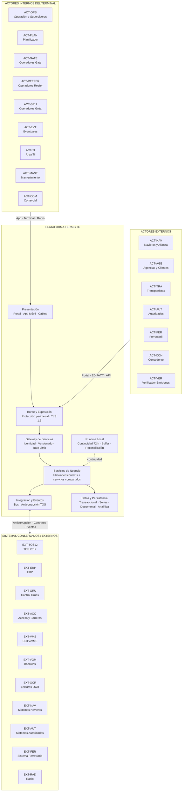
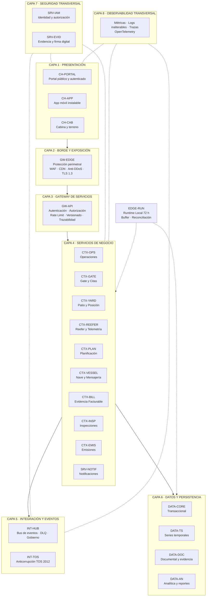
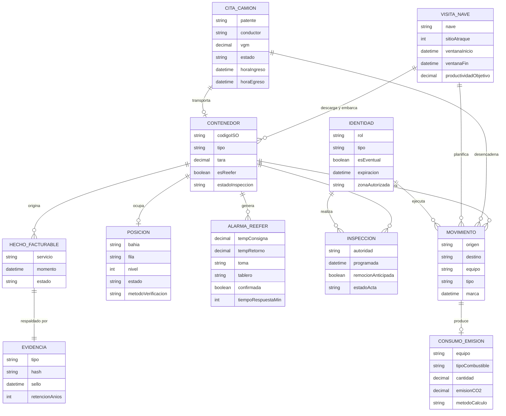

# A1 — Contexto y arquitectura lógica

## Contrato del entregable

### Objetivo y destino

Producir el esquema de solución y la arquitectura lógica oficial. Alimenta las secciones 4.1.1–4.1.5 de `90_Consolidado/00_CONTENIDO_FINAL_SUBDOCUMENTO_4.md`.

### Cumplimientos asignados

- `SD4-01`, `SD4-07`, `SD4-08` — corresponden 1:1 a las viñetas 1, 7 y 8 del Subdocumento 4 (Bases Administrativas, Formulario T-7): "Arquitectura lógica: capas, módulos, límites de contexto, responsabilidades e interfaces" (T7-4.1); "Decisiones de arquitectura registradas, con alternativas evaluadas y criterio de selección" (T7-4.7); "La arquitectura debe ser propia de la solución planteada. No se aceptarán diagramas genéricos" (T7-4.8).
- T21 4.1 a) Esquema de solución y b) Arquitectura lógica (Formulario T-21, ítem 4.1: 16 % de ponderación del Informe 1). **Alerta de exclusión (Art. 58° Bases Administrativas):** un puntaje inferior a 30/100 en el ítem 4 excluye la propuesta completa del proceso; el ítem 4 no admite un diagrama genérico ni referencias sin evidencia.
- BTT Capítulo 2 "Modelo de Arquitectura de Referencia" (RT-02.01 a RT-02.14) es el capítulo que A1 debe satisfacer íntegramente:
  - Cubiertos en este documento: `RT-02.01` (ocho capas + diagrama), `RT-02.02` (modularidad/acoplamiento débil), `RT-02.05` (capa de negocio sin estado), `RT-02.06` (idempotencia), `RT-02.07` (entrega de eventos), `RT-02.08` (patrones de resiliencia), `RT-02.09` (degradación elegante informada), `RT-02.11` (puntos únicos de falla), `RT-02.13` (modelo de dominio), `RT-02.14` (Deseable: patrones evolutivos — capa anticorrupción, estrangulamiento progresivo).
  - Compartidos con otros paquetes: `RT-02.03` (ISO/IEC/IEEE 42010, 5 vistas — A1 aporta lógica y datos; procesos en A3, despliegue en C1, seguridad en D1); `RT-02.04` (registro ADR — A1 redacta `ADR-001`; el registro consolidado vive en `00_Gobierno/03_REGISTRO_ADR_GLOBAL.md`); `RT-02.10` (autoescalado horizontal) y `RT-02.12` (réplica a nuevas unidades, Según caso) — la decisión de escala se esboza en `ADR-001` (§6.2); la implementación física es de C1/C3.
- Referencias cruzadas de otros capítulos BTT que A1 origina como componente lógico y que otros paquetes deben acreditar con evidencia física/de seguridad: `RT-13.01` (WCAG 2.2 AA en `CH-PORTAL`/`CH-APP`/`CH-CAB`), `RT-16.06-08` (auditoría inalterable, ya modelada como Capa 8), Ley N° 19.799 y `RT-16.17/18` (firma electrónica en `SRV-EVID`), `RT-17.01` (app móvil sin conexión, `CH-APP`).

### Entradas obligatorias

1. Maestro de Contexto §§2–6, 17–19.
2. Catálogos RF vigentes y RNF de Célula 2.
3. Registro de decisiones/supuestos y reglas de negocio.
4. `A2` para interfaces detalladas y `D1` para controles lógicos, cuando exista `v0.1`.

### Trabajo requerido

- [x] Delimitar TERABYTE frente a actores y sistemas conservados.
- [x] Dibujar esquema de solución de alto nivel.
- [x] Dibujar arquitectura lógica con ocho capas obligatorias.
- [x] Confirmar/refinar los IDs del Maestro sin crear un componente por RF.
- [x] Definir bounded context, responsabilidad, dato/evento y propietario.
- [x] Declarar dependencias permitidas y prohibidas.
- [x] Representar seguridad y observabilidad como transversales.
- [x] Incorporar app instalable, portal, cabina/terreno y canales compartidos.
- [x] Elaborar modelo conceptual mínimo y eventos principales.
- [x] Comparar núcleo modular con alternativa distribuida.
- [x] Explicar por qué las vistas son específicas del puerto.

### Reglas de diagramación

- una dirección de lectura dominante;
- actores/sistemas externos fuera del límite;
- capas como bandas y módulos agrupados por contexto;
- leyenda de colores, tipos de flecha y alcance;
- nombres de negocio idénticos en todas las vistas;
- máximo aproximado de 15–20 elementos principales por página; usar detalle aparte si se excede;
- sin marcas de producto en la vista lógica;
- cada flecha relevante debe tener significado, no decoración.

### Productos obligatorios

1. Diagrama de contexto/esquema de solución.
2. Diagrama lógico por capas.
3. Catálogo: ID, nombre, capa, contexto, responsabilidad, criticidad, datos, interfaces, continuidad y dueño.
4. Modelo conceptual de dominio y eventos.
5. Tabla de comparación de estilos y candidato `ADR-001`.
6. Narrativa lista para insertar, no solo notas.

### Decisiones permitidas y escalamiento

Puede ajustar límites lógicos si conserva todas las capacidades y justifica el cambio. Debe escalar cualquier cambio que altere la Decisión TOS, las 72 h, el Programa 2029, sistemas conservados o alcance de Célula 2.

### Aporte T-11/ADR

No llena cantidades físicas. Identifica plataformas/licencias que podrían materializar componentes y entrega candidatos a C4. Redacta `ADR-001` como propuesta.

### Salidas hacia otros frentes

- Frente 2: catálogo lógico `v0.1` y criticidad (§3), cinco funciones críticas de continuidad (§2.4) y decisiones/dependencias con impacto en emplazamiento (§7).
- Frente 3: componentes, fronteras de confianza, usuarios y sensibilidad (§3, §4), cinco funciones críticas (§2.4) y decisiones/dependencias con impacto en seguridad (§7).

### Definición de terminado

- [x] Dos diagramas coherentes y legibles.
- [x] Ocho capas visibles.
- [x] Todos los componentes tienen responsabilidad y límite.
- [x] No hay acceso UI→BD ni caja física en la vista lógica.
- [x] Actores, TOS, ERP, VMS, autoridades, ferrocarril y concedente visibles.
- [x] Catálogo y modelo conceptual acompañan los diagramas.
- [ ] `TRZ_A1.md` completo y revisión cruzada resuelta. — traza completa; **revisión cruzada pendiente** (Plan §1: revisor de Frente 1 aún `POR ASIGNAR`).

## Contenido listo para integrar

### 1. Esquema de solución y frontera del sistema

#### 1.1 Visión general de la plataforma

La plataforma TERABYTE es una solución portuaria modular e híbrida diseñada para modernizar la operación de un terminal de contenedores que transfiere 780.000 TEU anuales (486.000 contenedores físicos), opera 3 sitios de atraque sobre 940 metros lineales, administra 18 hectáreas de patio con 12.400 TEU de capacidad y gestiona 2.400 tomas reefer distribuidas en 26 tableros eléctricos. No es una colección de aplicaciones independientes ni un microservicio por requisito funcional: el volumen de negocio estimado (~0,11 TPS normal, ~0,23 TPS peak con dos naves simultáneas y gate saturado) y la capacidad operativa del área TI del CLIENTE (5 personas) obligan a una solución operable, consolidada y resiliente (Maestro §3, §4.1).

La plataforma se estructura en cinco bloques arquitectónicos que responden a los condicionantes reales del terminal:

1. **Núcleo operacional local resiliente** que mantiene nave, movimientos, posición, gate, reefer y hechos facturables durante 72 horas sin enlace exterior, con resincronización automática y determinista en ≤90 minutos tras reconexión (Maestro §9.1; RNF-DIS-02/04).
2. **Plataforma central modular** para reglas de negocio, flujos, identidad, auditoría, notificaciones e integración, desplegable en arquitectura híbrida nube/on-premise conforme al Artículo 16 de las bases (Maestro §3, §10).
3. **Canales sobre capacidades compartidas:** aplicación móvil instalable con cuatro perfiles y offline cifrado para perfiles internos, portal público/autenticado con dato mínimo seguro, interfaces de cabina/terreno operables con guantes e intemperie, y adaptadores para correo, mensajería, radio operacional y mensajería marítima EDIFACT (Maestro §3; MC-01/03/06).
4. **Capa de servicios y anticorrupción frente al TOS 2012** con coexistencia bidireccional, autoridad explícita por `dominio × zona × fase`, conciliación por turno, detección temprana de divergencias y retorno probado con doble control y procedimiento break-glass auditable (Maestro §8; Decisión 1; MC-07/08).
5. **Subsistemas conservados** — ERP, control de grúas de muelle, control de acceso/barreras, CCTV/VMS, básculas y sistemas externos — integrados sin apropiarse de su responsabilidad ni inventar interfaces que no existen (Maestro §5.2; §19 reglas negativas).

#### 1.2 Actores del ecosistema portuario

La arquitectura reconoce 16 perfiles de actor organizados en dos grupos: internos (personal del terminal) y externos (contrapartes comerciales, regulatorias y de verificación). Cada actor condiciona el canal de acceso, el dispositivo, el turno, la identidad, el idioma y los controles de seguridad.

**Actores internos del terminal:**

| ID | Actor / grupo | Canal primario | Contexto operacional | Restricción de interfaz clave |
|---|---|---|---|---|
| `ACT-OPS` | Operación y supervisores de turno | App / Terminal / Radio | 3 turnos, 24×7, patio y muelle | Decisiones operacionales en tiempo real; alarmas y excepciones |
| `ACT-PLAN` | Planificador de patio y estiba | Terminal dedicado | Conocimiento tácito; captura de reglas desde mes 1 | Persona única (retiro inminente); propuesta, corrección y aprobación |
| `ACT-GATE` | Operadores y jefatura de gate | Terminal gate + OCR | Validación y excepciones; peak 2.600 camiones/día | ≤120 s por camión completo; carril de excepción ≥50 % más lento |
| `ACT-REEFER` | Operadores y supervisores reefer | App / Terminal | 3 turnos; rondas, alarmas e intervención | Alarma ≤5 min; confirmación obligatoria; canal redundante |
| `ACT-MANT` | Mantenimiento y energía, incluida jefatura de energía | App / Terminal | Equipos, tableros, continuidad y evidencia | Registro de intervenciones y condición de 88 equipos proyectados |
| `ACT-TI` | Área TI del CLIENTE | Consola de administración | 5 personas; operación posterior y monitoreo | Solución operable sin especialistas dedicados por módulo |
| `ACT-EVT` | Eventuales por nombrada | Terminal compartido | Rotación diaria; hasta 380 por turno peak | Credencial temporal sin biometría; guantes e intemperie; expiración |
| `ACT-GRU` | Operadores de equipos y grúa | Cabina (pantalla dedicada) | Indicaciones visuales; sin confirmación rutinaria manual | Sin apartar vista de la carga; telemetría como fuente primaria |
| `ACT-COM` | Comercial y facturación | Portal / Terminal | Hechos facturables, objeciones y evidencia | Relación con ERP para emisión tributaria; no emite documentos |

**Actores externos:**

| ID | Actor / grupo | Canal primario | Contexto operacional | Restricción de interfaz clave |
|---|---|---|---|---|
| `ACT-NAV` | Navieras y alianza | Mensajería EDIFACT | 14 navieras actuales (16 proyectadas); alianza = 34 % vol. | BAPLIE/COPRAR/COARRI/CODECO; cero redigitación alianza 2029 |
| `ACT-AGE` | Agencias de aduana, embarcadores, importadores y exportadores | Portal autenticado | Trámites, instrucción de embarque estructurada (`RF-POR-09`), trazabilidad y documentos | Autoservicio sin teléfono ni mostrador; presentación estructurada sin redigitación por el terminal |
| `ACT-TRA` | Transportistas | Portal / App | Citas, validación previa y cola virtual | Estadía objetivo: de 78 hacia 45 min sostenida y auditable |
| `ACT-AUT` | Aduana, SAG y autoridad marítima | Interfaz si existe; canal asistido si no | Inspecciones, resultados y actas | No se inventan APIs; fallback asistido trazable |
| `ACT-FER` | Operador ferroviario | Interfaz bidireccional por definir | Coordinación, arribo y entrega/recepción | Contrato por levantar (`ESC-06`) |
| `ACT-CON` | Concedente | Reportes trazables | Indicadores operacionales y regulatorios | Producidos oportunamente; no reconstruidos después del evento |
| `ACT-VER` | Verificador de emisiones | Reporte verificable ISO 14083 | Historia, cálculo y verificación efectiva | Suficiencia de historia acordada tempranamente (`ESC-02`) |

*Fuente: Maestro §5.1; Caso 06, Caps. 1, 2, 6, 7 y 14.*

#### 1.3 Sistemas externos y conservados

La plataforma coexiste con 11 sistemas y activos que mantienen su autoridad sobre funciones específicas. TERABYTE no los reemplaza: se integra con ellos respetando sus límites y sin inventar capacidades que no tienen.

| ID | Sistema / activo | Límite de responsabilidad | Patrón de integración | Restricción clave |
|---|---|---|---|---|
| `EXT-TOS12` | TOS 2012 | Legado envuelto; interfaz real por levantar | Anticorrupción bidireccional con secuencia e idempotencia | Fin de soporte ~2028; autoridad por dominio×zona×fase |
| `EXT-ERP` | ERP / facturación | Único emisor tributario; recibe hechos y evidencia | TERABYTE → ERP: hechos; ERP → TERABYTE: estado tributario | No se reemplaza; conciliación 1:1 de hechos facturables |
| `EXT-GRU` | Control de grúas de muelle | Solo lectura; no se interviene ni automatiza | Lectura autorizada por fabricante | Restricción absoluta de seguridad: personas y carga compartidas |
| `EXT-ACC` | Control de acceso y barreras | Conserva autoridad física; integración de habilitación | Habilitación/eventos bidireccional | Condición ISPS/OIV; no comprometer plan de protección aprobado |
| `EXT-VMS` | CCTV/VMS | Se conserva; no crear portal de video | Eventos, metadatos y evidencia confirmados | No transportar video por red operacional sin justificación |
| `EXT-VGM` | Básculas | Captura y trazabilidad de peso verificado | Lectura de VGM | No se opera ni certifica la báscula; tolerancia por confirmar |
| `EXT-OCR` | Lectores OCR de gate | Eventos e imágenes de patente y contenedor | Eventos + imágenes al ingresar/egresar | OCR de código de contenedor ≥98 %; lectura ≤3 s |
| `EXT-NAV` | Sistemas de navieras | Contratos y versiones por contraparte | EDIFACT bidireccional por naviera | Alianza 2029: exclusivo sin puente ni redigitación |
| `EXT-AUT` | Sistemas de autoridades | API o archivo si existe; canal asistido si no | Variable por autoridad; fallback trazable | No se inventan APIs; `ESC-14` para plazo/interfaz |
| `EXT-FER` | Sistema/canal ferroviario | Contrato por levantar | Bidireccional por definir | Programación local y reenvío; `ESC-06` |
| `EXT-RAD` | Radio operacional | Medio existente integrado | Adaptador al medio actual | No se inventa sistema de radio nuevo sin fundamento |

*Fuente: Maestro §5.2, §7; Caso 06, Caps. 5, 14 y 16.*

#### 1.4 Diagrama de contexto

**Lectura del diagrama:** los actores internos acceden a TERABYTE mediante canales de presentación (app instalable, terminal de cabina/terreno y radio); los actores externos acceden por el borde público (portal web, mensajería EDIFACT y APIs cuando existan). Toda interacción con sistemas conservados y externos fluye exclusivamente a través de la capa de integración y eventos, que implementa la capa anticorrupción, contratos versionados y resiliencia. El runtime local opera como réplica de funciones críticas que sostiene la operación durante 72 horas sin enlace exterior.

#### 1.5 Exclusiones que condicionan el diseño

Las siguientes capacidades quedan **explícitamente fuera del alcance** de TERABYTE, pero condicionan interfaces, datos o controles que la plataforma sí debe proveer (Maestro §4.5):

1. **No reemplazar ERP ni emisión tributaria.** TERABYTE produce hechos facturables con evidencia y los entrega al ERP; el ERP emite el documento tributario.
2. **No intervenir, modificar ni automatizar control de grúas de muelle.** Solo lectura autorizada por el fabricante.
3. **No administrar remuneraciones ni nombrada.** Sí habilitar y controlar acceso de personal asignado por cada turno.
4. **No electrificar flota.** Sí medir por separado 16 equipos diésel y 2 eléctricos para cálculo de emisiones ISO 14083.
5. **No construir infraestructura civil.** Sí especificarla técnicamente para que el CLIENTE la ejecute (sala técnica, ductos, energía).
6. **No desarrollar sistemas de autoridades.** Sí integrarse cuando exista interfaz y ofrecer fallback asistido trazable cuando no.
7. **No operar ni certificar básculas.** Sí capturar y trazar VGM.
8. **No comprar hardware.** Sí especificar qué, cuánto y con qué características en el Formulario T-11.

---

### 2. Arquitectura lógica en ocho capas

Las ocho capas siguientes son de existencia obligatoria conforme a BTT §2.1 "Modelo multicapa exigido" y RT-02.01: cada una corresponde uno a uno con las ocho filas de esa tabla (Presentación, Borde y exposición, Puerta de enlace de servicios, Servicios de negocio, Integración y eventos, Datos, Seguridad transversal, Observabilidad transversal).

#### 2.1 Diagrama lógico general

**Convención:** las flechas sólidas representan el flujo descendente normal de invocación; las líneas punteadas representan transversalidad (seguridad y observabilidad aplican a todas las capas) y la relación del runtime local con los servicios de negocio y datos que replica.

#### 2.2 Descripción por capa

**Capa 1 — Presentación** (Maestro §6, fila 1; MC-01/06)

Esta capa agrupa los tres canales mediante los cuales usuarios humanos interactúan con la plataforma. Ningún canal contiene lógica de negocio ni accede directamente a datos persistidos; toda operación se realiza a través del gateway de servicios. Los tres canales deben cumplir WCAG 2.2 nivel AA (BTT RT-13.01); el informe de conformidad y el detalle de implementación son de D1/cruce UX (Matriz global `STD-11`), pero la exigencia nace aquí porque condiciona el diseño de interacción de cada canal (contraste, navegación por teclado en `CH-PORTAL`, objetivos táctiles ≥44×44 px en `CH-APP`/`CH-CAB` para uso con guantes).

- `CH-PORTAL` — Portal público/autenticado, con dos obligaciones acumulativas que comparten el mismo número de código en dos documentos distintos (Célula 2, `Registro_supuestos_v3.md`, Supuesto M — ambas exigibles, no alternativas): la obligación transversal `BTT RT-16.31` ("portal público accesible sin autenticación, Según caso") y el parámetro del caso `CP, Cap. 15, RT-16.30` ("Portal público", con el contenido exacto que sigue):
  - **Sin autenticación**: consulta del estado de un contenedor por número, condiciones de acceso al terminal y estado de congestión del gate en tiempo real.
  - **Autenticado**: coordinación de citas de camión, presentación y validación anticipada de documentación, consulta de hechos facturables con su evidencia, objeción de facturas con seguimiento, y consulta de la curva de temperatura de la carga refrigerada propia.
  - **Bilingüe** español/inglés en ambas modalidades (BTT `RT-13.12`, endurecido por el caso de Deseable a Obligatorio — Maestro §4.4 restricción 13).
  - Resiste picos de tráfico sin degradar los servicios transaccionales internos, mediante aislamiento de recursos y caché (BTT `RT-16.34`). Autoatención para agencias, importadores, exportadores y transportistas, evitando el contacto telefónico para operaciones simples (BTT `RT-16.32`), con reducción de atención asistida estimada y comprometida como indicador (BTT `RT-16.33`).
  - Umbrales de desempeño bajo peak (`RNF-DES-09`, Célula 2): carga inicial ≤2 s, navegación entre vistas cargadas ≤1 s, búsqueda con criterios compuestos ≤3 s, informe estándar en línea ≤30 s (p95).
- `CH-APP` — Aplicación móvil instalable: una sola aplicación con cuatro perfiles diferenciados (operación, reefer, mantenimiento, supervisión). Los perfiles internos disponen de modo offline cifrado para operar durante desconexión o sombras de cobertura en patio. No es una web responsiva empaquetada (Maestro §19, regla 1).
- `CH-CAB` — Interfaz de cabina y terreno: pantallas e indicaciones para operadores de grúa y equipos de patio, diseñadas para uso con guantes, intemperie, vibración y luz solar directa. Sin confirmación rutinaria manual; la telemetría del equipo es la fuente primaria de posición y movimiento. Tolera hasta 8 horas de sombra de radio local en el patio sin pérdida de registro (Maestro §4.6) — un umbral distinto e independiente de las 72 h de continuidad ante pérdida del enlace exterior que cubre `EDGE-RUN`. Mientras el equipo está sin cobertura, sus movimientos se acumulan localmente con marca de tiempo del equipo (no de recepción); al recuperar señal, `EDGE-RUN`/`CTX-YARD` reconcilian la secuencia por orden de marca de tiempo y detectan huecos o superposiciones con `CTX-OPS`, sin sobrescribir movimientos ya confirmados por otra fuente (Caso 06, Cap. 16.1 decisión pendiente N° 9, resuelta aquí).

**Capa 2 — Borde y exposición** (Maestro §6, fila 2; §11.1)

Punto único de contacto con el exterior. Protege la plataforma mediante WAF gestionado con reglas personalizadas, CDN para contenido estático, anti-DDoS en capas L3/L4/L7, protección contra bots y TLS 1.3 obligatorio (TLS 1.0/1.1 prohibidos). HSTS habilitado con certificados automatizados. Todo tráfico público termina en esta capa antes de alcanzar el gateway de servicios.

- `GW-EDGE` — Borde público: terminación de tráfico, inspección inicial y descarte de solicitudes malformadas o maliciosas.

**Capa 3 — Gateway de servicios** (Maestro §6, fila 3)

Punto de control que media entre los canales de presentación y los servicios de negocio. Aplica autenticación (tokens OIDC/OAuth 2.1), autorización basada en roles y atributos (RBAC+ABAC), cuotas por cliente/servicio, rate limiting, validación de esquema de entrada, catálogo de servicios, versionado de contratos y trazabilidad de cada solicitud mediante correlación de identificadores.

- `GW-API` — Gateway de servicios: enruta solicitudes autenticadas hacia el bounded context correspondiente; registra cada transacción para auditoría y observabilidad. Umbrales de desempeño bajo peak (`RNF-DES-10`, Célula 2): consulta simple ≤500 ms, escritura transaccional ≤800 ms (p95); complementados por `RNF-DES-11` (lotes ≥10.000 registros/min, carga de archivo de 100 MB ≤60 s, arranque en frío ≤60 s) y `RNF-DES-12` (prueba de carga/estrés a 1,5× el peak antes de cada paso a producción).

**Capa 4 — Servicios de negocio** (Maestro §6, fila 4; §6.1)

Núcleo funcional de la plataforma. Contiene nueve bounded contexts con responsabilidad exclusiva y un servicio compartido de notificaciones. Cada contexto encapsula su dominio, expone contratos versionados y se comunica con otros contextos preferentemente mediante eventos asincrónicos publicados en el bus de la capa 5. Los componentes críticos pueden desplegarse de forma separada cuando la frontera esté justificada por continuidad, seguridad o escala. **Todos los bounded contexts de esta capa son sin estado** (BTT RT-02.05): ningún `CTX-*` retiene estado de sesión o de proceso en memoria de instancia; el estado de sesión reside en `SRV-IAM` y el estado de proceso/transaccional reside en `DATA-CORE` (Capa 6), de modo que cualquier instancia de un contexto puede atender cualquier solicitud y ser reemplazada sin pérdida de estado en curso.

- `CTX-OPS` — Núcleo operacional: agregado maestro de contenedores, movimientos, posición y hechos operacionales. Fuente de verdad para el estado del contenedor dentro del terminal.
- `CTX-GATE` — Gate y citas: prevalidación documental, gestión de citas con prioridad, cola virtual, registro de entradas/salidas con OCR (camión completo ≤120 s), control de tiempos y manejo de excepciones (carril de excepción ≥50 % más lento que validado).
- `CTX-YARD` — Patio y posición: asignación de posiciones (bahía-fila-nivel), verificación cruzada con telemetría de equipos, gestión de condiciones dinámicas (pilas, pesos, tipos), **programación anticipada de remociones** (`RF-PAT-10` — ataca el 18 % de remociones evitables de forma proactiva, no solo reactiva, y es la base física que `CTX-INSP` usa para agendar inspecciones con margen) y cálculo de remociones. Meta: 100 % de posiciones conocidas correctas y ≤0,5 % "por verificar" al cierre (Maestro §4.8).
- `CTX-REEFER` — Reefer y telemetría: recepción de muestras de temperatura de 2.400 tomas (2.900 proyectadas), evaluación contra consigna, generación de alarmas en ≤5 minutos, gestión de confirmación/escalamiento y registro de series temporales para evidencia.
- `CTX-PLAN` — Planificación: algoritmos de estiba y patio que proponen asignaciones, permiten corrección humana y capturan motivos de excepción para aprendizaje. Reemplaza la dependencia de una persona única (Nibaldo) mediante sistematización de reglas tácitas desde el mes 1.
- `CTX-VESSEL` — Nave y mensajería: gestión de planes de carga/descarga, órdenes, confirmaciones, ventanas de atraque (≥72 h para alianza), cálculo de productividad por grúa/hora y procesamiento de mensajería marítima EDIFACT (BAPLIE, COPRAR, COARRI, CODECO).
- `CTX-BILL` — Evidencia facturable: registro de hechos facturables con evidencia digital vinculada, gestión de objeciones y entrega estructurada al ERP para emisión tributaria. No emite documentos tributarios.
- `CTX-INSP` — Inspecciones: agenda de inspecciones de autoridades (Aduana, SAG), remoción anticipada de contenedores, generación de actas digitales firmadas y cierre trazable.
- `CTX-EMIS` — Energía y emisiones: medición de consumo por equipo (16 diésel + 2 eléctricos actuales, 88 proyectados), cálculo según ISO 14083/GLEC Framework, acumulación de historia verificable y generación de reportes para verificación efectiva por tercero.
- `SRV-NOTIF` — Notificaciones (servicio compartido): motor de reglas de notificación, escalamiento configurable, confirmación identificada del receptor y adaptadores de canal — al menos tres canales (correo, SMS, push, radio, mensajería marítima), obligación transversal `BTT RT-16.20` y, acumulativamente, parámetro del caso `CP, Cap. 15, RT-16.21` (alarma reefer por canal redundante, navieras por mensajería estándar, transportistas/agencias por correo/app, interna por app y radio — mismo par de códigos, ambos exigibles, Célula 2 Supuesto M). Canal redundante obligatorio para alarmas reefer: si el receptor asignado no confirma dentro de la ventana declarada, la alarma escala automáticamente al siguiente responsable del turno y, agotada la cadena de escalamiento sin confirmación, al supervisor de turno por el canal redundante — nunca queda una alarma crítica sin destinatario activo (Caso 06, Cap. 16.1 decisión pendiente N° 10, resuelta aquí).

**Capa 5 — Integración y eventos** (Maestro §6, fila 5; §7)

Capa responsable de todo intercambio entre bounded contexts y de toda comunicación con sistemas externos y conservados. Implementa bus/broker con persistencia, colas de mensajes fallidos (DLQ), reintentos con backoff exponencial y jitter, deduplicación por clave e idempotencia obligatoria. Garantiza entrega **al menos una vez** con deduplicación en el consumidor, y **orden garantizado dentro de la partición o del agregado** (por contenedor, por nave o por camión, según el evento) cuando el proceso de negocio lo exige (BTT RT-02.07). Distingue entre orquestación (flujos coordinados) y coreografía (reacción a eventos).

- `INT-HUB` — Hub de integración y eventos: publica y consume eventos de dominio, gestiona contratos versionados con las 21 contrapartes lógicas actuales y 7 familias de periferia/instrumentación (23 contrapartes con las navieras proyectadas), observa todos los intercambios para auditoría y gobierno (Maestro §7).
- `INT-TOS` — Capa anticorrupción del TOS 2012: traduce entre el modelo de dominio de TERABYTE y la interfaz real del TOS legado, gestiona secuencia, idempotencia, coexistencia bidireccional y traspaso de autoridad por dominio × zona × fase. Implementa conciliación por turno y detección temprana de divergencias.

**Capa 6 — Datos y persistencia** (Maestro §6, fila 6; §16)

Almacenamiento organizado por naturaleza del dato y patrón de acceso. No se usa un único repositorio para todo; cada tipo de dato tiene su mecanismo adecuado. Cifrado en reposo obligatorio mediante gestión centralizada de llaves, rotación y separación de funciones.

- `DATA-CORE` — Datos operacionales transaccionales: estado del contenedor, movimientos, posiciones, citas, hechos. Fuente de verdad según la fase operacional vigente.
- `DATA-TS` — Series temporales: telemetría reefer (muestreo local cada minuto, reportado al núcleo cada 5 minutos), posición de equipos (frecuencia ~2 s por validar) y consumo energético. Retención: 2 años en línea con agregación histórica.
- `DATA-DOC` — Documentos y evidencia: imágenes OCR (~1,4 TB/año), actas de inspección firmadas, evidencia de hechos facturables, expedientes. Retención según tipo (12 meses OCR, 6 años evidencia facturable, 5 años VGM).
- `DATA-AN` — Analítica y reportes: KPI operacionales, indicadores del concedente, reportes de emisiones y métricas de productividad. Opera sobre réplica o agregación; no carga la operación transaccional.

**Capa 7 — Seguridad transversal** (Maestro §6, fila 7; §11)

Capacidades de seguridad que atraviesan todas las capas sin constituir un bounded context de negocio. Implementan Zero Trust conforme NIST SP 800-207.

- `SRV-IAM` — Identidad y autorización: Zero Trust conforme NIST SP 800-207 (BTT RT-11.01), autenticación OIDC/OAuth 2.1 o SAML 2.0 con integración al directorio corporativo (RT-12.01), cierre SSO propagado (RT-12.02), MFA para administradores y accesos externos (RT-12.03), RBAC+ABAC con matriz de segregación de funciones (RT-12.05), PAM con elevación temporal y grabación de sesión (RT-12.06), credencial temporal para eventuales adecuada al perfil operacional de terreno — guantes, dispositivo compartido por turno — vinculada a nombrada sin biometría obligatoria (RT-12.11, Según caso), baja efectiva ≤24 h (RT-12.10).
- `SRV-EVID` — Evidencia y firma digital: firma en cuatro actos (instrucciones de embarque, recepción/entrega, acta de inspección y hechos facturables) conforme a la Ley N° 19.799 sobre documentos electrónicos y firma electrónica, con firma avanzada donde el caso lo requiera y verificación de validez del certificado al momento de firmar — obligación transversal `BTT RT-16.17/18` y, acumulativamente, parámetro del caso `CP, Cap. 15, RT-16.14` (mismo par de códigos, dos documentos, ambos exigibles — Célula 2, Supuesto M), sellos de tiempo, integridad verificable, consulta y retención conforme a plazos declarados. El acta de inspección conjunta (uno de los cuatro actos) se firma **por autoridad y terminal**, la lectura más exigente ante la ambigüedad del caso (Célula 2, Supuesto N; vinculado a `RF-INS-06`).

**Capa 8 — Observabilidad transversal** (Maestro §6, fila 8; BTT RT-14.01)

Métricas, logs y trazas correlacionadas entre componentes nube y on-premise, sin puntos ciegos, instrumentadas conforme a OpenTelemetry (RT-14.01), con retención de métricas/registros/trazas declarada distinguiendo línea y archivo (RT-14.08). Log central de auditoría inalterable con retención de 12 meses en línea y 24 meses en archivo — no puede ser modificado ni eliminado por ningún perfil, incluido el administrador de la plataforma, y debe quedar consultable/exportable con filtros por persona, período, entidad y tipo de operación (BTT RT-16.06-08). Integración con SIEM para casos de uso portuarios (acceso no autorizado a zona restringida, anomalía de temperatura reefer, patrón de gate inusual).

**Componente transversal adicional:**

- `EDGE-RUN` — Runtime local: réplica de las funciones críticas que debe operar durante 72 horas sin enlace exterior. Replica exactamente los componentes marcados "Crítica" en el catálogo §3.1 — `CTX-OPS`, `CTX-GATE`, `CTX-YARD`, `CTX-REEFER`, `CTX-VESSEL`, `CTX-BILL`, `INT-TOS` y su almacenamiento transaccional `DATA-CORE` — más buffer dimensionado al peak coincidente (2 naves + gate saturado), almacenamiento local tolerante a fallo y mecanismo de reconciliación automática y determinista. No es una capa formal sino un componente que atraviesa las capas 4, 5 y 6 mediante réplica selectiva.

  **Dos escenarios de continuidad, no uno (no confundir en el consolidado):** (a) *pérdida del enlace exterior* con el sitio local operando con normalidad — 72 h sin pérdida, sync ≤90 min, gobernado por `RNF-DIS-02/04` y ejecutado enteramente por `EDGE-RUN`; (b) *interrupción mayor* del propio sitio (desastre, no solo enlace) — RTO ≤4 h / RPO ≤15 min (`RNF-DIS-13`, Célula 2, FEP02 Cap. 7 RT-07.04), con conmutación a sitio/región secundaria, respaldo 3-2-1-1-0 cifrado con copia inmutable (`RNF-DIS-14`) y prueba de conmutación real semestral (`RNF-DIS-15`) — este segundo escenario es responsabilidad física de C1/C3, no de `EDGE-RUN`.

#### 2.3 Reglas de comunicación entre capas

1. Toda escritura reintentable requiere **idempotencia** con clave y ventana de deduplicación (Maestro §6.2; BTT RT-02.06).
2. Toda llamada remota requiere **timeout explícito** y, según criticidad, reintento con backoff exponencial+jitter, circuit breaker, bulkhead y rate limit (BTT RT-02.08 — ninguna llamada remota carece de tiempo de espera).
3. Se debe declarar **degradación elegante**: qué se degrada, cuál es el fallback, cómo se recupera y cómo se reconcilia; ante indisponibilidad de un componente no crítico la plataforma sigue operando en modo reducido y **nunca falla totalmente** (BTT RT-02.09). La degradación se informa a la persona usuaria en el canal correspondiente — `CH-PORTAL`/`CH-APP` muestran el estado de sincronización o de servicio reducido; `CH-CAB` señaliza cuando opera con telemetría en modo local — nunca de forma silenciosa.
4. Los canales de presentación (Capa 1) **nunca acceden directamente a datos** (Capa 6); toda operación fluye a través del gateway (Capa 3) y los servicios de negocio (Capa 4).
5. Los bounded contexts (Capa 4) **no llaman directamente a sistemas externos** (EXT-*); toda integración externa fluye a través de INT-HUB o INT-TOS (Capa 5).
6. Cualquier **punto único de falla residual** debe declararse explícitamente y tener plan de mitigación documentado.

#### 2.4 Cinco funciones críticas de continuidad (salida temprana v0.1 a Frente 2 y Frente 3)

Estas son las cinco funciones que el Maestro (§9.1) exige mantener localmente sin pérdida durante 72 horas sin enlace exterior. Se listan aquí como salida temprana explícita, tal como lo pide [`00_INDICE_DEL_FRENTE.md`](00_INDICE_DEL_FRENTE.md), y sirven de base para que Frente 2 dimensione `EDGE-RUN` y Frente 3 modele sus amenazas.

| # | Función crítica | Componente(s) responsable(s) | Qué debe seguir funcionando sin enlace | Qué se degrada explícitamente | Umbral/fuente |
|---|---|---|---|---|---|
| 1 | Atención de nave y movimientos | `CTX-OPS`, `CTX-VESSEL` | Registro de movimientos de carga/descarga, confirmaciones, ventana de atraque en curso | Nueva mensajería EDIFACT con navieras (INT-HUB) queda en buffer hasta reconectar | Maestro §9.1; RNF-DIS-02/04 |
| 2 | Posición/inventario y cruce de zonas | `CTX-YARD`, `CTX-OPS`, `INT-TOS` | Asignación y verificación de posición bahía-fila-nivel; traspaso de autoridad `dominio × zona × fase` con el TOS | Conciliación fina con el TOS se posterga a la reconexión (ventana de investigación 48 h) | Maestro §9.1, §8; posición ≤30 s |
| 3 | Gate y tiempos de entrada/salida | `CTX-GATE` | Prevalidación, cola virtual, registro de entrada/salida, manejo de excepciones | Verificación contra sistemas de autoridades externas (`EXT-AUT`) usa fallback asistido | Maestro §9.1; ≤120 s por camión |
| 4 | Monitoreo y alarma reefer | `CTX-REEFER`, serie reefer de `DATA-TS` | Muestreo, evaluación contra consigna, generación y confirmación de alarma | Reporte agregado/histórico hacia `DATA-AN` se difiere | Maestro §9.1; alarma ≤5 min |
| 5 | Hechos y evidencia facturable | `CTX-BILL`, `SRV-EVID` (parcial) | Registro del hecho con evidencia vinculada y sello local | Entrega estructurada al ERP (`EXT-ERP`) y conciliación 1:1 se reconcilian al reconectar | Maestro §9.1, §4.7 |

Estas cinco funciones son exactamente las que justifican qué queda dentro de `EDGE-RUN` (§2.2, §3.1, §4.1): todo componente marcado "Crítica" en el catálogo pertenece a una de estas cinco cadenas. Lo que **no** está en esta lista (identidad nueva, catálogo central del gateway, planificación, inspecciones, emisiones, analítica) se degrada de forma explícita y documentada, no silenciosa.

*Fuente: Maestro §9.1.*

#### 2.5 Puntos únicos de falla declarados en la vista lógica

BTT RT-02.11 exige declarar explícitamente los puntos únicos de falla (SPOF) que subsistan y justificar por qué son aceptables; **omitir esta declaración se evalúa como observación grave**. Esta tabla es la declaración que corresponde a la vista lógica; el registro consolidado con impacto/aceptación/mitigación de infraestructura vive en `D2_AMENAZAS_ADR_Y_PUNTOS_DE_FALLA.md` (Frente 3).

| SPOF lógico | Por qué es un punto único | Por qué se acepta en esta vista | Mitigación (frente que la ejecuta) |
|---|---|---|---|
| `GW-API` como única puerta de entrada a `CTX-*`/`SRV-*` | Toda operación de negocio pasa por un solo componente lógico de enrutamiento/autorización | Concentrar el control de acceso es preferible a distribuirlo sin gobierno; el riesgo se traslada a redundancia física, no a duplicar lógica | Alta disponibilidad e instancias redundantes sin estado (C1/C3) |
| `INT-TOS` como único traductor hacia el TOS 2012 | Si falla, se pierde toda coexistencia nuevo↔legado mientras dure la falla | Duplicar la capa anticorrupción multiplicaría el riesgo de secuencia/idempotencia sin necesidad, dado el volumen (≈0,27 TPS peak) | Redundancia activo-pasivo y cola persistente con reintento (C1/C3); alcance de mitigación en `ADR-004` |
| `SRV-IAM` como única autoridad de identidad | Sin `SRV-IAM` no hay autenticación nueva ni revocación | Se acepta porque las sesiones activas se cachean localmente (`EDGE-RUN`, Parcial — §3.2) y el requisito RT-02.09 exige degradación informada, no cero autoridad | Alta disponibilidad e IAM redundante (D1); baja efectiva ≤24 h se cuenta desde la reconexión |
| `EDGE-RUN` como único mecanismo de continuidad de 72 h | Si el runtime local falla simultáneamente con la pérdida del enlace exterior, no existe una tercera capa de resguardo | El caso no exige ni financia un segundo sitio local; se acepta con redundancia interna de `EDGE-RUN` (no de un tercer sistema) | Componentes internos redundantes y almacenamiento tolerante a disco (C1/C2); condición de aceptación en `ADR-002` |
| `CTX-PLAN` como único módulo que sistematiza el conocimiento del planificador | Concentra en un solo módulo lo que hoy depende de una sola persona (Nibaldo) | Es precisamente la mitigación al SPOF humano preexistente (Maestro §4.2); el riesgo remanente es de calidad del modelo capturado, no de disponibilidad | Corrección humana y aprendizaje continuo de excepciones (A1); validación antes de mes 12 |

*Fuente: BTT RT-02.11; Maestro §19 regla 14 (no ocultar puntos únicos de falla).*

---

### 3. Catálogo de componentes lógicos (v0.1)

Este catálogo es la **salida temprana obligatoria** hacia el Frente 2 (dimensionamiento y emplazamiento físico) y el Frente 3 (modelo de amenazas y controles de seguridad). Los identificadores provienen del Maestro §6.1 y son estables para referencia cruzada.

#### 3.1 Identificación y responsabilidad

| ID | Nombre | Capa | Responsabilidad exclusiva | Criticidad |
|---|---|---|---|---|
| `CH-PORTAL` | Portal público/autenticado | 1-Presentación | Estado mínimo seguro, acceso, congestión, trámites y autoservicio | Media |
| `CH-APP` | App móvil instalable | 1-Presentación | Cuatro perfiles; offline cifrado para perfiles internos | Alta |
| `CH-CAB` | Interfaz de cabina/terreno | 1-Presentación | Indicaciones visuales y alertas de seguridad; uso con guantes | Alta |
| `GW-EDGE` | Borde público | 2-Borde | Protección y terminación de tráfico expuesto | Alta |
| `GW-API` | Gateway de servicios | 3-Gateway | Políticas, identidad, versionado y trazabilidad | Alta |
| `CTX-OPS` | Núcleo operacional | 4-Negocio | Agregado contenedor, movimientos, posición y hechos operacionales | Crítica |
| `CTX-GATE` | Gate y citas | 4-Negocio | Prevalidación, citas, cola virtual, entradas/salidas y excepciones | Crítica |
| `CTX-YARD` | Patio y posición | 4-Negocio | Asignación, verificación cruzada, condiciones dinámicas y remociones | Crítica |
| `CTX-REEFER` | Reefer y telemetría | 4-Negocio | Medición, alarmas ≤5 min, series y estado de tomas/tableros | Crítica |
| `CTX-PLAN` | Planificación | 4-Negocio | Estiba/patio, propuesta, corrección y aprendizaje de reglas | Alta |
| `CTX-VESSEL` | Nave y mensajería | 4-Negocio | Planes, órdenes, confirmaciones, ventana y productividad | Crítica |
| `CTX-BILL` | Evidencia facturable | 4-Negocio | Hecho, evidencia, objeción y entrega al ERP | Crítica |
| `CTX-INSP` | Inspecciones | 4-Negocio | Agenda, remoción anticipada, acta y cierre | Alta |
| `CTX-EMIS` | Energía y emisiones | 4-Negocio | Medición por equipo, cálculo ISO 14083, historia y reporte verificable | Alta |
| `SRV-IAM` | Identidad y autorización | 7-Seguridad | Internos, externos, eventuales, roles/atributos, sesiones y PAM | Alta |
| `SRV-NOTIF` | Notificaciones | 4-Negocio | Reglas, escalamiento, confirmación y adaptadores de canal | Alta |
| `SRV-EVID` | Evidencia y firma | 7-Seguridad | Cuatro actos, sellos, integridad, consulta y retención | Alta |
| `INT-HUB` | Hub de integración/eventos | 5-Integración | Contratos, colas, gobierno y observación de intercambios | Alta |
| `INT-TOS` | Anticorrupción TOS | 5-Integración | Traducción, secuencia, coexistencia y autoridad | Crítica |
| `EDGE-RUN` | Runtime local | Transversal | Continuidad de funciones críticas, buffer y reconciliación | Crítica |
| `DATA-CORE` | Datos operacionales | 6-Datos | Estado transaccional y fuente de verdad según fase | Crítica |
| `DATA-TS` | Series temporales | 6-Datos | Telemetría reefer/equipos | Alta |
| `DATA-DOC` | Documentos y evidencia | 6-Datos | Imágenes, actas, firmas y expedientes | Alta |
| `DATA-AN` | Analítica y reportes | 6-Datos | KPI, concedente y emisiones sin cargar la operación | Media |

**Escala de criticidad:**

- **Crítica:** debe sobrevivir 72 h sin enlace exterior; incluida en `EDGE-RUN`. Falla detiene operación de muelle o gate.
- **Alta:** degradación tolerable por horas; requiere fallback documentado. No detiene operación pero genera riesgo.
- **Media:** disponible solo con enlace exterior activo; sin impacto operacional inmediato si se degrada.

#### 3.2 Datos, interfaces y continuidad

| ID | Datos principales | Interfaces principales | Continuidad 72 h | Propietario del dato |
|---|---|---|---|---|
| `CH-PORTAL` | Sesión, preferencias de usuario | GW-EDGE → GW-API | No requerida; degradación aceptable | N/A (sin datos propios) |
| `CH-APP` | Caché cifrado offline, credenciales temporales | GW-API; EDGE-RUN en modo offline | Sí, mediante caché local cifrado | N/A (sin datos propios) |
| `CH-CAB` | Indicaciones en tiempo real, estado de equipo | GW-API; EDGE-RUN en modo offline | Parcial — dos umbrales distintos: hasta 8 h de sombra de radio local en patio sin pérdida (Maestro §4.6), respaldado por `EDGE-RUN` para las 72 h de pérdida del enlace exterior | N/A (sin datos propios) |
| `GW-EDGE` | Logs de tráfico, reglas de protección | Tráfico entrante externo | No requerida para operación local | GW-EDGE |
| `GW-API` | Catálogo de servicios, políticas, tokens | CH-* → CTX-*, SRV-* | Parcial — políticas y tokens vigentes en caché local; catálogo/versionado central no disponible hasta reconectar | GW-API |
| `CTX-OPS` | Contenedores, movimientos, posiciones, hechos | CTX-GATE, CTX-YARD, CTX-PLAN, CTX-VESSEL, INT-TOS | Sí — incluido en EDGE-RUN | CTX-OPS |
| `CTX-GATE` | Citas, validaciones, entradas/salidas, tiempos | CTX-OPS, SRV-IAM, EXT-OCR vía INT-HUB | Sí — incluido en EDGE-RUN | CTX-GATE |
| `CTX-YARD` | Posiciones, asignaciones, condiciones, remociones | CTX-OPS, CTX-PLAN, telemetría equipos | Sí — incluido en EDGE-RUN | CTX-YARD |
| `CTX-REEFER` | Temperaturas, alarmas, estado de tomas/tableros | CTX-OPS, SRV-NOTIF, DATA-TS | Sí — incluido en EDGE-RUN | CTX-REEFER |
| `CTX-PLAN` | Reglas, propuestas, correcciones, motivos | CTX-OPS, CTX-YARD, CTX-VESSEL | Parcial — propuesta ejecutable localmente | CTX-PLAN |
| `CTX-VESSEL` | Planes de carga/descarga, ventanas, productividad | CTX-OPS, INT-HUB (EDIFACT), CTX-PLAN | Sí — operación de nave incluida en EDGE-RUN | CTX-VESSEL |
| `CTX-BILL` | Hechos, evidencias, objeciones, estado ERP | CTX-OPS, SRV-EVID, EXT-ERP vía INT-HUB | Sí — registro de hechos incluido en EDGE-RUN | CTX-BILL |
| `CTX-INSP` | Agendas, remociones anticipadas, actas | CTX-OPS, CTX-YARD, SRV-EVID, EXT-AUT vía INT-HUB | Parcial — acta firmable localmente | CTX-INSP |
| `CTX-EMIS` | Consumos, cálculos, historia, reportes | CTX-OPS, DATA-TS, DATA-AN | No — cálculo retrospectivo tolera demora | CTX-EMIS |
| `SRV-IAM` | Identidades, roles, sesiones, políticas | Todas las capas | Parcial — sesiones y credenciales activas cacheadas localmente para validación offline; alta de identidades nuevas y sincronización de revocación quedan pendientes hasta reconectar (baja efectiva ≤24 h se cuenta desde la reconexión) | SRV-IAM |
| `SRV-NOTIF` | Reglas, plantillas, estado de entrega | CTX-REEFER, CTX-OPS, CTX-GATE y otros | Parcial — canal local para alarmas reefer | SRV-NOTIF |
| `SRV-EVID` | Firmas, sellos, hashes, cadena de custodia | CTX-BILL, CTX-INSP | Parcial — firma local con sincronización posterior | SRV-EVID |
| `INT-HUB` | Contratos, colas, estado de entregas, DLQ | Todos los CTX-*, todos los EXT-* | Parcial — buffer local en EDGE-RUN | INT-HUB |
| `INT-TOS` | Traducciones, secuencias, estado de coexistencia | CTX-OPS, EXT-TOS12 | Sí — coexistencia local incluida en EDGE-RUN | INT-TOS |
| `EDGE-RUN` | Réplica de datos críticos, buffer de eventos | CTX-OPS, CTX-GATE, CTX-YARD, CTX-REEFER, CTX-BILL, CTX-VESSEL, INT-TOS, DATA-CORE | Es el componente de continuidad | EDGE-RUN |
| `DATA-CORE` | Estado transaccional completo | CTX-OPS, CTX-GATE, CTX-YARD y otros | Sí — réplica local en EDGE-RUN | Según bounded context |
| `DATA-TS` | Series de telemetría y consumo | CTX-REEFER, CTX-EMIS | Parcial — la serie reefer (asociada a la función crítica de `CTX-REEFER`) se almacena y evalúa localmente para sostener alarma ≤5 min; la serie de consumo/emisiones (`CTX-EMIS`, no crítica) tolera demora | CTX-REEFER / CTX-EMIS |
| `DATA-DOC` | Imágenes, actas, firmas, expedientes | CTX-BILL, CTX-INSP, SRV-EVID | Parcial — almacenamiento local temporal | Según contexto origen |
| `DATA-AN` | Agregaciones, KPI, reportes | DATA-CORE, DATA-TS, CTX-EMIS | No — tolera operación diferida | DATA-AN |

---

### 4. Interfaces y dependencias entre módulos

#### 4.1 Dependencias permitidas

Las dependencias se leen como «A consume capacidad de B» y están organizadas por dirección de flujo.

| Origen | Destino | Función consumida | Mecanismo |
|---|---|---|---|
| `CH-PORTAL`, `CH-APP`, `CH-CAB` | `GW-API` | Toda operación de negocio | Solicitud HTTP/WebSocket autenticada |
| `GW-API` | `CTX-*`, `SRV-*` | Enrutamiento a servicio de destino | Invocación interna con autorización |
| `CTX-GATE` | `CTX-OPS` | Validar existencia y estado de contenedor | Consulta síncrona |
| `CTX-GATE` | `SRV-IAM` | Verificar identidad y habilitación en gate | Consulta síncrona |
| `CTX-YARD` | `CTX-OPS` | Lectura de posición y estado de contenedores | Consulta síncrona o evento |
| `CTX-YARD` | `CTX-PLAN` | Recibir propuesta de asignación | Evento |
| `CTX-REEFER` | `CTX-OPS` | Asociación contenedor-toma reefer | Consulta síncrona |
| `CTX-REEFER` | `SRV-NOTIF` | Disparar alarma con canal redundante | Evento prioritario |
| `CTX-PLAN` | `CTX-OPS`, `CTX-YARD`, `CTX-VESSEL` | Datos para propuesta de planificación | Consulta síncrona |
| `CTX-VESSEL` | `CTX-OPS` | Operaciones de descarga/embarque | Consulta síncrona y eventos |
| `CTX-VESSEL` | `INT-HUB` | Envío/recepción de mensajería EDIFACT | Evento asíncrono |
| `CTX-BILL` | `CTX-OPS` | Lectura de hechos operacionales facturables | Evento |
| `CTX-BILL` | `SRV-EVID` | Firma y sellado de evidencia | Invocación síncrona |
| `CTX-INSP` | `CTX-OPS`, `CTX-YARD` | Ubicación del contenedor para remoción anticipada | Consulta síncrona |
| `CTX-INSP` | `SRV-EVID` | Firma de acta de inspección | Invocación síncrona |
| `CTX-EMIS` | `CTX-OPS`, `DATA-TS` | Datos de movimiento y consumo de equipos | Consulta síncrona / lectura |
| `SRV-NOTIF` | Múltiples `CTX-*` | Reglas de notificación por contexto | Configuración/evento |
| `INT-HUB` | Todos los `EXT-*` | Intercambio con sistemas externos | Contratos versionados |
| `INT-TOS` | `EXT-TOS12` | Interfaz anticorrupción | Protocolo por levantar |
| `INT-TOS` | `CTX-OPS` | Traducción de operaciones TOS ↔ TERABYTE | Eventos bidireccionales |
| `EDGE-RUN` | `CTX-OPS`, `CTX-GATE`, `CTX-YARD`, `CTX-REEFER`, `CTX-BILL`, `CTX-VESSEL`, `INT-TOS`, `DATA-CORE` | Réplica de funciones críticas | Sincronización + buffer |
| Todos los `CTX-*` | `DATA-CORE` | Persistencia de estado propio | Escritura/lectura transaccional |
| `CTX-REEFER`, `CTX-EMIS` | `DATA-TS` | Persistencia de series temporales | Escritura/lectura de series |
| `CTX-BILL`, `CTX-INSP`, `SRV-EVID` | `DATA-DOC` | Almacenamiento de evidencia documental | Escritura/lectura de archivos |
| `DATA-AN` | `DATA-CORE`, `DATA-TS` | Agregación para reportes | Lectura de réplica o snapshot |

#### 4.2 Dependencias prohibidas

Las siguientes relaciones están **explícitamente prohibidas** por la arquitectura:

1. `CH-*` → `DATA-*` — Los canales de presentación no acceden directamente a ningún almacén de datos. Toda operación fluye a través del gateway y los servicios de negocio.
2. `CH-*` → `CTX-*` / `SRV-*` — Los canales no invocan servicios de negocio directamente; deben pasar por `GW-API`.
3. `CTX-*` → `EXT-*` — Ningún bounded context llama directamente a un sistema externo; toda comunicación externa fluye a través de `INT-HUB` o `INT-TOS`.
4. `DATA-*` → `CTX-*` — La capa de datos no invoca servicios de negocio; es pasiva ante las capas superiores.
5. `EXT-*` → `CTX-*` — Los sistemas externos no pueden invocar directamente bounded contexts; las solicitudes entrantes pasan por `GW-EDGE` → `GW-API` o por `INT-HUB`.
6. Dependencias circulares directas entre bounded contexts (ej.: `CTX-OPS` → `CTX-GATE` → `CTX-OPS`) — Se rompen mediante eventos asincrónicos en `INT-HUB`.
7. Cualquier componente lógico → hardware o nodo físico específico — La vista lógica no referencia emplazamiento (responsabilidad del Frente 2).

#### 4.3 Datos y eventos principales entre bounded contexts

Columna `Sensibilidad` según la clasificación exigida por Maestro §11.1 (mínimo privilegio) y §4.6 (cifrar datos personales, comerciales y los que infieran contenido/ruta): `Personal` (identifica a una persona natural), `Comercial` (valor, manifiesto o negocio expuesto a terceros), `Operacional-sensible` (no identifica personas pero permite inferir contenido o ruta de carga) y `Operacional` (sin las anteriores). Es la base para que Frente 3 aplique cifrado y control de acceso diferenciado.

| Evento de dominio | Productor | Consumidores principales | Dato transportado | Sensibilidad | Criticidad |
|---|---|---|---|---|---|
| `ContenedorDescargado` | CTX-OPS | CTX-YARD, CTX-BILL, CTX-INSP, INT-TOS | ID contenedor, tipo, posición asignada, nave | Operacional-sensible (infiere carga/ruta) | Crítica |
| `ContenedorEmbarcado` | CTX-OPS | CTX-VESSEL, CTX-BILL, INT-TOS | ID contenedor, nave, grúa, marca de tiempo | Operacional-sensible (infiere carga/ruta) | Crítica |
| `MovimientoEjecutado` | CTX-OPS | CTX-YARD, CTX-BILL, CTX-EMIS, INT-TOS | Origen, destino, equipo, tiempo, tipo | Operacional | Crítica |
| `PosicionActualizada` | CTX-YARD | CTX-OPS, CTX-PLAN, CTX-GATE | Contenedor, bahía-fila-nivel, estado, método | Operacional-sensible (infiere ruta) | Crítica |
| `CamionIngresado` | CTX-GATE | CTX-OPS, CTX-YARD, CTX-BILL | Patente, contenedor, conductor, VGM, hora | Personal (patente, conductor) | Crítica |
| `CamionEgresado` | CTX-GATE | CTX-OPS, CTX-BILL | Patente, contenedor, hora, duración estadía | Personal (patente) | Crítica |
| `AlarmaReeferDisparada` | CTX-REEFER | SRV-NOTIF, CTX-OPS | Contenedor, toma, tablero, temp. consigna vs retorno | Operacional-sensible (infiere tipo de carga) | Crítica |
| `AlarmaReeferConfirmada` | CTX-REEFER | SRV-NOTIF, CTX-OPS | Confirmante, acción, tiempo de respuesta | Personal (confirmante) | Alta |
| `NaveAnunciada` | CTX-VESSEL | CTX-PLAN, CTX-OPS | Nave, sitio, ETA, ventana, BAPLIE recibido | Comercial (manifiesto BAPLIE) | Alta |
| `PlanEstibaAprobado` | CTX-PLAN | CTX-OPS, CTX-VESSEL | Nave, asignaciones, correcciones, motivos | Operacional-sensible (infiere ruta/carga) | Alta |
| `InspeccionProgramada` | CTX-INSP | CTX-YARD, CTX-OPS | Contenedor, autoridad, hora, remoción requerida | Operacional-sensible (regulatorio) | Alta |
| `ActaInspeccionFirmada` | CTX-INSP | CTX-BILL, SRV-EVID | Contenedor, resultado, acta, firma | Personal (firma del inspector/receptor) | Alta |
| `HechoFacturableRegistrado` | CTX-BILL | INT-HUB → EXT-ERP, SRV-EVID | Servicio, contenedor, evidencia, monto | Comercial (monto, servicio facturado) | Alta |
| `EmisionCalculada` | CTX-EMIS | DATA-AN | Equipo, período, combustible, CO2, método | Comercial (insumo de reporte a verificador/concedente) | Media |
| `IdentidadHabilitada` | SRV-IAM | CTX-GATE, INT-HUB → EXT-ACC | Persona, rol, zona, vigencia, credencial | Personal | Alta |
| `IdentidadRevocada` | SRV-IAM | CTX-GATE, INT-HUB → EXT-ACC | Persona, motivo, efectividad ≤24 h | Personal | Alta |
| `EnlaceExteriorPerdido` | EDGE-RUN | Todos los CTX-* críticos | Timestamp, último estado sincronizado | Operacional | Crítica |
| `SincronizacionIniciada` | EDGE-RUN | Todos los CTX-*, DATA-CORE | Ventana de desconexión, volumen acumulado | Operacional | Crítica |
| `DivergenciaDetectada` | INT-TOS | CTX-OPS, SRV-NOTIF | Dominio, tipo, severidad, ventana de investigación | Operacional | Alta |

---

### 5. Modelo conceptual de dominio y eventos

#### 5.1 Entidades principales del dominio portuario

El modelo conceptual representa las diez abstracciones fundamentales que la plataforma debe gestionar. No es un modelo de datos relacional ni un esquema de base de datos; es la representación del lenguaje de dominio compartido entre negocio y arquitectura.

| Entidad | Descripción | Contexto propietario | Datos clave |
|---|---|---|---|
| **Contenedor** | Unidad de transporte identificada por código ISO. Es el objeto central del dominio portuario; todos los procesos giran en torno a él. | CTX-OPS | Código ISO, tipo (seco/reefer/peligroso/sobredimensionado), tara, condición reefer (sí/no), estado de inspección, nave de origen/destino |
| **Posición** | Ubicación física en el patio expresada como bahía-fila-nivel. Una posición puede estar ocupada por un contenedor o vacía. La correspondencia entre posición registrada y posición real es un criterio de aceptación contractual. | CTX-YARD | Bahía, fila, nivel, estado (confirmada/por verificar), timestamp, método de verificación (DGPS/óptico/manual) |
| **Movimiento** | Acción física de traslado de un contenedor de un origen a un destino, ejecutada por un equipo. Es la unidad atómica de operación y la base de productividad, facturación y emisiones. | CTX-OPS | Origen, destino, equipo asignado, tipo (descarga/embarque/reubicación/entrega/recepción), marca de tiempo, operador |
| **Visita de Nave** | Período durante el cual una embarcación ocupa un sitio de atraque. Agrupa operaciones de descarga y embarque, y está sujeta a ventanas confirmadas, productividad mínima y mensajería EDIFACT. | CTX-VESSEL | Nave, sitio de atraque (1–3, futuro 4), ETA/ETD, ventana confirmada (≥72 h alianza), BAPLIE recibido, productividad objetivo (≥30 mov/h/grúa) |
| **Cita y Camión** | Reserva de franja horaria para la entrada de un camión al terminal. Incluye prevalidación documental, cola virtual, tiempos de estadía y manejo de excepciones. | CTX-GATE | Patente, contenedor asociado, conductor, VGM, hora de cita, estado (pendiente/validado/ingresado/egresado/excepción), tiempos reales |
| **Alarma Reefer** | Evento generado cuando la temperatura reportada por una toma reefer se desvía de la consigna configurada. Requiere acuse de recibo ≤5 min, canal redundante y escalamiento si no se confirma. | CTX-REEFER | Contenedor, toma, tablero, temperatura de consigna, temperatura de retorno, marca de tiempo, confirmada (sí/no), tiempo de respuesta, acción tomada |
| **Inspección** | Actividad programada por una autoridad (Aduana, SAG, autoridad marítima/sanitaria) que requiere remoción anticipada del contenedor, acta formal firmada y cierre trazable. | CTX-INSP | Contenedor, autoridad solicitante, fecha/hora programada, remoción anticipada requerida (sí/no), estado del acta (pendiente/firmada/cerrada) |
| **Hecho Facturable y Evidencia** | Servicio portuario prestado que tiene valor comercial y requiere evidencia digital vinculada para su cobro. El hecho se registra como evento; la evidencia (imágenes, firmas, datos) lo respalda. | CTX-BILL + SRV-EVID | Servicio prestado, contenedor, momento, evidencia vinculada (hash, sello, tipo), estado (registrado/objetado/conciliado), entrega al ERP |
| **Identidad** | Representación de un actor humano en el sistema con su rol, tipo (interno/externo/eventual), zona autorizada y vigencia. Especialmente compleja para eventuales por nombrada con rotación diaria. | SRV-IAM | Persona, rol, tipo (interno/externo/eventual), credencial (permanente/temporal), zona autorizada, vigencia, nombrada asociada (si eventual) |
| **Consumo y Emisión** | Registro de combustible consumido y emisiones de CO2 por equipo y por movimiento, calculado según ISO 14083/GLEC Framework. Base para verificación efectiva por tercero. | CTX-EMIS | Equipo, período, tipo de combustible (diésel/eléctrico), litros/kWh, emisión CO2 calculada, método de cálculo, movimientos asociados |

#### 5.2 Diagrama de dominio

**Lectura del diagrama:** el Contenedor es la entidad central del dominio. Se asocia a una Visita de Nave (que lo trae o se lo lleva), ocupa una Posición en el patio, genera Movimientos ejecutados por Identidades (operadores), puede disparar Alarmas Reefer si es refrigerado, ser objeto de Inspecciones de autoridades, y originar Hechos Facturables respaldados por Evidencia digital. Los Movimientos producen datos de Consumo y Emisión. Las Citas de Camión vinculan al transportista con el contenedor y desencadenan movimientos de entrega/recepción en gate.

---

### 6. Comparación de estilos y decisión arquitectónica

#### 6.1 Alternativas evaluadas

Se evalúan tres estilos arquitectónicos contra los criterios que impone el Caso 06 Portuaria. La selección no es teórica: está determinada por las restricciones operacionales reales del terminal.

| Criterio | Monolito Clásico | Microservicios Distribuidos | Núcleo Modular Híbrido + Edge |
|---|---|---|---|
| **Complejidad operacional** | Baja: un artefacto desplegable | Muy alta: decenas de servicios, orquestación, malla de red, descubrimiento | Moderada: pocos artefactos desplegables con fronteras justificadas |
| **Operabilidad por 5 personas TI** | Favorable | Inviable sin equipo especializado dedicado | Favorable: consolidado pero con separación donde lo exige continuidad |
| **Resiliencia y autonomía 72 h** | Difícil: todo o nada; un fallo compromete todo | Parcialmente favorable: servicios independientes, pero la coordinación distribuida durante desconexión es extremadamente compleja | Favorable: runtime local replica funciones críticas como unidad coherente |
| **Convivencia con TOS 2012** | Difícil: la capa anticorrupción queda incrustada en el monolito | Favorable: servicio dedicado de anticorrupción | Favorable: módulo anticorrupción separable sin fragmentar innecesariamente el resto |
| **Escala (0,11–0,27 TPS)** | Sobrado: el volumen no justifica distribución | Sobredimensionado: complejidad injustificada para el volumen | Adecuado: escala vertical suficiente; horizontal solo donde se necesite |
| **Telemetría reefer (35–43 ev/s local)** | Problema: la ingestión de series temporales compite con la transaccional | Favorable: servicio de ingestión independiente | Favorable: módulo de reefer con almacén de series separado |
| **Costo de infraestructura** | Bajo | Alto: múltiples instancias, bases de datos por servicio, malla de red | Moderado: concentra recursos sin fragmentar |
| **Evolución y reemplazo del TOS** | Riesgo alto: cambios profundos al monolito | Favorable: servicio de TOS reemplazable | Favorable: módulo anticorrupción con contrato estable |
| **Despliegue sin interrupción** | Difícil: despliegue completo | Nativo: despliegue por servicio | Alcanzable: despliegue por módulo con estrategia azul-verde |
| **Pruebas a 1,5× peak** | Simple: un entorno | Compleja: orquestación de todos los servicios | Moderada: entorno representativo |

#### 6.2 ADR-001 — Estilo arquitectónico de la plataforma

**Estado:** Propuesto  
**Fecha:** 2026-09-05  
**Participantes:** Frente 1 — Lógica e integración

**Contexto:**

El terminal portuario opera 24×7×365 con un área TI de 5 personas, un volumen transaccional moderado (~0,27 TPS peak), una exigencia de autonomía local de 72 horas sin enlace exterior, y la necesidad de convivir con un TOS de 2012 en proceso de sustitución progresiva. La arquitectura debe ser operable, resiliente y evolucionable, pero no puede generar una complejidad operacional que supere la capacidad del equipo de TI del CLIENTE.

**Decisión:**

Se adopta un **Núcleo Modular Híbrido con Runtime de Borde** como estilo arquitectónico de la plataforma, con las siguientes características:

1. **Núcleo modular:** los bounded contexts se implementan como módulos con responsabilidad exclusiva, contratos versionados y comunicación preferente por eventos, pero desplegados como un conjunto reducido de artefactos (no un servicio por módulo). La frontera de despliegue se traza solo cuando la justifica continuidad (runtime local), seguridad (borde), escala (ingestión de telemetría) o patrón de datos (series temporales).
2. **Runtime de borde (EDGE-RUN):** réplica selectiva de las funciones críticas (nave, gate, patio, reefer, hechos facturables) que opera de forma autónoma durante 72 horas con resincronización determinista ≤90 minutos.
3. **Separación justificada:** se separan físicamente solo los componentes que lo requieren por razones demostradas:
   - `INT-TOS` — porque la capa anticorrupción tiene ciclo de vida y riesgo distinto al resto.
   - `CTX-REEFER` + `DATA-TS` — porque la ingestión de ~43 eventos/s de series temporales tiene un patrón de carga distinto al transaccional de negocio.
   - `GW-EDGE` — porque el borde público requiere aislamiento de seguridad.
   - `EDGE-RUN` — porque el runtime local es un artefacto desplegable independiente en la infraestructura on-premise.
4. **Crecimiento por parametrización, no por rediseño:** `CTX-YARD` modela la posición como bahía-fila-nivel independiente del número de sitios de atraque, de modo que un cuarto sitio (horizonte 2030-2032), grúas adicionales (hasta 18 en patio), bloques nuevos o tomas reefer proyectadas (2.900/32) se incorporan como nuevas instancias de datos, no como cambio de modelo. El primer componente que satura ante ese crecimiento (`CTX-REEFER`/`DATA-TS` por volumen de series, o `EDGE-RUN` por buffer de peak) se determina en C4 (dimensionamiento); aquí solo se garantiza que ninguno de los dos exige rediseño del catálogo lógico (Caso 06, Cap. 17.4 punto 14).

**Alternativas descartadas:**

- **Monolito clásico:** descartado porque acopla la capa anticorrupción del TOS al núcleo, dificulta la autonomía local de 72 h como unidad desplegable separada, y la ingestión de telemetría reefer competiría con las transacciones de negocio en el mismo proceso.
- **Microservicios distribuidos por dominio:** descartado porque genera una complejidad operacional inviable para un equipo TI de 5 personas, multiplica la infraestructura necesaria sin beneficio proporcional al volumen de negocio (0,27 TPS peak), y la coordinación distribuida durante 72 h de desconexión introduce riesgos de consistencia difíciles de gestionar y probar.

**Consecuencias positivas:**

- Operable por el equipo TI del CLIENTE sin especialistas por servicio.
- El runtime local funciona como unidad coherente que replica las funciones críticas.
- La sustitución del TOS se aísla en un módulo separable sin afectar el resto.
- La ingestión de telemetría reefer no compite con transacciones de negocio.
- El volumen transaccional no justifica la fragmentación; la consolidación reduce costos de infraestructura.

**Consecuencias negativas (mitigaciones):**

- Menor independencia de despliegue entre módulos de negocio → se mitiga con estrategia azul-verde y pruebas integradas en preproducción equivalente.
- Acoplamiento temporal entre módulos dentro del mismo artefacto → se mitiga con contratos versionados y comunicación por eventos asincrónicos a través de `INT-HUB`.
- El runtime local requiere mecanismo de sincronización determinista → se mitiga con reconciliación automatizada, detección temprana de divergencias y ventanas de investigación (48 h posición, 24 h gate/hechos).

**Trazabilidad:** Maestro §3, §4.1 (magnitudes), §4.4 (restricciones 2, 4, 11), §9 (72 h), §19 (reglas negativas 3, 4, 8); Decisión 1 (TOS), Decisión 9 (red); RNF-DIS-02/04/09/12; BTT RT-02.02/03/04 (modularidad, ISO 42010, registro ADR) y RT-02.14 — Deseable, acreditado por `INT-TOS` como capa anticorrupción con estrangulamiento progresivo del TOS 2012.

#### 6.3 Por qué esta arquitectura es propia del Caso 06

Esta arquitectura no es una plantilla genérica de software empresarial aplicada a un puerto. Cada decisión estructural responde a una condición específica del terminal:

1. **El runtime local existe porque el enlace exterior es frágil.** La fibra óptica proviene de un solo proveedor y el radioenlace de respaldo no ha sido probado en conmutación real desde 2022 (Maestro §4.3). Las 72 horas de autonomía no son un deseo: son la condición que impone un terminal que opera 24×7 y no puede detener naves, grúas ni camiones porque un cable se cortó.

2. **La separación de reefer existe porque la falla reefer tiene consecuencias reales.** El incidente de 38 contenedores perdidos por falta de instrumentación y alarmas tempranas obliga a tratar la telemetría de las 2.400 tomas como un flujo de datos separado (~35 eventos/s locales) con canal redundante de notificación y confirmación obligatoria. No es un subsistema genérico de IoT: es un sistema que evita pérdidas comerciales millonarias.

3. **La capa anticorrupción del TOS es un módulo separable porque el TOS tiene fecha de caducidad.** El TOS 2012 perderá soporte en ~2028 y será sustituido progresivamente. La interfaz real del TOS aún no se ha levantado. Aislar esta capa permite que el resto de la plataforma evolucione sin acoplarse a un sistema legado que desaparecerá.

4. **La planificación captura reglas tácitas porque el planificador se jubila.** El conocimiento de Nibaldo (planificador de patio) debe sistematizarse desde el mes 1. CTX-PLAN no es un algoritmo que reemplaza a una persona: es un módulo que captura, propone, permite corrección humana y aprende de las excepciones.

5. **El gate tiene cola virtual porque la fila tiene 3,2 km y 140 camiones.** CTX-GATE no es un sistema de registro de entradas: es un mecanismo de control de congestión que incluye prevalidación documental, citas con prioridad, carril de excepción y medición de estadía para reducirla de 78 a 45 minutos.

6. **Los canales comparten capacidades porque hay 380 eventuales por turno.** No se crean cuatro aplicaciones separadas por perfil; se tiene una app instalable con cuatro vistas, credencial temporal vinculada a nombrada sin biometría, operación con guantes e intemperie, y terminal compartido con relevo sin detención.

7. **El núcleo es modular porque 5 personas de TI no pueden operar microservicios.** La consolidación de bounded contexts en pocos artefactos desplegables no es una limitación técnica: es la consecuencia directa de que el equipo TI del CLIENTE tiene 5 personas y la solución debe ser operable sin especialistas dedicados por servicio.

8. **La mensajería EDIFACT es crítica porque la alianza naviera (34 % del volumen) exige cero redigitación desde 2029.** CTX-VESSEL no es un adaptador opcional: es un módulo que implementa BAPLIE, COPRAR, COARRI y CODECO por contrato y por naviera, con versiones gestionadas y sin puente manual.

*Fuente: Maestro §3, §4.1–4.8, §8, §14; Decisiones 1–21 de Célula 2; MC-01 a MC-30.*

---

### 7. Decisiones y dependencias que podrían cambiar emplazamiento o seguridad (salida temprana v0.1 a Frente 2 y Frente 3)

Esta lista es la cuarta salida temprana exigida por [`00_INDICE_DEL_FRENTE.md`](00_INDICE_DEL_FRENTE.md). No son decisiones de Física ni de Seguridad; son elecciones lógicas de A1 que **condicionan** lo que Frente 2 puede emplazar y lo que Frente 3 debe proteger, y que deben revisarse en cada puerta de integración si cambian.

| ID | Decisión / dependencia | Por qué puede cambiar emplazamiento o seguridad | Afecta a | Estado |
|---|---|---|---|---|
| `F1-IMPL-01` | ADR-001: `EDGE-RUN` como runtime local obligatorio para 72 h (§6.2) | Exige cómputo/almacenamiento on-premise dimensionado al peak coincidente; condiciona directamente la decisión de sala técnica | C1/C2 (ADR-005, `ESC-09`) | Propuesto |
| `F1-IMPL-02` | `INT-TOS` separado como artefacto desplegable independiente (§6.2) | Puede requerir nodo/proceso propio y zona de red distinta por su ciclo de vida y nivel de riesgo frente al resto del núcleo | C1/D1 | Propuesto |
| `F1-IMPL-03` | `CTX-REEFER` + `DATA-TS` separados por patrón de ingestión (~35–43 eventos/s locales) | Requiere almacenamiento de series temporales dedicado y dimensionamiento propio, distinto del transaccional | C2/C4 | Propuesto |
| `F1-IMPL-04` | `GW-EDGE` como único punto de exposición pública (Capa 2) | Define la frontera exacta que Frente 3 debe proteger con WAF/anti-DDoS/TLS y que Frente 2 debe emplazar como borde aislado | C1/D1 | Definido |
| `F1-IMPL-05` | Credencial temporal de eventuales sin biometría obligatoria, vinculada a nombrada, con terminal compartido (`SRV-IAM`, §2.2) | Condiciona el modelo IAM, la zonificación de acceso físico y el diseño del terminal compartido en patio/gate | D1/C3 | Heredada (Decisiones 12–13 de Célula 2) |
| `F1-IMPL-06` | Autoridad `dominio × zona × fase` del TOS depende de un contrato/CDC aún no levantado (`INT-TOS`, §2.2) | Si el TOS no soporta lectura/escritura confiable, cambia el diseño de integración y posiblemente su ubicación (puerta de viabilidad H2/mes 4, Maestro §8) | A2/A3/C1 | `BLOQUEADO EXTERNO` (`ESC-06`, `F1-ESC-001`) |
| `F1-IMPL-07` | Cifrado en reposo de datos sensibles (VGM, identidad, evidencia, reefer) vía KMS/HSM (Capa 6, §2.2) | Requiere gestión centralizada de llaves y posiblemente HSM físico en sala, o equivalente gestionado en nube | D1/C2 | Definido |

*Fuente: Maestro §3, §8, §10, §11.2; Decisiones 1, 9, 12–13, 19–20 de Célula 2.*

## Trazabilidad

Ver [`trazabilidad/TRZ_A1.md`](trazabilidad/TRZ_A1.md).

