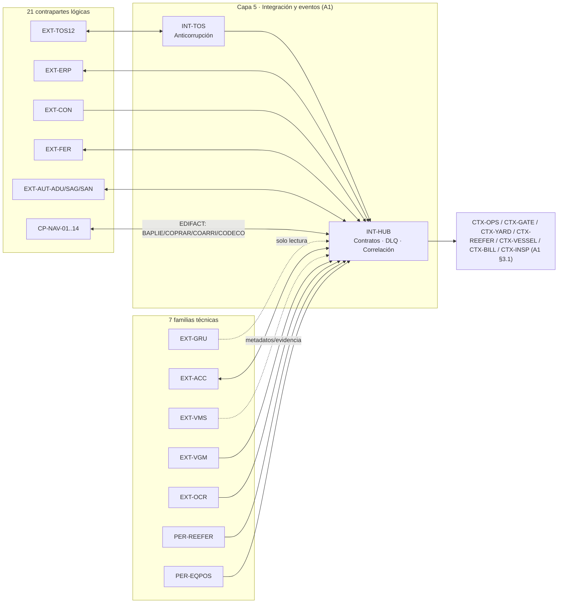

# A2 — Arquitectura de integración

## Contrato del entregable

### Objetivo y destino

Definir contratos, mensajería, resiliencia y gobierno para todas las contrapartes. Alimenta la sección 4.1.6 y referencias de continuidad del consolidado.

### Cumplimientos asignados

- `SD4-03`, apoyo a `SD4-04`, `SD4-05`, `SD4-06` y `SD4-08`.
- T7-4.3 (Subdocumento 4, Bases Administrativas: "Arquitectura de integración: servicios, contratos, mensajería, versionado y gobierno").
- BTT Capítulo 5.3 "Integración e interoperabilidad" — capítulo propio de A2, igual que el Capítulo 2 lo es de A1: `RT-05.16` (OpenAPI 3.1/AsyncAPI 2.6+ documentados desde el código), `RT-05.17` (versionado semántico, compatibilidad hacia atrás, preaviso ≥6 meses), `RT-05.18` (OAuth 2.1 o mTLS entre sistemas; prohibida clave estática en URL), `RT-05.19` (identificador de correlación común de extremo a extremo), `RT-05.20` (capa anticorrupción obligatoria para todo sistema heredado o de terceros), `RT-05.21` (declarar por integración: síncrono/asíncrono, volumen, ventana de disponibilidad de la contraparte y comportamiento ante no respuesta), `RT-05.22` (carga/descarga masiva con validación e informe de error por registro), `RT-05.23` (estándares sectoriales del caso — EDIFACT, Según caso), `RT-05.24` (Deseable: portal de desarrollador).
- BTT Capítulo 2 (compartido con A1, aplica también aquí): `RT-02.06` (idempotencia), `RT-02.07` (entrega al menos una vez + orden), `RT-02.08` (resiliencia: timeout/retry/breaker/bulkhead/rate limit), `RT-02.09` (degradación elegante informada), `RT-02.11` (SPOF).
- `MC-02`, `MC-03`, `MC-07`, `MC-08`, `MC-12`, `MC-20`, `MC-21`, `MC-23`.
- Caso 06 (FEP03): Cap. 4 (ciclo nave/camión, fuente de cada evento), Cap. 5 (sistemas existentes y su destino), Cap. 12 (marco normativo de cada contraparte), Cap. 13.2 (hitos externos 2028/2029), Anexo A (mapa de 22 flujos AS-IS que este documento traduce a contratos TO-BE).

### Entradas obligatorias

- Maestro §§5–8, 14–16, 18–19.
- Volumetría C2 y su matriz 21+7.
- RF-CON, RF-INT, RF-POR, RF-FIR, RF-APP y RNF asociados.
- Catálogo lógico A1 `v0.1`; controles D1 `v0.1` para sensibilidad/autenticación.

### Trabajo requerido

- [x] Inventariar las 21 contrapartes y 7 familias sin doble conteo.
- [x] Definir propietario del dato, dirección, patrón y contrato por integración.
- [x] Separar evento de negocio, documento, mensaje y sobre de red.
- [x] Precisar BAPLIE, COPRAR, COARRI y CODECO por evento correcto.
- [x] Definir versionado, compatibilidad y retiro de contrato.
- [x] Completar timeout, reintento, backoff+jitter, breaker, bulkhead y rate limit.
- [x] Completar idempotencia, deduplicación, orden, DLQ y replay.
- [x] Definir disponibilidad, peak, sensibilidad, observabilidad y evidencia.
- [x] Definir fallo/fallback y recuperación por contraparte.
- [x] Diferenciar hechos confirmados de contratos `POR LEVANTAR`.

### Matriz obligatoria

Ver §2 ("Catálogo de 21 contrapartes lógicas y 7 familias técnicas") en "Contenido listo para integrar" — la matriz completa con las 14 columnas exigidas está allí, no aquí, para no mantener dos versiones de la misma tabla.

### Restricciones obligatorias

- ERP conserva emisión tributaria.
- Grúas: solo lectura, sin intervenir control.
- VMS/CCTV: eventos/metadatos/evidencia confirmados; no portal de video.
- Autoridades: interfaz si existe; fallback asistido trazable si no.
- Alianza 2029: sin puente ni redigitación desde vigencia efectiva.
- Radio: adaptador al medio existente, no sistema nuevo sin fundamento.

### Productos obligatorios

1. Diagrama de integración.
2. Matriz completa anterior.
3. Política de gobierno/versionado.
4. Tabla de fallos y recuperación.
5. Candidato `ADR-003`.

### Aporte T-11/ADR

Propone, sin cantidades definitivas, gateway/broker/API management/adaptadores/licencias necesarias. C4 decide filas y cantidades físicas.

### Salidas hacia otros frentes

- Frente 2: protocolos/patrones, volúmenes, latencias y necesidades de conectividad.
- Frente 3: fronteras externas, identidad, sensibilidad y amenazas.

### Definición de terminado

- [x] Todas las contrapartes/familias están presentes.
- [x] No hay llamada remota sin timeout ni escritura reintentable sin idempotencia.
- [x] Todo fallo tiene fallback y recuperación.
- [x] Todos los desconocidos están marcados y tienen levantamiento.
- [x] Diagrama, matriz y nombres coinciden con A1.
- [x] `TRZ_A2.md` completo.

## Contenido listo para integrar

### 1. Panorama de integración: de 22 flujos manuales a contratos gobernados

#### 1.1 Qué resuelve este documento

El [Anexo A del Caso 06](../FEP03.06.26%20Caso%2006%20-%20Portuaria%20%28Bases%20Tecnicas%20del%20Caso%29.md) describe 22 flujos de información que hoy viajan por correo, teléfono, radio, papel o planilla entre TERABYTE y sus contrapartes. Cada uno de esos 22 flujos se traduce aquí en un contrato gobernado: con propietario del dato, dirección, patrón síncrono/asíncrono, contrato/versión, comportamiento ante falla y evidencia de aceptación (BTT RT-05.21). Este documento no inventa capacidades que la contraparte no tiene: donde el contrato real no existe todavía, se marca `POR LEVANTAR` con su mecanismo de fallback, nunca con un supuesto optimista.

Ejemplos directos de la traducción AS-IS → TO-BE (Anexo A, Caso 06):

| Flujo AS-IS (Anexo A) | Cómo viaja hoy | Contrato TO-BE en este documento |
|---|---|---|
| Naviera → Jefatura: anuncio de recalada (nave, ETA, movimientos estimados) | Correo, portal de la naviera o teléfono, según la línea | `CP-NAV-*` → `CTX-VESSEL`, evento `NaveAnunciada` — aviso preliminar, **anterior** al BAPLIE y sin mensaje EDIFACT estándar propio; se recibe por el mismo canal EDIFACT/asistido de cada naviera, normalizado por `INT-HUB` |
| Naviera → Planificador: plano de estiba (llega después, ya con la nave en tránsito) | Correo, en 6 formatos distintos | `CP-NAV-*` → `CTX-PLAN` vía `BAPLIE` normalizado (mensaje EDIFACT real, distinto del anuncio anterior) |
| Supervisor de turno → Sistema de operación: movimientos | Formulario en papel al cierre de turno | Evento `MovimientoEjecutado` (A1 §4.3), sin intermediario documental |
| Tableros refrigerados → Nadie (falla no se transmite) | No se transmite; se descubre en la ronda siguiente | `PER-REEFER` → `CTX-REEFER`, telemetría activa con alarma ≤5 min |
| Autoridad aduanera/fitosanitaria → Documentación | Canales propios, coordinación por correo/teléfono | `EXT-AUT-*` → `CTX-INSP` vía interfaz si existe, canal asistido trazable si no |
| Sistema de operación → Facturación | Extracción periódica con ajustes manuales | Evento `HechoFacturableRegistrado` (A1 §4.3) → `EXT-ERP` |
| Terminal → Concedente: indicadores semestrales | Reconstrucción manual desde formularios de turno | `EXT-CON` ← `DATA-AN`, generación trazable sin reconstrucción (Maestro §4.4 restricción 14) |

#### 1.2 Principios de gobierno de contratos

1. **Catálogo único y versionado**: todo contrato de interfaz se documenta en OpenAPI 3.1 (síncrono) o AsyncAPI 2.6+ (eventos), generado desde el código y mantenido automáticamente (BTT RT-05.16).
2. **Versionado semántico y compatibilidad hacia atrás**, con preaviso de obsolescencia ≥6 meses antes del retiro de una versión (BTT RT-05.17).
3. **Autenticación entre sistemas** mediante OAuth 2.1 con credenciales de cliente o mTLS; prohibida clave estática en la URL (BTT RT-05.18).
4. **Correlación de extremo a extremo**: todo evento e invocación porta un identificador de correlación común que permite reconstruir una transacción de negocio completa a través de `INT-HUB`, `EXT-*` y de vuelta (BTT RT-05.19).
5. **Capa anticorrupción obligatoria** frente a todo sistema heredado o de terceros (BTT RT-05.20) — ya implementada para el TOS como `INT-TOS` (A1 §2.2); este documento la extiende como principio a **toda** contraparte externa: ningún modelo de dato de un tercero se propaga sin traducción al núcleo.
6. **Declaración obligatoria por integración** (BTT RT-05.21): síncrono/asíncrono, volumen esperado, ventana de disponibilidad de la contraparte y comportamiento cuando no responde — es exactamente la matriz de la sección 2.
7. **Ciclo de vida de contrato**: alta (borrador → publicado), cambio (versión menor compatible / versión mayor con preaviso), retiro (deprecado → retirado), cada uno con responsable nombrado en `INT-HUB` (gobierno de contratos, Maestro §7).
8. **Responsable único por contraparte**: cada fila de la matriz de la sección 2 tiene un dueño que aprueba cambios de contrato; por defecto `INT-HUB` para contrapartes internas del catálogo y el Frente 1 para el diseño del contrato hasta que se asigne un responsable operativo (Plan §1, `POR ASIGNAR`).
9. **Datos maestros sin duplicación con sistemas externos** (BTT RT-05.09): la columna "Dueño del dato" de §2.1/§2.2 **es** la estrategia de gestión de datos maestros exigida — cada entidad compartida (contenedor por ISO 6346, naviera, contraparte de inspección, equipo) tiene un único propietario declarado; ningún `CTX-*` mantiene su propia copia autoritativa de una entidad cuyo dueño es una contraparte externa (p. ej., el contenedor lo identifica ISO 6346 igual en `EXT-OCR`, `CP-NAV-*` y `CTX-OPS` — un solo código, no tres).

#### 1.3 Cuatro capas que no deben confundirse

Este documento distingue explícitamente cuatro conceptos que suelen mezclarse y que la evaluación técnica exige separar (Maestro §19, regla 17):

| Capa | Qué es | Ejemplo en este caso |
|---|---|---|
| **Evento de negocio** | El hecho de dominio que ocurrió, sin importar cómo se transporta | `ContenedorDescargado` (A1 §4.3) |
| **Documento** | El contenido de negocio que respalda o describe el evento | Plano de estiba, orden de embarque |
| **Mensaje** | La codificación estándar del documento para intercambio | `BAPLIE`, `COPRAR`, `COARRI`, `CODECO` (EDIFACT) |
| **Sobre de red** | El transporte y la envoltura técnica del mensaje | AS2/SFTP/API REST sobre el mensaje EDIFACT; **no** es el mensaje en sí |

Confundir "mensaje" con "sobre de red" lleva a errores como tratar un cambio de protocolo de transporte (p. ej. de SFTP a AS2) como si fuera un cambio de versión EDIFACT — no lo es, y gobernarlos igual generaría reintentos y versionados innecesarios.

---

### 2. Catálogo de 21 contrapartes lógicas y 7 familias técnicas (v0.1)

Base de dimensionamiento: **21 contrapartes lógicas actuales** (14 navieras + 3 autoridades + ferrocarril + concedente + TOS + ERP) y **7 familias de periferia/instrumentación** (Maestro §7). Con 16 navieras proyectadas serán 23 contrapartes. Los nombres reales de líneas navieras y el contrato exacto del ferrocarril y del TOS no están en las Bases del caso — se marcan `POR LEVANTAR`, nunca se inventan (Maestro §1, regla 4; BTT §1.5).

#### 2.1 Contrapartes lógicas (21)

| ID | Contraparte | Dueño del dato | Dirección | Servicio/evento | Contrato/versión | Patrón | Frecuencia/peak | Timeout/retry | Idempotencia/DLQ/orden | Sensibilidad | Fallback | Evidencia de aceptación | Estado |
|---|---|---|---|---|---|---|---|---|---|---|---|---|---|
| `EXT-TOS12` | TOS 2012 | Compartido, autoridad por `dominio×zona×fase` (Decisión 1) | Bidireccional | Movimientos, posiciones, hechos operacionales, traducidos por `INT-TOS` | Interfaz real **por levantar**; licencia perpetua, soporte hasta 2028 (`ESC-04`) | Async preferente (eventos); síncrono solo para consulta de autoridad vigente | Todo el tráfico transaccional (~0,27 TPS peak) | Timeout explícito + circuit breaker (Crítica) | Secuencia, idempotencia y deduplicación obligatorias por dominio×zona×fase | Operacional-sensible | Cola persistente + conciliación por turno; puerta de viabilidad H2/mes 4 (Maestro §8) | Cero diferencias no explicadas al cierre diario; ventanas de investigación 48 h posición / 24 h gate | `BLOQUEADO EXTERNO` (contrato técnico y capacidad de CDC por confirmar) |
| `EXT-ERP` | ERP / facturación | ERP (único emisor tributario) | Bidireccional | `HechoFacturableRegistrado` → ERP; estado tributario ← ERP | API o archivo batch, **por definir**; conciliación 1:1 obligatoria | Evento asíncrono con confirmación | Ligado a hechos facturables (órdenes de cientos/día, no continuo) | Timeout + reintento con backoff | Idempotencia por ID de hecho; sin doble emisión | Comercial | Cola con reintento; objeción gestionada por `CTX-BILL`, nunca por reconstrucción manual | Conciliación 1:1 diaria sin diferencias | Definido (patrón); contrato técnico `POR LEVANTAR` |
| `EXT-CON` | Concedente | Terminal (emite) | Unidireccional (salida) | Indicadores de desempeño (estadía, productividad grúa, KPI contractuales) | Formato de reporte del concedente, **por levantar**; periodicidad semestral mínima | Asíncrono, por lote programado desde `DATA-AN` | Semestral obligatorio; deseable en tiempo casi real | Reintento con confirmación de recepción | Idempotencia por período de reporte | Comercial (indicadores contractuales) | Acumulación local si el canal de entrega falla; reintento hasta confirmación | Indicadores trazables, sin reconstrucción manual (Maestro §4.4 restricción 14) | Definido (patrón); canal de entrega `POR LEVANTAR` |
| `EXT-FER` | Operador ferroviario | Compartido (por definir) | Bidireccional | Programación de arribo, entrega/recepción de contenedores | Contrato/canal **por levantar** (`ESC-06`) | Por definir; se diseña como asíncrono con reenvío | Baja (15% de la carga terrestre — Caso 06 Cap. 2.2) | Timeout + reintento; sin acoplar `CTX-GATE`/`CTX-YARD` a su disponibilidad | Idempotencia por movimiento ferroviario | Operacional | Programación local y reenvío cuando el canal esté disponible | Conciliación de arribos vs. programación | `BLOQUEADO EXTERNO` (contrato inexistente hoy) |
| `EXT-AUT-ADU` | Aduana | Aduana | Bidireccional | Selección de contenedores para inspección; resultado | API/archivo si existe; si no, canal asistido trazable | Síncrono si hay API; asistido (correo/portal) si no | Ligado a 620 naves/año y sus descargas | Timeout + reintento; sin bloquear el gate por espera de respuesta | Idempotencia por N° de contenedor + evento de inspección | Operacional-sensible (regulatorio) | Expediente trazable con seguimiento manual asistido | Registro cerrado con hora, resultado y acta (`SRV-EVID`) | `BLOQUEADO EXTERNO` (interfaz real por levantar, `ESC-14`) |
| `EXT-AUT-SAG` | Servicio Agrícola y Ganadero (SAG) | SAG | Bidireccional | Selección fitosanitaria; resultado | API/archivo si existe; canal asistido si no | Igual que `EXT-AUT-ADU` | Estacional, pico en temporada de fruta (dic-abr) | Igual que `EXT-AUT-ADU` | Igual que `EXT-AUT-ADU` | Operacional-sensible | Igual que `EXT-AUT-ADU` | Igual que `EXT-AUT-ADU` | `BLOQUEADO EXTERNO` |
| `EXT-AUT-SAN` | Autoridad sanitaria | Autoridad sanitaria | Bidireccional | Selección sanitaria; resultado | API/archivo si existe; canal asistido si no | Igual que `EXT-AUT-ADU` | Menor volumen que SAG/Aduana | Igual que `EXT-AUT-ADU` | Igual que `EXT-AUT-ADU` | Operacional-sensible | Igual que `EXT-AUT-ADU` | Igual que `EXT-AUT-ADU` | `BLOQUEADO EXTERNO` |
| `CP-NAV-01`…`CP-NAV-14` | 14 navieras individuales (una concentra el 34%, alianza) | Cada naviera (plano de estiba, anuncio) | Bidireccional | `BAPLIE` (plano de estiba), `COPRAR` (orden de embarque), `COARRI` (confirmación carga/descarga), `CODECO` (movimiento/gate-custodia) | EDIFACT, versión **por naviera** — madurez desigual (Caso 06 Cap. 13.1); nombres reales `POR LEVANTAR` | Asíncrono, mensajería por lote/evento | Por recalada (620 naves/año); pico con 2 naves simultáneas | Timeout + reintento; puente manual tolerado solo para no-alianza hasta 2029 | Idempotencia por mensaje; deduplicación por número de mensaje EDIFACT; DLQ por naviera | Comercial (manifiesto de carga) | Cola durable por naviera; puente/digitación manual asistida transitoria (nunca para la alianza desde 2029) | Cero redigitación para la alianza al hito 2029; ≥72 h de ventana confirmada | `EN CURSO` (protocolo definido aquí; contrato por naviera `POR LEVANTAR`) |

*Total: 7 filas individuales (`EXT-TOS12`, `EXT-ERP`, `EXT-CON`, `EXT-FER`, `EXT-AUT-ADU`, `EXT-AUT-SAG`, `EXT-AUT-SAN`) + 14 navieras agrupadas en una fila (`CP-NAV-01`…`CP-NAV-14`) = **21 contrapartes**, sin doble conteo.*

**Equivalencia de identificadores con el Maestro y con A1 (para que los nombres coincidan, Definición de terminado de este entregable):** esta tabla desglosa por contrato lo que el Maestro §5.2 y A1 §1.3 nombran de forma agregada. Ningún código de aquí sustituye al del catálogo: lo detalla.

| Código en este documento | Equivale a | Por qué se desglosa aquí |
|---|---|---|
| `CP-NAV-01`…`CP-NAV-14` | `EXT-NAV` (Maestro §5.2; A1 §1.3) | El contrato EDIFACT es por naviera, con madurez desigual (Caso 06 Cap. 13.1); el dimensionamiento de contrapartes las cuenta una a una. `EXT-NAV` sigue siendo el identificador canónico de la familia. |
| `EXT-AUT-ADU`, `EXT-AUT-SAG`, `EXT-AUT-SAN` | `EXT-AUT` (Maestro §5.2; A1 §1.3) | Cada autoridad tiene interfaz, disponibilidad y fallback propios; `EXT-AUT` sigue siendo el identificador canónico de la familia. |
| `EXT-CON` | Canal de salida hacia el actor `ACT-CON` (Maestro §5.1; A1 §1.2) | **No es un duodécimo sistema conservado.** El concedente no aporta un sistema a integrar: recibe reportes generados desde `DATA-AN`. Los 11 sistemas de Maestro §5.2 y A1 §1.3 no cambian; `EXT-CON` existe solo como contraparte de este catálogo porque tiene contrato, periodicidad y fallback propios. |

*Es el mismo criterio que §2.2 aplica a `PER-REEFER` y `PER-EQPOS`: contratos que A1 da por sentado y que aquí se formalizan, sin alterar el catálogo de A1.*

**Nota sobre las "3 autoridades" (sin inventar precisión que el caso no da):** Caso 06 Cap. 4.7 nombra exactamente Aduana, SAG y autoridad sanitaria como quienes seleccionan contenedores para inspección — son las 3 contrapartes de este catálogo. El Cap. 12 menciona además una "autoridad marítima" (atraque, permanencia y zarpe de naves), pero la trata como marco normativo de `CTX-VESSEL`, no como una cuarta contraparte de intercambio de datos de inspección; por eso no se cuenta aparte aquí. Si el levantamiento posterior confirma que la autoridad marítima requiere su propio contrato de datos, se agrega como contraparte N° 22 y se actualiza esta cifra — no se fuerza a encajar en las 3 actuales.

#### 2.2 Familias técnicas de periferia/instrumentación (7)

Estas familias no son "contrapartes de negocio": son el punto donde el hardware conservado o instrumentado entrega datos a la plataforma. Cinco de ellas ya están identificadas como sistemas conservados en A1 §1.3 (`EXT-GRU`, `EXT-ACC`, `EXT-VMS`, `EXT-VGM`, `EXT-OCR`); las dos restantes (`PER-REEFER`, `PER-EQPOS`) son el contrato de instrumentación que A1 da por sentado dentro de `CTX-REEFER`/`CTX-YARD` y que aquí se formaliza como integración física.

| ID | Familia | Dueño del dato | Dirección | Protocolo/mecanismo | Frecuencia | Fallback | Sensibilidad | Estado |
|---|---|---|---|---|---|---|---|---|
| `EXT-GRU` | Grúas de muelle (6: 4 nuevas + 2 >20 años) | Fabricante | Solo lectura | API/protocolo del fabricante, sujeto a autorización — factibilidad **por verificar** (Caso 06 Cap. 5) | Evento por movimiento de grúa | Registro manual de respaldo si la lectura no está autorizada | Operacional | `BLOQUEADO EXTERNO` |
| `EXT-ACC` | Control de acceso y barreras | Sistema de protección (ISPS/PBIP) | Bidireccional | Habilitación/eventos, conserva autoridad física | Evento por habilitación/paso | Portería manual (proceso actual) mientras se integra | Personal (credencial, identidad) | Definido |
| `EXT-VMS` | CCTV (142 cámaras) | Sistema de protección | Unidireccional (metadatos/evidencia hacia la plataforma) | Eventos + evidencia confirmada; **nunca** transporte de video por red operacional sin justificación (A1 §1.3) | Por evento de interés (no continuo) | VMS nativo sigue siendo la interfaz de video | Operacional-sensible | Definido |
| `EXT-VGM` | Básculas (2: entrada y salida) | Terminal (no certifica báscula) | Unidireccional (captura) | Lectura de masa verificada; tolerancia legal **por confirmar** (SOLAS VGM, `ESC-13`) | Por pesaje (~1.450-2.600 camiones/día) | Registro manual si la báscula falla | Comercial | Definido; tolerancia `POR LEVANTAR` |
| `EXT-OCR` | Lectores OCR de gate | Terminal | Unidireccional (captura) | Eventos + imágenes de patente/contenedor | Por camión (≤3 s de lectura) | Digitación manual asistida (proceso actual) como fallback | Personal (patente) | Definido |
| `PER-REEFER` | Tableros/tomas refrigeradas (26 tableros, 2.400 tomas) | `CTX-REEFER` | Unidireccional (telemetría hacia la plataforma) | Instrumentación remota (hoy inexistente — Caso 06 Cap. 4.5/6); muestreo local 1 min, reporte a núcleo cada 5 min | Continuo mientras el contenedor esté conectado | Ronda física a pie (proceso actual, se retiene como respaldo, no como método) | Operacional-sensible | `EN CURSO` (protocolo eléctrico/instrumentación `POR LEVANTAR` — Frente 2) |
| `PER-EQPOS` | Equipos de patio y tractocamiones (18 grúas de patio, 42 tractocamiones) sin posicionamiento hoy | `CTX-YARD` | Unidireccional (telemetría hacia la plataforma) | GPS/RTLS + lectura óptica (Decisión 2); frecuencia ~2 s **por validar** | Continuo durante operación | Confirmación manual por radio (proceso actual) mientras se instrumenta | Operacional-sensible | `EN CURSO` (frecuencia y tecnología `POR VALIDAR` — Frente 2) |

*Total: 7 familias, sin solaparse con las 21 contrapartes de negocio de §2.1.*

---

### 3. Mensajería marítima estándar: BAPLIE, COPRAR, COARRI y CODECO

BTT RT-05.23 exige, además de la mensajería, la **norma internacional de codificación e identificación de contenedores** como estándar sectorial de intercambio: cada `CP-NAV-*` identifica el contenedor conforme a **ISO 6346** (código de propietario + dígito de categoría + número de serie + dígito verificador) en los cuatro mensajes EDIFACT y en el evento `ContenedorDescargado`/`ContenedorEmbarcado` de A1 — es el mismo código que `EXT-OCR` reconoce en gate (A1 §1.3, ≥98 % de acierto) y que identifica al contenedor en todo el catálogo de A1 §5.1 (entidad Contenedor, campo "Código ISO"). RT-05.23 exige además acreditar la factibilidad de adopción de todo el conjunto (EDIFACT + ISO 6346) con las 14 navieras — no basta declarar el estándar, hay que demostrar que es adoptable.

**Multiidioma obligatorio (BTT RT-13.12, endurecido por el caso de Deseable a Obligatorio):** toda interfaz y mensaje dirigido a navieras, agencias internacionales o mensajería marítima se produce en español e inglés — incluye el contenido de negocio de `BAPLIE`/`COPRAR`/`COARRI`/`CODECO` cuando corresponda texto libre (p. ej. observaciones), no solo el código estructurado del mensaje.

Los cuatro mensajes EDIFACT que la Decisión 18 de Célula 2 fija como estándar, mapeados al evento de dominio de A1 que cada uno produce o consume, y a la etapa del ciclo nave/camión del Caso 06 (Cap. 4) donde ocurren:

| Mensaje EDIFACT | Qué transporta | Dirección | Evento de dominio A1 relacionado (§4.3) | Etapa del Caso 06 |
|---|---|---|---|---|
| **BAPLIE** | Plano de estiba de la nave (bay plan): posición de cada contenedor a bordo | Naviera → `CTX-VESSEL`/`CTX-PLAN` | `NaveAnunciada` (BAPLIE recibido) | Cap. 4.1-4.2: anuncio de recalada y plan de estiba, hoy en 6 formatos por correo |
| **COPRAR** | **Orden de embarque** naviera → terminal (container discharge/load list) — no confundir con la **instrucción de embarque** embarcador/agencia → terminal | Naviera ↔ `CTX-VESSEL` | Insumo de `PlanEstibaAprobado` | Cap. 4.2: instrucción de qué se descarga/embarca |
| **COARRI** | Confirmación de carga y descarga efectivamente ejecutada | `CTX-VESSEL` → Naviera | `ContenedorDescargado`/`ContenedorEmbarcado` | Cap. 4.3: atención de la nave, movimientos ejecutados |
| **CODECO** | Notificación de movimiento de contenedor / custodia en gate | `CTX-GATE` ↔ Naviera/agencia | `CamionIngresado`/`CamionEgresado` | Cap. 4.6: gate, documentación y pesaje |

**Regla de no confusión (Maestro §19, regla 17):** COARRI es carga/descarga en el muelle; CODECO es gate/custodia terrestre. No se intercambian entre sí, y ninguno de los dos es "el mensaje EDIFACT" genérico — cada evento de negocio usa el mensaje que le corresponde.

**Segunda regla de no confusión, añadida por Célula 2 (`RF-POR-09`, nuevo requerimiento — el catálogo RF pasó de 138 a 139 exactamente por este código):** el 41 % de "instrucciones digitadas a mano" que reporta el Caso 06 (Anexo A, Cap. 7.1) es el flujo **embarcador o agencia → Documentación** (210 agencias de aduana + ~1.400 exportadores/importadores) — **no** es el flujo naviera → terminal que cubre COPRAR/`RF-INT-02`. Son dos contrapartes, dos contratos y dos mediciones distintas:

| Flujo | Remitente | Mensaje/canal | Requerimiento | Meta | Contraparte en §2 |
|---|---|---|---|---|---|
| Orden de embarque | Naviera | COPRAR (EDIFACT) | `RF-INT-02` | 0 % alianza; ≤5 % resto (sin cifra base propia) | `CP-NAV-*` |
| Instrucción de embarque | Embarcador o agencia de aduana | Portal, canal estructurado con validación por registro (BTT RT-05.22) | `RF-POR-09` (Etapa 2, Crítica) | Cero digitación manual (línea base 41 %) | `ACT-AGE` → `CH-PORTAL` (actor ya existente, no contraparte nueva — ver abajo) |

**No es una 22ª contraparte de §2.1.** El embarcador/agencia (`ACT-AGE`) ya es un actor servido por `CH-PORTAL` en A1 (no un sistema externo con su propio contrato de integración, a diferencia de las 21 contrapartes de §2.1). `RF-POR-09` es **funcionalidad nueva de ese canal ya existente**, no una contraparte adicional: presentación estructurada con validación previa e informe de error por registro (BTT RT-05.22), precondición de identidad `RF-POR-02` (Etapa 2), dirección entrante (`ACT-AGE` → `CH-PORTAL` → `CTX-VESSEL`), sensibilidad Comercial, sin fallback alterno declarado (el objetivo es eliminar la digitación manual existente, no ofrecer un canal paralelo a ella), evidencia = informe de error por registro + cero instrucciones redigitadas por el terminal. Estado: `EN CURSO` — ya reflejado en A1 `CH-PORTAL`/`ACT-AGE`; el contrato de validación se detalla con A1/D1.

**Convivencia con quien no adopta el estándar (Caso 06 Cap. 13.1, objeción de la gerenta comercial):** hasta que cada naviera adopte EDIFACT, `INT-HUB` acepta un puente asistido (digitación validada desde el correo/formato propio) por naviera individual — **nunca** para la naviera de la alianza, que exige cero redigitación desde la vigencia efectiva de 2029 (`ESC-01`). El puente es una degradación declarada (BTT RT-02.09), no una arquitectura paralela.

---

### 4. Reglas de resiliencia y comunicación remota (extiende A1 §2.3)

Estas reglas aplican a **toda** fila de las secciones 2.1 y 2.2, con el nivel que exige BTT RT-02.08 y RT-05.21:

1. **Timeout explícito** en toda llamada síncrona a una contraparte externa; ninguna espera indefinida (BTT RT-02.08).
2. **Reintento con backoff exponencial + jitter**, circuit breaker, bulkhead y rate limit por contraparte — un circuito abierto hacia `EXT-TOS12` no debe agotar los hilos disponibles para `EXT-ERP` ni viceversa (aislamiento por bulkhead).
3. **Idempotencia y deduplicación** en toda escritura reintentable, con clave de idempotencia declarada (BTT RT-02.06); en EDIFACT, la clave es el número de mensaje por naviera.
4. **Entrega al menos una vez y orden garantizado** dentro de la partición del agregado (por contenedor, por nave, por camión) — BTT RT-02.07, ya declarado en A1 §2.2 Capa 5.
5. **Identificador de correlación** común de extremo a extremo por transacción de negocio, visible en `INT-HUB` y en el log de auditoría (BTT RT-05.19).
6. **Degradación elegante e informada**: si una contraparte no responde, el comportamiento se declara explícitamente por fila (columna "Fallback" de §2.1/§2.2) y se informa en el canal correspondiente — nunca falla total (BTT RT-02.09).
7. **DLQ y replay** por contraparte: los mensajes que agotan reintentos van a una cola de mensajes fallidos propia de esa contraparte, revisable y reproducible sin perder orden dentro del agregado.
8. **Carga/descarga masiva** (migración inicial del TOS, catálogos de navieras) con validación previa, informe de error por registro y procesamiento parcial — nunca todo-o-nada (BTT RT-05.22).

---

### 5. Fallos por contraparte y recuperación

| Contraparte | Escenario de falla | Qué degrada | Recuperación | Frente que ejecuta la mitigación física |
|---|---|---|---|---|
| `EXT-TOS12` | Caída o divergencia del TOS | Autoridad `dominio×zona×fase` se congela en la última confirmada; `EDGE-RUN` sigue operando localmente | Reconciliación por turno; ventanas de investigación 48 h/24 h; retorno con doble control y break-glass auditable | A3 (procesos), C1/C3 |
| `EXT-ERP` | ERP no responde | Hechos facturables se acumulan localmente con evidencia sellada | Reintento con backoff; conciliación 1:1 al restablecer | C3 |
| `CP-NAV-*` (una naviera) | Naviera no confirma EDIFACT a tiempo | Ventana de atraque queda en estado "por confirmar"; el resto de la operación no se bloquea | Escalamiento a canal asistido (correo/teléfono) documentado como excepción, no como norma | A3 |
| `EXT-AUT-*` | Autoridad sin interfaz o sin respuesta | Inspección queda pendiente de coordinación manual | Canal asistido trazable; expediente abierto hasta cierre | A3, D2 (amenaza de dependencia externa) |
| `EXT-FER` | Sin contrato/canal | Coordinación 100% manual (hoy) | Diseño de adaptador cuando el contrato exista; no se bloquea el resto del gate | A3 |
| `PER-REEFER` | Tablero o sensor deja de reportar | Alarma de "sin dato" (distinta de alarma de temperatura); no se asume "todo normal" por defecto | Ronda física de respaldo mientras se repone instrumentación; escalamiento igual que alarma de temperatura | C2 (instrumentación), C3 |
| `PER-EQPOS` | Equipo sin señal de posición | `CTX-YARD` marca posición "por verificar", no "confirmada" | Confirmación manual por radio como fallback declarado, con cierre posterior | C3 |

---

### 6. Diagrama de integración

**Lectura:** todas las contrapartes y familias entran o salen exclusivamente por `INT-HUB` o `INT-TOS` (A1 §4.2, regla 3: ningún `CTX-*` llama directamente a un `EXT-*`). Las flechas punteadas marcan restricciones explícitas (solo lectura, sin transporte de video).

---

### 7. ADR-003 — Mecanismo de integración y eventos

**Estado:** Propuesto
**Fecha:** 2026-09-05
**Participantes:** Frente 1 — Lógica e integración

**Contexto:** 21 contrapartes lógicas + 7 familias de periferia, con madurez y disponibilidad desiguales (desde EDIFACT nativo hasta correo electrónico), deben convivir con un núcleo operable por 5 personas de TI y con continuidad de 72 h.

**Decisión:** Bus de eventos con persistencia (`INT-HUB`) como mecanismo por defecto, con adaptador dedicado por contraparte cuando el protocolo lo exija (EDIFACT por naviera, protocolo del fabricante para grúas, instrumentación eléctrica para tableros reefer). Se descarta la integración punto a punto (multiplica acoplamiento y hace inviable el gobierno de 21+7 contratos con 5 personas de TI) y se descarta un ESB centralizado de orquestación pesada (contradice BTT §2.3: sofisticación no justificada por el volumen 0,11-0,27 TPS).

**Alternativas descartadas:** integración punto a punto (N×M contratos sin gobierno común); ESB con orquestación centralizada (complejidad operacional no proporcional al caso).

**Consecuencias positivas:** un solo lugar (`INT-HUB`) gobierna catálogo, versionado y DLQ de las 28 contrapartes/familias; degradación de una contraparte no compromete a las demás (bulkhead).

**Consecuencias negativas (mitigación):** `INT-HUB` es en sí mismo un punto único de coordinación — mitigado como SPOF ya declarado en A1 §2.5 (`TRZ-A1-033`), con alta disponibilidad e instancias redundantes sin estado a cargo de C1/C3.

**Trazabilidad:** Maestro §7, §17 (Decisión 18: BAPLIE/COPRAR/COARRI/CODECO); MC-23 (mensajería alianza exclusiva); BTT RT-05.16-21; Caso 06 Cap. 4, 5, 12, 13.1-13.2.

## Trazabilidad

Ver [`trazabilidad/TRZ_A2.md`](trazabilidad/TRZ_A2.md).

