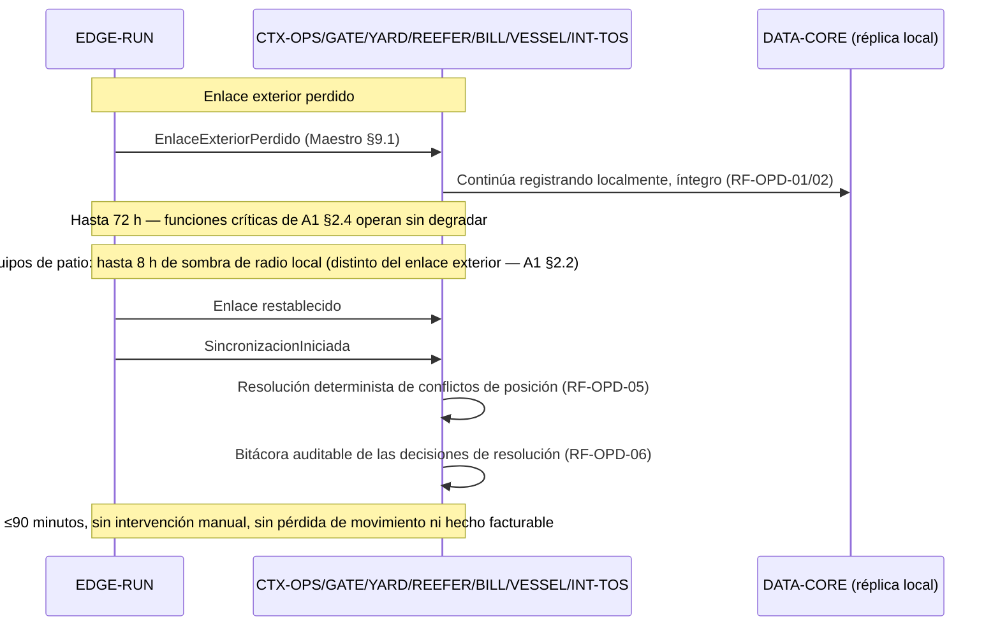
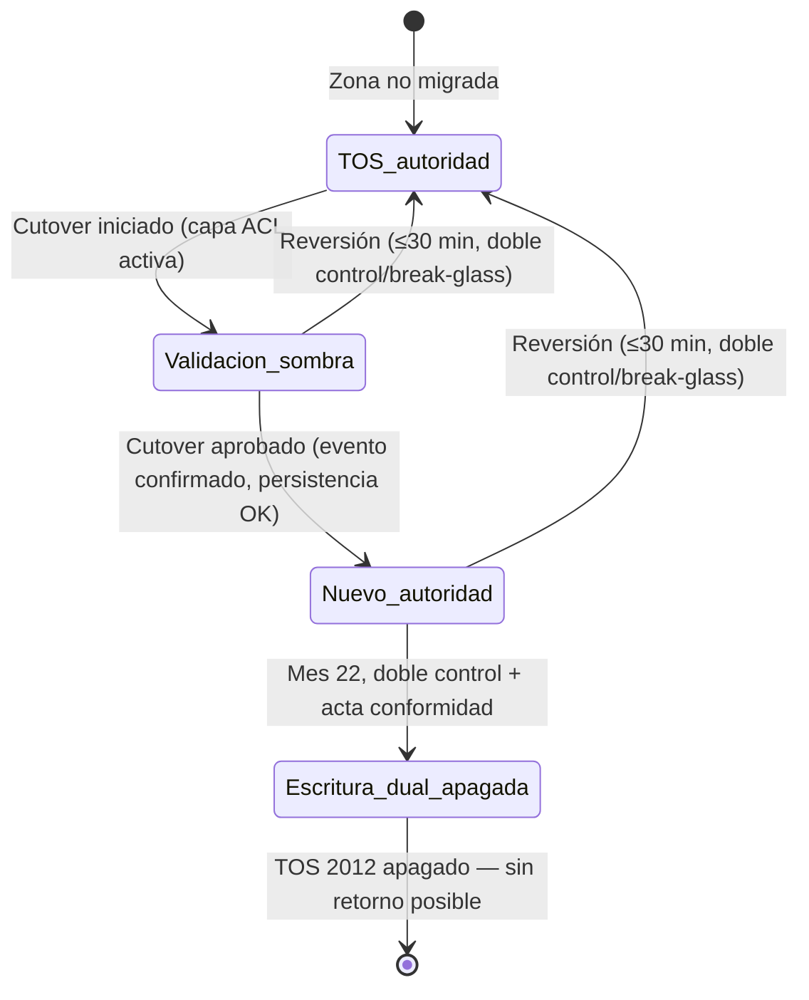

# A3 — Procesos críticos y convivencia TOS

## Contrato del entregable

### Objetivo y destino

Explicar el comportamiento dinámico de los procesos críticos, la convivencia con el TOS y la continuidad local. Alimenta las secciones 4.1.7 y 4.2.9 del consolidado.

### Cumplimientos asignados

- `SD4-01`, `SD4-03`, `SD4-05`, `SD4-07`, `SD4-08`.
- `MC-07/08/09/13/14/23/24/25/27/30`.
- RF-CON-01..14, RNF-DIS-02/04/09/12 y requisitos críticos de nave/gate/reefer (`RF-GAT-*`, `RF-REF-*`, `RF-NAV-*`, `RF-INS-*`, `RF-OPD-*`, `RF-ACC-08`), verificados contra el catálogo real de Célula 2 (`Catalogo rf definitivo` partes 1-3).
- BTT Capítulo 10 "Disponibilidad, continuidad y resiliencia" (`RT-10.01-09`) — capítulo propio de A3, análogo a como el Cap. 2 lo es de A1 y el Cap. 5.3 de A2: `RT-10.01` (99,9 % E2E en críticos), `RT-10.02` (clasificación crítico/alto/medio/bajo por servicio), `RT-10.03` (BCP ISO 22301), `RT-10.04` (continuidad TIC ISO/IEC 27031), `RT-10.06` (cambios sin interrupción), `RT-10.07` (inyección de fallas antes de producción y semestral), `RT-10.08` (comportamiento documentado por cada dependencia externa que no responde/error/lentitud — es la base de la tabla de fallos de A2 §5, ahora con la secuencia temporal completa).
- Compartidos con A1 (Cap. 2): `RT-02.07` (entrega al menos una vez + orden), `RT-02.09` (degradación informada), `RT-02.11` (SPOF).
- **Fuente primaria de todo el bloque TOS**: [`Celula2/02_Decisiones_Reglas_Supuestos/01_decision_01_tos_2012_registro_final.md`](../../Celula2/02_Decisiones_Reglas_Supuestos/01_decision_01_tos_2012_registro_final.md) — documento consolidado de Célula 2, mucho más detallado que la síntesis del Maestro (§8); se cita por su numeral, no por el resumen. Complementa el [`Registro_supuestos_v3.md`](../../Celula2/02_Decisiones_Reglas_Supuestos/Registro_supuestos_v3.md) (decisiones 2-21) y el [`Registro reglas de negocio v2.md`](../../Celula2/02_Decisiones_Reglas_Supuestos/Registro%20reglas%20de%20negocio%20v2.md) (RN-01 a RN-11 — el contrato pedía "RN-01..10"; existe una RN-11 posterior sobre tolerancia de desviación de temperatura, incorporada aquí).

### Entradas obligatorias

- Maestro §§8–9, 12–14, 16–18.
- Decisión TOS 2012 completa.
- Reglas RN-01..10 y catálogos RF/RNF.
- A1/A2 `v0.1`; C3 refina nodos y D1 refina controles.

### Trabajo requerido

- [x] Diagramar operación nave y mensajería.
- [x] Diagramar cita/prevalidación/gate/excepción.
- [x] Diagramar reefer: muestra→regla→alarma→confirmación→escalamiento.
- [x] Diagramar inspección→remoción→acta→hecho facturable.
- [x] Diagramar 72 h desconectado→reconexión≤90 min.
- [x] Diagramar TOS nuevo→legado y legado→nuevo con fallo parcial.
- [x] Crear matriz de autoridad `dominio × zona × fase`.
- [x] Definir conciliación, umbrales, ventanas y clasificación de diferencias.
- [x] Definir cruce de zona, cutover, retorno normal y break-glass.
- [x] Declarar funciones indisponibles offline y respaldo manual.
- [x] Reflejar congelamiento y programa 2029 en los escenarios.

### Matriz de autoridad obligatoria

Ver §3 ("Matriz de autoridad dominio × zona × fase") en "Contenido listo para integrar" — la matriz completa de los 5 dominios está allí.

### Catálogo de procesos obligatorio

Ver §2 ("Cinco secuencias críticas") en "Contenido listo para integrar".

### Productos obligatorios

1. Cinco secuencias mínimas y detalle TOS.
2. Matriz de autoridad.
3. Tabla de conciliación/retorno.
4. Tabla de funciones disponibles/no disponibles offline.
5. Candidatos `ADR-002` y `ADR-004`.

### Aporte T-11/ADR

Informa capacidades necesarias para runtime local, colas/buffer y herramientas de reconciliación; no fija hardware.

### Salidas hacia otros frentes

- Frente 2: criticidad, continuidad, latencia, buffer y recuperación.
- Frente 3: operaciones privilegiadas, break-glass, trazas y fallos.

### Definición de terminado

- [x] No existe autoridad simultánea ambigua.
- [x] Ambas direcciones TOS y fallos parciales están resueltas.
- [x] Las cinco funciones críticas sobreviven 72 h.
- [x] Se declaran funciones no disponibles y procedimientos manuales.
- [x] Retorno y reconciliación tienen responsables, disparadores y relojes.
- [x] Escenarios y diagramas coinciden con A1/A2.
- [x] `TRZ_A3.md` completo.

## Contenido listo para integrar

### 1. Panorama: qué demuestra este documento y qué no puede demostrar una caja estática

A1 define los componentes; A2 define los contratos con contrapartes. Ninguno de los dos demuestra que la plataforma **se comporta correctamente en el tiempo** frente a los cinco escenarios donde el caso exige más que una caja: la nave que llega, el camión que se atrasa, la alarma que nadie confirma, la inspección que se agenda, y el enlace que se cae. Este documento entrega esas cinco secuencias, la convivencia con el TOS 2012 (que es, según Célula 2, *"la decisión de arquitectura más importante del caso"*), y el calendario que hace todo lo anterior ejecutable dentro de las restricciones del Caso 06.

**Fuente primaria distinta de la habitual:** para el bloque TOS este documento no resume el Maestro — cita directamente el [registro de decisión consolidado de Célula 2](../../Celula2/02_Decisiones_Reglas_Supuestos/01_decision_01_tos_2012_registro_final.md), que resuelve con precisión numérica (relojes, umbrales, fechas) lo que el Maestro §8 solo sintetiza como "envolver y sustituir progresivamente".

---

### 2. Cinco secuencias críticas

#### 2.1 Nave y mensajería

```mermaid
sequenceDiagram
    participant NAV as Naviera (CP-NAV-*)
    participant VES as CTX-VESSEL
    participant PLAN as CTX-PLAN
    participant OPS as CTX-OPS
    participant CAB as CH-CAB

    NAV->>VES: Anuncio de recalada (10-3 días antes)
    VES->>VES: Programa sitio y grúas (RF-NAV-02)
    NAV->>VES: BAPLIE (plano de estiba)
    VES->>PLAN: Evento NaveAnunciada (BAPLIE recibido)
    PLAN->>PLAN: Propuesta automática plan estiba/patio (RF-NAV-06; precedencia RN-09)
    PLAN->>PLAN: Planificador aprueba o corrige, motivo registrado (RF-NAV-07/08)
    PLAN->>CAB: Distribución del plan a cabina (RF-NAV-10)
    CAB->>OPS: Ejecución del movimiento (telemetría, sin confirmación activa — Decisión 15)
    OPS->>VES: ContenedorDescargado/Embarcado
    VES->>NAV: COARRI (confirmación carga/descarga)
    VES->>VES: Medición productividad tiempo real (RF-NAV-12; meta ≥30 mov/h desde 2029)
```

**Umbral y regla:** ventana de atraque confirmada con 72 h (`RF-NAV-03`); si cambia, notificación registrada (`RF-NAV-04`, no por teléfono como hoy). Prioridad de recursos compartidos con el gate: **la nave tiene prioridad**, salvo que comprometa a un camión cuyo proceso de gate ya inició o el umbral de estadía del turno (RN-03, corregida — la excepción existe porque la estadía es indicador concesional en incumplimiento, no por cortesía).

*Fuente: Célula 2, Registro_supuestos_v3.md Decisiones 2-5; Registro reglas de negocio v2.md RN-03, RN-09; Caso 06 Cap. 4.1-4.3.*

#### 2.2 Gate: cita, prevalidación, excepción y liberación

```mermaid
sequenceDiagram
    participant TRA as Transportista (CH-APP/CH-PORTAL)
    participant GATE as CTX-GATE
    participant IAM as SRV-IAM
    participant OCR as EXT-OCR
    participant VGM as EXT-VGM
    participant OPS as CTX-OPS

    TRA->>GATE: Solicitud de cita (RF-GAT-01, opcional, sin multa — Decisión 6)
    GATE->>TRA: Confirmación con ventana ±15 min (RN-07)
    TRA->>GATE: Presentación anticipada de documentación (RF-GAT-03, Decisión 7)
    alt Documentación válida y dentro de ventana
        GATE->>IAM: Verifica habilitación
        GATE->>OCR: Lectura automática de contenedor (≤3 s, ≥98 %)
        GATE->>VGM: Verificación de masa bruta (tolerancia 5 % — RN-05)
        GATE->>OPS: CamionIngresado / movimiento autorizado
        GATE->>GATE: Cierre ≤120 s (RF-GAT-*)
    else Documentación incompleta o fuera de ventana
        GATE->>GATE: Carril de excepción (Decisión 7); pierde prioridad de cita (RN-07)
    else Discrepancia VGM >5 %
        GATE->>VES: Alerta a planificador; replanificación (RN-05, RF-NAV-14)
    end
    GATE->>GATE: Liberación solo si RN-06 (1-5) se cumple simultáneamente
```

**Umbral:** estadía objetivo 78→45 min sostenida y auditable (criterio de aceptación N° 1). Conciliación de entradas/salidas: **cero diferencias no explicadas al cierre del día** (§4).

*Fuente: Decisiones 6-7 (Célula 2); RN-05, RN-06, RN-07; Caso 06 Cap. 4.6.*

#### 2.3 Reefer: muestra → regla → alarma → confirmación → escalamiento

```mermaid
sequenceDiagram
    participant TOMA as PER-REEFER (tomas/tableros)
    participant REF as CTX-REEFER
    participant NOT as SRV-NOTIF
    participant OP as Operador de turno
    participant SUP as Supervisor de guardia
    participant TER as Tercer contacto

    TOMA->>REF: Muestreo local 1-5 min (Decisión 8)
    REF->>REF: Evalúa contra consigna y banda por familia de carga (RN-11)
    REF->>REF: Agregación en borde; reporte a núcleo 5-15 min, salvo excepción
    alt Desviación sostenida más allá de la banda y duración mínima (RN-11)
        REF->>NOT: AlarmaReeferDisparada
        par Notificación simultánea (Decisión 10, RN-08)
            NOT->>OP: Alarma
            NOT->>SUP: Alarma
        end
        alt Ninguno confirma dentro del plazo
            NOT->>TER: Escalamiento automático (sin intervención manual — RN-08)
        end
        OP-->>NOT: Confirmación con identidad y timestamp (RF-REF-10)
    else Ausencia de dato (sensor caído)
        REF->>REF: Alarma de "ausencia de dato" tras 3 intervalos de muestreo sin lectura, **o a los 5 min si eso ocurre primero** (RF-REF-07, acotado por el techo de RT-05.29) — no se asume condición estable
    end
```

**Umbral:** alarma ≤5 min desde el evento físico (RT-05.29); es el umbral cuya violación produjo el incidente del 18 de febrero (38 contenedores, 9 h sin frío, USD 620.000) — la razón de ser de todo este proceso.

*Fuente: Decisión 8, 10 (Célula 2); RN-08, RN-11; RF-REF-01..13; Caso 06 Cap. 4.5, Cap. 7.2.*

#### 2.4 Inspección → remoción anticipada → acta → hecho facturable

```mermaid
sequenceDiagram
    participant AUT as EXT-AUT-* (Aduana/SAG/Sanitaria)
    participant INSP as CTX-INSP
    participant YARD as CTX-YARD
    participant EVID as SRV-EVID
    participant BILL as CTX-BILL

    AUT->>INSP: Selección para inspección (interfaz si existe; canal asistido si no)
    INSP->>INSP: Reserva de disponibilidad + programación anticipada de remoción
    INSP->>YARD: Solicitud de remoción anticipada (antes de que el inspector llegue)
    YARD->>YARD: Ejecuta remoción con margen (no en el momento de la inspección)
    AUT->>INSP: Inspección en zona, contenedor abierto
    INSP->>EVID: Firma del acta de inspección (cuatro actos — RF-FIR-01)
    INSP->>BILL: Cierre trazable + hecho facturable si corresponde
```

**El desplazamiento conceptual (Decisión 21, Célula 2):** la inspección deja de competir por recursos de patio *en el momento en que se necesita* y pasa a competir *en el momento en que se agenda*, cuando aún hay margen — ataca directamente el 28 % de atrasos que hoy ocurre "porque la remoción no se programó" (Caso 06 Cap. 4.7). El mecanismo físico que hace esto posible es `RF-PAT-10` ("programación anticipada de remociones", A1 §2.2 `CTX-YARD`) — sin él, `CTX-INSP` podría reservar la disponibilidad pero no tendría cómo ejecutar la remoción con margen real.

*Fuente: Decisión 21 (Célula 2, `Registro_supuestos_v3.md` A.4) — vinculación `RF-INS` completo, `RF-PAT-11`, `RF-INT-10`, `RF-POR-06`, meta 11.*

#### 2.5 Operación desconectada: 72 h sin enlace → reconexión ≤90 min



**Qué NO está disponible offline (declaración obligatoria, BTT RT-03.13 — omitirla es "observación grave"):** ver tabla §7.

*Fuente: BTT RT-03.10/13; RF-OPD-01,02,05,06,07,08; RNF-DIS-03/04 (Célula 2 — cubren específicamente las 8 h de terminales de patio y los ≤90 min de sincronización, sustituyendo a los antiguos `RF-OPD-03/04`, eliminados y no reutilizados).*

---

### 3. Matriz de autoridad dominio × zona × fase

Basada en la secuencia de sustitución adoptada por Célula 2 (§5.4 del registro de decisión): el núcleo de registro es **un solo contexto acotado** (gate+posición+movimientos+salida) que se sustituye completo, pero se **despliega por zona del patio**, nunca por función — dejar la posición en el TOS mientras el gate ya migró generaría dos fuentes de verdad sobre el mismo objeto (prohibido por BA Art. 17.2.2).

| Dominio | Zona | Fase | Fuente de verdad | Escritura autorizada | Sincronización | Criterio de traspaso | Retorno |
|---|---|---|---|---|---|---|---|
| Núcleo de registro (gate, posición, movimientos, salida) — `CTX-OPS/GATE/YARD` | Bloque de patio aún no migrado | Pre-cutover | TOS 2012 | Solo TOS | Captura hacia el nuevo (RF-CON-13) | — | — |
| Núcleo de registro | Bloque en validación paralela | Validación (sombra) | TOS 2012 | Solo TOS | Sistema nuevo es solo lector/sombra | Evento transaccional secuenciado e idempotente, confirmación de persistencia | Automático mientras dura la validación |
| Núcleo de registro | Bloque con cutover aprobado | Post-cutover | Sistema nuevo | Solo nuevo | Réplica hacia TOS (escritura dual, para retorno) | — | Redirección de enrutamiento en la fachada; doble control + break-glass (§5) |
| Telemetría patio refrigerado (`CTX-REEFER`) | Todo el patio (capacidad nueva, no toca el TOS) | Etapa 1, en paralelo | Sistema nuevo desde el día 1 | Solo nuevo | No aplica (no hay registro previo en TOS) | No aplica | Ronda física a pie (reversibilidad máxima) |
| Evidencia facturable / planificación / mensajería / portal | — | Etapa 2 (tras estabilizar dominio 1) | TOS 2012 hasta cutover Etapa 2 | Según fase | Igual patrón que núcleo | Igual patrón | Igual patrón |

**Regla de cruce de zona (invariante, sin excepción):** el sistema con autoridad emite evento secuenciado e idempotente; el receptor confirma persistencia; **solo entonces** cambia la autoridad. Un fallo parcial mantiene la autoridad anterior, deja el evento en cola y **bloquea una segunda transferencia hasta conciliarlo**. Nunca ambos sistemas aceptan escrituras autoritativas sobre el mismo contenedor y dominio simultáneamente.

*Fuente: Decisión 1 (Célula 2) §5.2, §5.4; RF-CON-13/14.*

---

### 4. Conciliación: umbrales, ventana de investigación y regla direccional

| Universo conciliado | Frecuencia | Umbral de alerta | Umbral de detención | Ventana de investigación |
|---|---|---|---|---|
| Posición de contenedor en patio | Por turno | 0,2 % no explicadas | 0,5 % no explicadas | 48 h |
| Movimientos registrados | Por turno | 0,2 % | 0,5 % | 48 h |
| Entradas y salidas por gate | Por turno | Cualquier diferencia | **Cero no explicadas al cierre del día** | 24 h |
| Hechos facturables y su evidencia | Diaria | Cualquier diferencia | Cero no explicadas al cierre del día | 24 h |

**Por qué gate y hechos facturables no admiten margen (a diferencia de posición/movimientos):** ambos alimentan indicadores con consecuencia externa —la estadía del camión es un indicador contractual con el concedente, ya en incumplimiento por tres semestres consecutivos— y son eventos discretos e individualmente investigables, a diferencia de una posición sobre ~11.200 TEU en movimiento continuo. El umbral de gate se revisó explícitamente de 0,3 % a **cero** (Célula 2, §15.3) porque 0,3 % equivalía a 4-8 camiones diarios sin explicación contaminando un indicador ya en falta.

**Regla direccional de clasificación** (evita que la marcha blanca penalice a la solución por ser mejor que el sistema que reemplaza — Célula 2 §15.2.b):

| Clasificación de la divergencia | Tratamiento |
|---|---|
| Explicada por desfase temporal | No computa |
| El sistema nuevo resulta correcto (verificado físicamente) | No computa — se registra como evidencia de mejora, alimenta el criterio de aceptación N° 9 |
| El sistema nuevo resulta incorrecto | Computa como defecto |
| No resuelta dentro de la ventana aplicable | Computa como **no explicada** — detiene el avance |

**Ventanas:** 48 h para posición/movimientos (con 3 turnos rotativos, en 48 h la dotación que originó el registro ha vuelto a servicio al menos dos veces); 24 h para gate/hechos (ciclo natural del cierre diario).

*Fuente: Decisión 1 (Célula 2) §7.1, §15.2, §15.3.*

---

### 5. Cutover, retorno y break-glass

**Dos relojes acotados, no uno:**

| Tramo | Objetivo | Fundamento |
|---|---|---|
| Detección → decisión | ≤15 min | BA Art. 78.2: 15 min es el tiempo máximo de respuesta ante incidente de severidad crítica |
| Decisión → reversión efectiva | ≤15 min | La reversión es una redirección de enrutamiento en la fachada — configuración pre-armada y probada, no una restauración |
| **Total detección → operación restituida** | **≤30 min** | No se usa el umbral de resolución de 4 h del Art. 78.2: 4 h con una nave amarrada equivalen a ~100 movimientos de grúa perdidos |

**Nota importante — no confundir con el umbral de 90 min:** el ≤30 min es el tiempo de **reversión de un dominio del TOS** (este documento). El ≤90 min (A1 §2.4, §9.1 Maestro) es el tiempo de **resincronización tras 72 h sin enlace exterior**. Son dos relojes distintos, para dos escenarios distintos, y no deben fusionarse en el consolidado.

**Autoridad — doble control normal, break-glass de emergencia:** en operación normal, la reversión requiere aprobación conjunta del **supervisor de turno del CLIENTE** (existe en los 3 turnos, operación 24×7×365) y el **jefe de turno de marcha blanca de Terabyte** (presencia en terreno en los 3 turnos exigida por RT-21.16). En emergencia, cualquiera de los dos activa **break-glass** previamente autorizado: motivo obligatorio, privilegio temporal, alerta inmediata al otro cargo y al Comité, revisión posterior — el escalamiento al Comité es posterior al retorno, nunca una condición que paralice la emergencia de madrugada.

**Asimetría declarada:** revertir sin necesidad cuesta poco (el TOS sigue al día mientras la escritura dual esté activa); no revertir cuando correspondía cuesta una nave detenida. **Ante la duda se revierte, y se documenta** — la misma lección del 18 de febrero (una alarma/decisión que espera a alguien que no está a las 03:00 tiene el mismo defecto de diseño).

**Cierre de la ventana de reversión:** la escritura dual no se apaga hasta el cierre formal de la marcha blanca. Apagada, no hay reversión sino corrección hacia adelante — **el apagado es un hito bajo doble control y aprobación explícita del CLIENTE, nunca automático** (mes 22, condicionado a acta de conformidad del repositorio histórico).

*Fuente: Decisión 1 (Célula 2) §7.2, §15.1, §15.4.*

---

### 6. Verificación física del inventario: barrido por bloques con congelamiento lógico

1. El patio se divide en bloques operativos.
2. Por bloque, se suspenden depósitos/retiros durante una ventana acotada, redirigiendo a bloques vecinos.
3. Se barre leyendo con terminales de equipo y reconocimiento óptico — **no conteo manual**.
4. Se libera el bloque y se avanza al siguiente.
5. Movimientos de otros bloques durante el barrido se reconcilian desde el registro de movimientos.
6. Se repite el barrido sobre una muestra para estimar el error del propio procedimiento.

Ejecutado entre mayo y noviembre, evitando los dos peaks de gate (05:00-09:00 y 14:00-18:00). El congelamiento lógico de un bloque reduce capacidad y **debe cuantificarse** en la propuesta (CP 13.3.2). La segmentación exacta en bloques, duración del barrido y % de capacidad resignada quedan **abiertos deliberadamente** por Célula 2 como supuesto de ingeniería (no consulta) — Frente 2/C4 debe completarlos, no Frente 1.

*Fuente: Decisión 1 (Célula 2) §7.3, §15.9 (pendiente N° 4, abierto a propósito).*

---

### 7. Cinco funciones críticas: qué no está disponible offline y su respaldo manual

Profundiza A1 §2.4 con el procedimiento manual exigido por BTT RT-03.13 (su ausencia es "observación grave"):

| Función crítica (A1 §2.4) | Qué se degrada sin enlace | Procedimiento manual de respaldo | RTO/RPO operacional |
|---|---|---|---|
| Nave y movimientos | Mensajería EDIFACT nueva con navieras queda en buffer | Ninguno — la operación de nave continúa localmente sin degradar | RPO ≈0 (local); RTO de mensajería = tiempo de reconexión |
| Posición/cruce de zonas | Conciliación fina con TOS se posterga | Ninguno — posición sigue con DGPS/RTLS+óptica local | RPO ≈0; conflictos resueltos en ≤90 min post-reconexión |
| Gate | Verificación contra autoridades externas usa fallback asistido | Carril de excepción manual (ya existente — RN-07) | RPO ≈0; RTO de verificación externa = tiempo de reconexión |
| Reefer | Reporte agregado a `DATA-AN` se difiere | Ninguno — alarma y registro continúan localmente | RPO ≈0 (crítica, incluida en `EDGE-RUN`) |
| Hechos facturables | Entrega a ERP y conciliación 1:1 se posterga | Ninguno — evidencia se sella localmente | RPO ≈0; RTO de conciliación ERP = tiempo de reconexión |
| *(fuera de las 5 críticas, declarado explícitamente)* Planificación, inspecciones, emisiones, analítica, alta de identidad nueva, catálogo central del gateway | Se degradan por diseño (A1 §2.4, §2.5) | Plan impreso y radio (modo degradado explícito — Decisión 1 §7.2); confirmación manual de headcount (`RF-ACC-08`) | No crítico — tolera demora hasta reconexión |

*Fuente: A1 §2.4, §2.5; BTT RT-03.10/13, RT-10.08; RF-ACC-08 (conteo operativo sin conectividad); Decisión 1 (Célula 2) §7.2.*

---

### 8. Programa 2029 como resultado operacional, no como fecha

Las tres condiciones de la alianza naviera (34 % de los contenedores) entran en vigor conjuntamente en 2029 y se demuestran como comportamiento observado, no como una fecha en un Gantt:

1. **Mensajería estándar exclusiva, cero redigitación** — demostrado por la ausencia de puente asistido activo hacia la naviera de la alianza en producción (A2 §2.1, `CP-NAV-*`; Decisión 18).
2. **Ventana de atraque confirmada ≥72 h, cumplida** — demostrado por el indicador de `RF-NAV-03` sobre el universo de recaladas de la alianza, no solo declarado.
3. **Productividad ≥30 movimientos/hora por grúa** — demostrado por `RF-NAV-12` (medición en tiempo real, por hora y por equipo), contra la línea base actual de 24,8 mov/h.
4. **Reporte de emisiones efectivamente verificado por tercero** — requiere serie histórica **previa** a 2029; por eso la captura empieza el mes 1 (Etapa 1), no en 2029 (objeción de la gerenta comercial, resuelta como programa indivisible — Decisión 1 §5.5).

**Precisión metodológica (catálogo RF de Célula 2, numeral 11.2):** "≥30 mov/h" y ">90 % de ventanas" son **metas de negocio** (indicador), no algo que el RF por sí solo garantice — el sistema puede medir correctamente y aun así arrojar 24,8 mov/h si la operación no cambia. Los requerimientos (`RF-NAV-12/13` para productividad; `RF-NAV-01..05` para ventana) verifican la **conducta del sistema** (mide, explica, reporta trazable), no el resultado de negocio. El criterio de aceptación de A3 es sobre la conducta; la meta se sigue en la tabla de indicadores de Célula 2 (catálogo RF parte 3, §11.2), no se reinventa aquí. El cumplimiento general de ventanas (no solo alianza) se mantiene como indicador separado: >90 %.

---

### 9. Calendario ejecutable (resuelve la colisión con el congelamiento)

| Hito | Mes | Fecha estimada | ¿Dentro del congelamiento (15-dic a 30-abr)? |
|---|---:|---|---|
| Inicio desarrollo Etapa 1 | 1 | feb 2027 (supuesto S1) | — |
| H2 — arquitectura, seguridad, modelo de datos (puerta de decisión TOS, §6 Decisión 1) | 4 | may 2027 | — |
| Versión candidata Etapa 1 lista, instalada, con retorno probado | ≤12 | **14-dic-2027** | No (límite exacto) |
| Validación paralela no invasiva, solo lectura/sombra, sin autoridad | 13-15 | 15-dic-2027 a 30-abr-2028 | Sí — permitida **solo** en este modo, condicionada a confirmación formal del CLIENTE (consulta C1) |
| Producción Etapa 1 | 16 | **mayo 2028** (no puede ser antes — Art. 17.1 obligatorio e indivisible) | No |
| Desarrollo Etapa 2 | 13-18 | feb-jul 2028 | — |
| Marcha blanca Etapa 2 | 19-20 | ago-sep 2028 | No |
| Producción Etapa 2 (planificación, mensajería, portal) | 21 | oct 2028 | No |
| Apagado TOS 2012 (escritura dual off) | 22 | nov 2028, bajo doble control + acta de conformidad del repositorio histórico | No |

**Riesgo estructural declarado, no oculto:** el soporte del fabricante podría vencer tan pronto como el 01-01-2028 (supuesto conservador S5, exigido por BA Art. 5.3/5.4 — la interpretación más exigente ante ambigüedad); la producción del núcleo no puede ocurrir antes de mayo 2028 **en ninguna oferta admisible** (aritmética del calendario contractual de 56 meses). La ventana de exposición resultante es común a **cualquier estrategia**, no un defecto de envolver el TOS, y se acota porque la capa anticorrupción reduce la superficie de exposición desde el mes 4-6 (nada accede directamente al sistema de 2012 una vez interpuesta), antes de lo que la acotaría cualquier alternativa.

*Fuente: Decisión 1 (Célula 2) §8, §15.6.*

---

### 10. ADR-002 y ADR-004 — candidatos

#### ADR-002 — Frontera del runtime local y sincronización

**Estado:** Propuesto · **Fecha:** 2026-09-05 · **Participantes:** Frente 1

**Decisión:** `EDGE-RUN` replica exactamente las 5 funciones críticas de A1 §2.4 (idéntico alcance a A1 §2.2/§2.5), con resincronización determinista ≤90 min tras hasta 72 h de desconexión, resolviendo conflictos de posición de forma determinista (`RF-OPD-05`) y dejando bitácora auditable (`RF-OPD-06`). Frontera: ningún componente fuera de esas 5 funciones se replica (planificación, inspecciones, emisiones, analítica se degradan por diseño, no por omisión).

**Alternativas descartadas:** replicar todo el núcleo (sobredimensiona el edge sin necesidad, contradice BTT §2.3); no replicar nada y detener la operación ante pérdida de enlace (viola restricción no negociable N° 4, RF-OPD-01).

**Trazabilidad:** A1 §2.4, §2.5 (`TRZ-A1-025`, `TRZ-A1-033`); BTT RT-03.10/13; RF-OPD-01,02,05,06,07,08; RNF-DIS-03/04.

#### ADR-004 — Convivencia y autoridad del TOS

**Estado:** Propuesto · **Fecha:** 2026-09-05 · **Participantes:** Frente 1

**Decisión:** Autoridad única por `dominio × zona × fase` (§3), con conciliación por turno con umbrales diferenciados (§4), reversión de ≤30 min con doble control/break-glass (§5), y apagado del TOS en mes 22 bajo doble control. Adopta íntegramente la Decisión N° 1 de Célula 2 (envolver + sustitución progresiva por zona, núcleo primero) como arquitectura de convivencia.

**Alternativas descartadas:** mantener e integrar el TOS indefinidamente (excluido por BA Art. 1.3 — tecnología sin soporte vigente); reemplazo integral de una vez (concentra el mayor riesgo del proyecto en una sola ventana — Decisión 1 §3.2).

**Trazabilidad:** Decisión 1 (Célula 2), completa; RF-CON-13/14; BTT RT-05.20, RT-02.14.

---

### 11. Diagrama de estados de autoridad por zona



## Trazabilidad

Ver [`trazabilidad/TRZ_A3.md`](trazabilidad/TRZ_A3.md).

