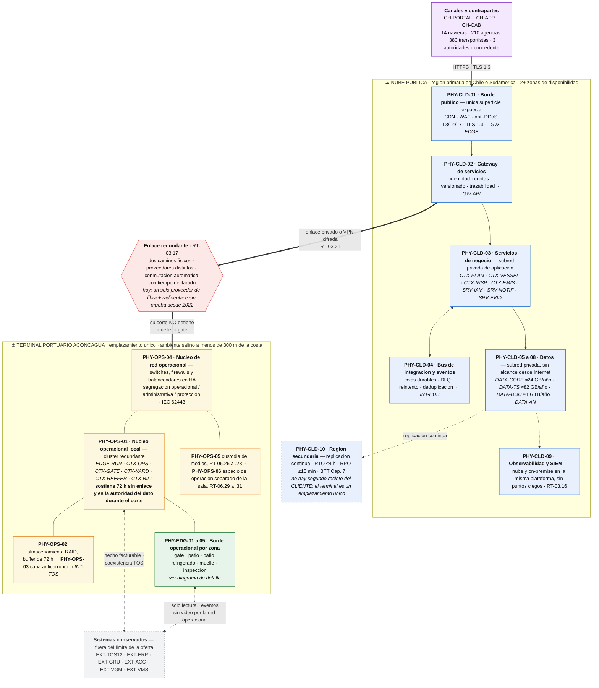
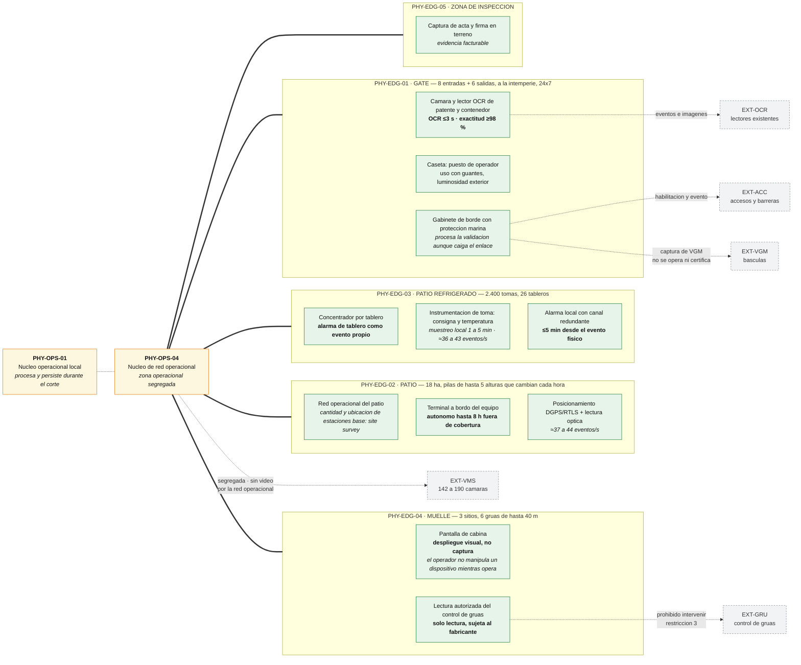

# C1 — Arquitectura física y emplazamiento

## Contrato del entregable

### Objetivo y destino

Ubicar cada componente desplegable en nube, on-premise o borde y justificarlo conforme al Artículo 16. Alimenta las secciones 4.2.1 y 4.2.2 del consolidado.

### Cumplimientos asignados

- `SD4-02`, `SD4-05`, `SD4-07`, `SD4-08`.
- T7-4.2, T7-4.5, T7-4.7 y T7-4.8.
- BTT Cap. 3 completo: `RT-03.01` a `RT-03.24`; Decisión 20; `MC-09/10/11`.
- Checklist del BTT, Cap. C, entregable N° 3: tabla de emplazamiento nube/on-premise justificada.

> *Corrección `F2-COR-001` (2026-09-05): el contrato declaraba `RT-03.01..15`. El Capítulo 3 del BTT llega a `RT-03.24` y los nueve omitidos son de este frente: `.17` enlace redundante por caminos y proveedores distintos con tiempo de conmutación declarado; `.18` gestión remota y centralizada de los dispositivos de borde, a la que `RT-08.14` remite; `.20` dimensionamiento del ancho de banda por sitio en normal y peak, con cálculo, que alimenta C4; `.21` enlace privado dedicado o VPN cifrada; `.22` acceso remoto de confianza cero con verificación de postura; `.23` red inalámbrica operacional con segmentación por tipo de dispositivo, autenticación por certificado y cobertura verificada mediante estudio de sitio; `.24` calidad de servicio y priorización del tráfico operacional. Ver `trazabilidad/DECISIONES_Y_ESCALAMIENTOS.md`.*

### Entradas obligatorias

- Maestro §§3–6, 9–10, 15, 17–19.
- A1 catálogo lógico `v0.1` para refinar el mapeo.
- A3 funciones críticas y D1 paquete `SEC-PHYS-v0.1`.
- Condiciones físicas y volumetría de Célula 2.

### Trabajo requerido

- [ ] Dibujar límite de oferta y topología híbrida completa.
- [ ] Identificar nube primaria/secundaria y al menos dos zonas de disponibilidad.
- [ ] Identificar sala, edge de gate/patio/reefer/muelle y sistemas conservados.
- [ ] Mapear cada componente lógico desplegable a uno o más nodos.
- [ ] Justificar cada ubicación por seis criterios Art. 16.
- [ ] Mostrar zonas, redes, enlaces, redundancia y protocolos.
- [ ] Comparar sala actual, nueva/reconstruida y edge mínimo+nube.
- [ ] Declarar SPOF residuales y dependencia de terceros.
- [ ] Delimitar qué queda fuera de la oferta o sujeto a levantamiento.

### Tabla de emplazamiento obligatoria

| ID físico | Componente lógico | Función | Ubicación | Latencia | Continuidad | Volumen | Regulación/seguridad | Conectividad/acoplamiento | TCO cualitativo | Justificación final | Estado |
|---|---|---|---|---|---|---|---|---|---|---|---|
| `PHY-001` | POR ASIGNAR | — | nube/on-prem/edge | — | — | — | — | — | — | — | PENDIENTE |

### Reglas del diagrama físico

- nombres de producto sí son permitidos, si están justificados;
- mostrar capacidades relevantes, redundancia, protocolos y fronteras;
- distinguir zona pública, privada, operacional, administrativa y protección;
- mostrar correspondencia con lógico mediante IDs;
- toda caja ofertada debe tener candidato T-11;
- no dibujar ubicación física inexistente ni ocultar dependencias.

### Productos obligatorios

1. Diagrama físico híbrido.
2. Tabla de emplazamiento Art. 16.
3. Matriz lógico→físico.
4. Comparación de alternativas de sala y candidato `ADR-005`.
5. Registro inicial de SPOF.

### Decisiones permitidas y escalamiento

Puede proponer topología y ubicación. Debe escalar contratos no confirmados, datos de sitio ausentes, cambios al plan de protección, infraestructura fuera del recinto no declarada o cualquier solución que reduzca las 72 h.

### Aporte T-11/ADR

Entrega a C4 el inventario de cajas físicas y su ubicación. Cada una se clasifica como fila T-11, parte interna de otra fila o elemento fuera de oferta, siempre con razón.

### Salidas hacia otros frentes

- Frente 1: restricciones físicas que cambien dependencia o flujo.
- Frente 3: nodos, zonas, exposición, administración y fronteras de confianza.

### Definición de terminado

- [ ] Todos los componentes desplegables tienen ubicación y justificación.
- [ ] La solución es realmente híbrida y multi-AZ.
- [ ] Se ven sala, borde, nube, DR, enlaces y sistemas conservados.
- [ ] Las 72 h no dependen de nube.
- [ ] No se presume que el ambiente marino desaparece.
- [ ] Físico, catálogo lógico y T-11 usan los mismos IDs.
- [ ] `TRZ_C1.md` completo.

## Contenido listo para integrar

**Versión:** `v0.5` — contenido completo, sujeto a revisión cruzada en la Puerta 2.
**Fecha:** 2026-09-05. **Destino:** consolidado 4.2.1 y 4.2.2.

### 1. Por qué esta arquitectura física no puede ser genérica

El Caso 06 impone tres hechos que, juntos, determinan la forma de la solución antes de elegir un solo producto.

**Toda la operación ocurre en un único emplazamiento.** El CP, Cap. 3 lo dice de entrada: *«aquí toda la operación ocurre en un solo emplazamiento»*. No existe un segundo recinto del CLIENTE donde alojar un sitio de respaldo. Esto decide, por sí solo, que el sitio secundario exigido por el BTT, Cap. 7 no puede ser un segundo rack del terminal: tiene que estar en la región secundaria de nube.

**La sala técnica está a menos de trescientos metros de la línea de costa.** El CP, Cap. 6 la describe: 34 m² habilitados en 2012, climatización tipo split, alimentación ininterrumpida de 25 minutos, acceso por llave, y una frase que el propio caso escribe: *«No cumple los estándares del Capítulo 6 de las Bases Técnicas Transversales»*. El `RT-07.02` del BTT exige declarar la distancia entre sitio principal y secundario **y el análisis de amenazas comunes**. Marejada, corte del acceso vial, atmósfera salina y evento ISPS son amenazas que un secundario dentro del recinto compartiría íntegramente con el principal.

**La operación de muelle y gate no puede detenerse porque se cayó un enlace hacia fuera.** Es el tercer punto de la Declaración Mandatoria del CP, Cap. 6, y el CP, Cap. 15 lo cuantifica en `RT-03.10`: 72 horas continuas de operación completa sin enlace exterior. El BTT pide un mínimo de 24 h *«o el mayor que fije el caso»*; el caso fija 72. Eso obliga a que las cinco funciones críticas —nave y movimientos, posición e inventario, gate, alarma de frío y hecho facturable— tengan cómputo y datos **en el terminal**, no en el borde entendido como pasarela.

De ahí la forma: **nube pública como plataforma principal, un núcleo operacional local capaz de sostener el terminal por sí solo durante tres días, y un borde instrumentado por zona del recinto.** No es una preferencia de estilo; es lo que queda cuando se respetan simultáneamente el Art. 16 de las BA, el `RT-03.10` del caso y la Declaración Mandatoria.

### 2. Límite de la oferta

| Dentro del límite TERABYTE | Fuera del límite, conservado e integrado | Fuera del límite, ejecuta el CLIENTE |
|---|---|---|
| plataforma en nube, núcleo operacional local, borde de gate/patio/frío/muelle, red operacional nueva, gabinetes y dispositivos de terreno, custodia de medios | ERP y emisión tributaria, control de grúas de muelle (solo lectura), control de acceso y barreras, CCTV/VMS del terminal, básculas, TOS 2012 durante la coexistencia | obra civil de la sala, canalizaciones exteriores, alimentación eléctrica del recinto, acceso vial |

La distinción importa por el CP, Cap. 11: no se construye infraestructura civil, **pero sí se especifica técnicamente para que el CLIENTE la ejecute**. Toda obra que aparezca en este entregable se entrega como especificación, no como partida ofertada.

### 3. Diagramas físicos

#### 3.1 Topología híbrida

Se lee de arriba abajo: los canales entran por un único punto expuesto en nube, la plataforma vive en subredes privadas, y el terminal cuelga de un enlace redundante cuyo corte —esto es lo que el diagrama tiene que hacer evidente— **no detiene el muelle ni el gate**. Los colores separan nube, sitio del terminal, borde operacional y sistemas conservados.

#### 3.2 Detalle del borde operacional por zona

Cada zona del recinto tiene condiciones distintas y por eso equipamiento distinto: el gate mide en segundos, el patio pierde cobertura por diseño del apilamiento, el frío alarma en minutos y la cabina no admite captura. Las cajas grises son sistemas que se conservan: se integran, no se reemplazan.

> Los diagramas distinguen zona pública, subred privada de aplicación, subred privada de datos, zona operacional del terminal, borde por zona del recinto y sistemas conservados. Las líneas punteadas son integraciones con sistemas que no ofertamos. Las fuentes están en [`diagramas/`](diagramas/).

### 4. Tabla de emplazamiento conforme al Artículo 16

El Art. 16.2 de las BA exige justificar **componente por componente** con seis criterios: latencia, criticidad operacional, volumen de datos, restricción regulatoria o de seguridad, disponibilidad de conectividad y acoplamiento físico, y costo total de propiedad. Una asignación no justificada *«será evaluada como observación grave»*. El costo se expresa cualitativamente: el Informe 1 no lleva cifras económicas.

| ID físico | Componente lógico | Ubicación | Latencia | Continuidad ante corte | Volumen | Regulación / seguridad | Acoplamiento físico | TCO cualitativo | Justificación final |
|---|---|---|---|---|---|---|---|---|---|
| `PHY-CLD-01` | `GW-EDGE` | nube, zona pública | tolera >100 ms | el portal puede esperar; el terminal no depende de él | moderado | única superficie expuesta; CDN/WAF/anti-DDoS | nulo | elástico, gestionado | La exposición pública se concentra en un solo punto administrado. Ponerlo on-premise obligaría a exponer la red del terminal a Internet, contra `RT-03.04` y la restricción 6. |
| `PHY-CLD-02` | `GW-API` | nube, subred privada | >100 ms | puede esperar | moderado | punto de identidad, cuotas y trazabilidad | nulo | gestionado | Políticas, versionado y catálogo de servicios centralizados. Los consumidores externos son 21 contrapartes; ninguna requiere latencia determinista. |
| `PHY-CLD-03` | `CTX-PLAN`, `CTX-VESSEL`, `CTX-INSP`, `CTX-EMIS`, `SRV-IAM`, `SRV-NOTIF`, `SRV-EVID` | nube, multi-AZ | 100 ms a 1 s | degradación aceptable; ver §6 | moderado | datos comerciales y personales cifrados | nulo | elasticidad estacional | Son procesos de planificación, coordinación y notificación con contraparte externa. Ninguno tiene un umbral inferior a 1 s en el CP, Cap. 15. |
| `PHY-CLD-04` | `INT-HUB` | nube, subred privada | asíncrono | cola durable; el borde acumula | alto en mensajería | contratos y versionado por contraparte | nulo | gestionado | El intercambio con navieras, autoridades, concedente y ferrocarril es asíncrono por naturaleza (EDIFACT, archivo, API). |
| `PHY-CLD-05` | `DATA-CORE` consolidado | nube, multi-AZ | consultas >100 ms | la fuente de verdad operacional durante el corte es local | ≈20–24 GB/año | cifrado en reposo con KMS | nulo | gestionado, multi-AZ | Es el consolidado y el sistema de registro fuera del corte. Durante los 72 h la autoridad pasa a `PHY-OPS-01`; ver §6. |
| `PHY-CLD-06` | `DATA-TS` histórico | nube | analítico | no crítico en corte | ≈68–82 GB/año, ≈340 GB acumulados | retención 5 años de temperatura | nulo | almacenamiento por capas | El histórico de temperatura es evidencia de cadena de frío, no dato de alarma. La alarma vive en el borde. |
| `PHY-CLD-07` | `DATA-DOC` | nube, objetos | tolera latencia | el borde retiene lo del corte | ≈1,4–1,6 TB/año de imágenes OCR | retención 12 meses con eliminación controlada | nulo | objetos con ciclo de vida | Dominan las imágenes OCR. Retenerlas localmente obligaría a dimensionar la sala para 1,6 TB/año sin necesidad operacional. |
| `PHY-CLD-08` | `DATA-AN` | nube | analítico | no crítico | derivado | indicadores del concedente | nulo | gestionado | El `RT-05.29` del caso exige consolidar los indicadores del concedente ≤1 h tras el cierre de turno; eso no compite con la operación. |
| `PHY-CLD-09` | observabilidad y SIEM | nube | asíncrono | el borde almacena y reenvía | logs 12 meses en línea + 24 en archivo | log central inalterable | nulo | gestionado | `RT-03.16` exige que el monitoreo on-premise se integre a **la misma** plataforma que la nube, sin puntos ciegos. |
| `PHY-CLD-10` | réplica de `DATA-CORE`, `DATA-DOC`, `DATA-TS` | nube, región secundaria | n/a | es el destino de la conmutación | réplica | BTT Cap. 7 | nulo | capacidad reducida en reposo | No hay segundo recinto del CLIENTE (CP, Cap. 3) y un secundario en el terminal compartiría las amenazas del principal (`RT-07.02`). |
| `PHY-OPS-01` | `EDGE-RUN` + `CTX-OPS`, `CTX-GATE`, `CTX-YARD`, `CTX-REEFER`, `CTX-BILL` | on-premise, sala | **≤1 s determinista** | **debe continuar 72 h** | alto, generado localmente | zona operacional segregada, IEC 62443 | directo, vía borde | inversión local con operación acotada | `RT-09.01` del caso exige confirmar un movimiento en ≤1 s y ver la posición en ≤30 s; `RT-03.10` exige 72 h. Ninguna de las dos cosas se resuelve con un enlace de por medio. |
| `PHY-OPS-02` | almacenamiento local | on-premise, sala | ≤1 s | buffer del corte, ≈13 GB + holgura | alto | cifrado en reposo | directo | RAID con tolerancia declarada | `RT-03.14` exige tolerar la falla de al menos un disco y declarar el nivel RAID con su justificación. Dimensionamiento en C4. |
| `PHY-OPS-03` | `INT-TOS` | on-premise, sala | ≤1 s | debe seguir durante el corte | moderado | zona operacional | directo con `EXT-TOS12` | acotado a la coexistencia | El TOS 2012 está en el terminal. Traducir y conciliar a través del enlace agregaría un punto de falla a una integración que ya es la más frágil del proyecto. |
| `PHY-OPS-04` | núcleo de red operacional | on-premise, sala | determinista | **sostiene el corte** | todo el tráfico operacional | segregación operacional / administrativa / protección | directo | equipamiento en HA | La Declaración Mandatoria exige segregar; hoy operación, terminales, cámaras y oficina comparten conmutación (CP, Cap. 6). `RT-08.03` exige HA sin punto único. |
| `PHY-OPS-05` | custodia de medios | on-premise, recinto separado | n/a | soporta el «fuera de sitio» del 3-2-1-1-0 | medios físicos | `RT-06.26` a `RT-06.28` | ninguno | recinto con condiciones ambientales | Exigencia explícita del BTT para el sitio primario, con inventario, rotación y verificación de legibilidad. |
| `PHY-OPS-06` | espacio de operación del personal | on-premise, fuera de la sala de equipos | n/a | n/a | n/a | `RT-06.29` a `RT-06.31` | ninguno | reutiliza instalaciones existentes | `RT-06.30` prohíbe que la operación habitual obligue a entrar al recinto técnico. Con TI del CLIENTE de 5 personas, el espacio se dimensiona en C4, no por defecto. |
| `PHY-EDG-01` | borde de gate | borde, 8 entradas + 6 salidas | **OCR ≤3 s; camión ≤120 s** | gate continúa sin enlace | imágenes OCR | zona primaria aduanera | directo: OCR, básculas, barreras | gabinete marino por puesto | Los umbrales del CP, Cap. 15 se miden en la barrera. El acoplamiento con báscula, barrera y lector es físico y no admite mediación remota. |
| `PHY-EDG-02` | borde de patio | borde, 18 ha | ≤1 s en confirmación | **terminal autónomo hasta 8 h fuera de cobertura** | telemetría de posición ≈37–44 ev/s | zona operacional | directo con equipos | según site survey | Las sombras de la red se mueven cada hora con las pilas (CP, Cap. 6). El diseño no promete cobertura perfecta: hace autónomo al terminal. |
| `PHY-EDG-03` | borde de patio refrigerado | borde, 26 tableros | **alarma ≤5 min** | **alarma local durante el corte** | ≈35,8–43,3 ev/s con muestreo de 1 min | continuidad de cadena de frío | directo con tomas y tableros | concentrador por tablero | El evento del 18 de febrero fue la falla de un tablero completo en turno de madrugada. La alarma no puede depender de un enlace hacia fuera del terminal. |
| `PHY-EDG-04` | borde de muelle | borde, 3 sitios | lectura periódica | opera sin enlace | bajo | **solo lectura, autorización del fabricante** | acoplamiento restringido | mínimo | La restricción 3 y la exclusión del CP, Cap. 11 prohíben intervenir el control de grúas. La cabina recibe una pantalla, no un terminal de captura: el operador no puede manipular un dispositivo mientras opera. |
| `PHY-EDG-05` | borde de zona de inspección | borde | ≤1 s | continúa | actas e imágenes | acta firmada como evidencia | directo | mínimo | La inspección debe estar disponible a la hora acordada; el acta se firma en terreno y es evidencia facturable. |

**Componentes lógicos sin nodo propio.** `CH-PORTAL` y `CH-APP` se ejecutan en el dispositivo del usuario y se sirven desde `PHY-CLD-01`; `CH-CAB` se ejecuta en la pantalla de cabina alimentada por `PHY-EDG-04`. No generan fila de emplazamiento propia y **no** generan fila de T-11 por sí mismos, sin perjuicio de las licencias que declare C2.

### 5. Matriz lógico → físico

| Componente lógico | Nodo primario | Nodo secundario | Criticidad | ¿Vive durante el corte? |
|---|---|---|---|---|
| `CH-PORTAL` | `PHY-CLD-01` | — | media | no; procedimiento manual declarado en A3 |
| `CH-APP` | dispositivo + `PHY-CLD-01` | `PHY-OPS-01` para perfiles internos | alta | sí, en modo interno cifrado |
| `CH-CAB` | `PHY-EDG-04` | — | alta | sí |
| `GW-EDGE` | `PHY-CLD-01` | — | media | no |
| `GW-API` | `PHY-CLD-02` | — | media | no |
| `CTX-OPS` | `PHY-OPS-01` | `PHY-CLD-03` | **crítica** | **sí** |
| `CTX-GATE` | `PHY-OPS-01` + `PHY-EDG-01` | `PHY-CLD-03` | **crítica** | **sí** |
| `CTX-YARD` | `PHY-OPS-01` + `PHY-EDG-02` | `PHY-CLD-03` | **crítica** | **sí** |
| `CTX-REEFER` | `PHY-OPS-01` + `PHY-EDG-03` | `PHY-CLD-03` | **crítica** | **sí** |
| `CTX-BILL` | `PHY-OPS-01` | `PHY-CLD-03` | **crítica** | **sí**, captura de hecho y evidencia |
| `CTX-PLAN` | `PHY-CLD-03` | `PHY-OPS-01` en solo lectura | alta | plan vigente sí; replanificación no |
| `CTX-VESSEL` | `PHY-CLD-03` | — | alta | operación de muelle sí; mensajería no |
| `CTX-INSP` | `PHY-CLD-03` + `PHY-EDG-05` | — | media | agenda vigente y acta sí |
| `CTX-EMIS` | `PHY-CLD-03` | `PHY-EDG-02` captura | media | captura sí; cálculo no |
| `SRV-IAM` | `PHY-CLD-03` | `PHY-OPS-01` caché de sesión | **crítica** | sí, con credenciales vigentes |
| `SRV-NOTIF` | `PHY-CLD-03` | `PHY-OPS-01` canal local | alta | alarma de frío sí, por canal local |
| `SRV-EVID` | `PHY-CLD-03` | `PHY-OPS-01` sello local | alta | sí, con sello diferido |
| `INT-HUB` | `PHY-CLD-04` | `PHY-OPS-01` cola de salida | alta | acumula, no entrega |
| `INT-TOS` | `PHY-OPS-03` | — | **crítica** | **sí** |
| `EDGE-RUN` | `PHY-OPS-01` | — | **crítica** | **sí, es el que lo sostiene** |
| `DATA-CORE` | `PHY-CLD-05` | `PHY-OPS-01`/`02` | **crítica** | **sí, autoridad local durante el corte** |
| `DATA-TS` | `PHY-CLD-06` | `PHY-OPS-02` ventana caliente | alta | sí, ventana local |
| `DATA-DOC` | `PHY-CLD-07` | `PHY-OPS-02` buffer | media | retiene y sincroniza |
| `DATA-AN` | `PHY-CLD-08` | — | media | no |

Las trece filas marcadas como críticas o que viven durante el corte son la traducción física de las cinco funciones del Maestro §9.1. `SRV-IAM` aparece con caché local porque una autenticación que dependa de la nube convertiría el corte de enlace en un corte de operación.

### 6. Autoridad del dato durante la desconexión

Es la consecuencia física de la regla negativa 8 del Maestro y hay que decirla explícitamente, porque decide dónde va el almacenamiento y no solo el cómputo:

| Fase | Autoridad de `DATA-CORE` | Qué ocurre con la nube |
|---|---|---|
| operación normal | nube, con réplica local caliente | sistema de registro |
| corte del enlace | **núcleo local `PHY-OPS-01`** | queda atrás; no recibe |
| reconexión | local, hasta cerrar la reconciliación | recibe el diferencial |
| conciliación cerrada | vuelve a nube | sistema de registro |

El traspaso debe ser explícito y auditado. La sincronización objetivo es ≤90 min tras 72 h de corte (CP, Cap. 15, `RT-03.13`, materia «sincronización tras la reconexión» — ver la colisión de código registrada en `F2-ESC-006`). El diseño del mecanismo pertenece a A3; aquí se declara únicamente su consecuencia física: el buffer y la capacidad de cómputo local se dimensionan para el peak coincidente durante 72 h, no para el promedio. Dimensionamiento en C4.

### 7. Alternativas de sala técnica — insumo para `ADR-005`

La Decisión N° 20 de Célula 2 dejó el destino de la sala como ADR con tres alternativas. Se evalúan contra los requisitos que el BTT hace obligatorios cuando existe cómputo sustantivo en el sitio del CLIENTE, que es el caso.

| Criterio | A. Endurecer la sala actual | B. Sala nueva dentro del terminal | C. Borde mínimo + nube |
|---|---|---|---|
| `RT-06.01` uso exclusivo, aislado, acceso independiente | dudoso: está dentro del edificio administrativo | cumple por diseño | no aplica en la misma escala |
| `RT-06.29`/`.30` espacio de operación **separado** de la sala de equipos | difícil en 34 m² | cumple por diseño | cumple: la operación es remota |
| `RT-06.32` rutas físicas distintas, **ingreso al edificio por puntos separados** | **posible criterio de descarte**; depende del edificio, hoy con un solo proveedor de fibra | cumple si se especifica en la obra | sigue exigiendo dos caminos hacia la nube |
| UPS ≥30 min y generación ≥24 h | hoy 25 min; exige reemplazo del respaldo | cumple por diseño | menor carga, pero el borde igual requiere respaldo |
| ambiente marino a <300 m de la costa | **no desaparece**; regla negativa 11 | **no desaparece** si sigue en el recinto | se reduce la superficie expuesta, no se elimina |
| 72 h de las cinco funciones críticas | cumple si hay cómputo local suficiente | cumple | **el riesgo está aquí**: «mínimo» no puede bajar de las cinco funciones |
| plazo: todo lo invasivo listo el **14-dic-2027** | menor obra, plazo más holgado | obra civil dentro de ~10 meses útiles | menor obra, pero más instrumentación de borde |
| congelamiento 15-dic a 30-abr y prohibición de intervenir con nave o 4 h antes | favorece la obra acotada | riesgo de calendario alto | favorece |
| operabilidad con TI de 5 personas | media | media | **la mejor**: menos superficie que administrar |

**Observaciones para quien redacte el ADR.** Primero, `RT-06.32` puede resolver la comparación antes que cualquier criterio de costo: si el edificio administrativo no admite dos ingresos físicos separados de comunicaciones, la alternativa A no cumple una obligación del BTT y queda descartada por norma, no por opinión. Ese dato **no está en el caso** y debe levantarse; queda registrado como `F2-ESC-008`. Segundo, la alternativa C no puede interpretarse como «poner lo mínimo en el terminal»: el piso de lo local está fijado por las cinco funciones críticas y por los umbrales de ≤1 s y ≤5 min, de modo que C se distingue de B por el tamaño del recinto, no por la existencia de cómputo local. Tercero, ninguna alternativa puede presumir que mover la sala elimina el ambiente marino.

**Recomendación preliminar de este frente, no vinculante:** una variante acotada de C —recinto técnico nuevo y pequeño, dimensionado estrictamente a las cinco funciones críticas y a su buffer de 72 h, con el resto de la plataforma en nube y el secundario en la región secundaria— es la que mejor concilia el plazo del 14-dic-2027, el congelamiento estacional y un área TI de cinco personas. Se somete a `ADR-005` con las tres alternativas desarrolladas.

### 8. Registro inicial de puntos únicos de falla

El Maestro, regla negativa 14, prohíbe ocultarlos. Los cinco primeros son condiciones **preexistentes** del CP, Cap. 6, no defectos de nuestro diseño; el entregable es declarar cuáles corregimos, cuáles quedan y quién los acepta.

| ID | Punto único de falla | Origen | Estado tras el diseño propuesto | Tratamiento |
|---|---|---|---|---|
| `SPOF-01` | fibra de un solo proveedor hacia el exterior | CP, Cap. 6 | **corregido** | `RT-03.17`: segundo camino por proveedor distinto y conmutación automática con tiempo declarado; C3 |
| `SPOF-02` | radioenlace de respaldo sin prueba de conmutación real desde 2022 | CP, Cap. 6 | **corregido** | prueba de corte real como criterio de aceptación; C3 |
| `SPOF-03` | operación, administración y CCTV sobre la misma conmutación | CP, Cap. 6 | **corregido** | segregación IEC 62443 con conductos controlados; Decisión 19; C3 y D1 |
| `SPOF-04` | 26 tableros reefer sin instrumentación remota | CP, Cap. 6 y 7.2 | **corregido** | `PHY-EDG-03`, concentrador por tablero; alarma de tablero como evento propio |
| `SPOF-05` | generación de respaldo del patio refrigerado nunca verificada a carga total de temporada | CP, Cap. 6 | **queda abierto** | fuera del límite de oferta; se especifica la prueba y se escala al CLIENTE |
| `SPOF-06` | emplazamiento único: todo el terminal comparte sitio, acceso vial y amenazas | CP, Cap. 3 | **mitigado, no eliminado** | secundario en región secundaria de nube; `RT-07.02` con análisis de amenazas comunes |
| `SPOF-07` | sala técnica única en el terminal durante el corte de 72 h | diseño | **residual aceptado** | redundancia interna de equipos (`RT-03.14`, `RT-08.03/04`); un segundo recinto local no es viable ni útil frente a amenazas comunes |
| `SPOF-08` | `EXT-TOS12` como fuente de verdad durante la coexistencia | Decisión 1 | **acotado en el tiempo** | puerta de viabilidad en H2/mes 4; A3 |
| `SPOF-09` | proveedor de nube único | Art. 16 | **residual declarado** | `RT-03.07`: estrategia de reversibilidad y portabilidad por componente; C2 |
| `SPOF-10` | red inalámbrica de patio con sombras móviles | CP, Cap. 6 | **mitigado por diseño** | el terminal de patio es autónomo hasta 8 h fuera de cobertura; la red no se declara perfecta; site survey pendiente (`F2-ESC-001`) |

### 9. Lo que este entregable deja sujeto a levantamiento

| ID | Qué falta | Efecto si no se levanta |
|---|---|---|
| `F2-ESC-001` | site survey del patio con carga real | cantidad y ubicación de estaciones base quedan como rango |
| `F2-ESC-002` | aprobación de la autoridad para la segregación de red | no se interviene la red de protección |
| `F2-ESC-008` | ingresos físicos de comunicaciones disponibles en el edificio administrativo | `ADR-005` no puede cerrarse por norma; se decide por criterios secundarios |
| `ESC-06` | contratos e interfaces de TOS, VMS, autoridades, ferrocarril, radio, grúas y periféricos | los nodos de borde se especifican por clase, no por producto |

### 10. Definición de terminado — estado

- [x] Todos los componentes desplegables tienen ubicación y justificación por los seis criterios.
- [x] La solución es híbrida y multi-AZ, con región primaria y secundaria declaradas.
- [x] Se ven sala, borde, nube, DR, enlaces y sistemas conservados.
- [x] Las 72 h no dependen de nube: la autoridad del dato pasa al núcleo local.
- [x] No se presume que el ambiente marino desaparece.
- [x] Físico, catálogo lógico y T-11 usan los mismos IDs.
- [ ] `TRZ_C1.md` completo — en curso.
- [ ] Revisión cruzada con A1 `v0.1` y D1 `SEC-PHYS-v0.1` — Puerta 1.

## Trazabilidad

Ver [`trazabilidad/TRZ_C1.md`](trazabilidad/TRZ_C1.md).

