# A-01 — Modelo conceptual de datos

**Caso:** 06 Portuaria — TERABYTE
**Subdocumento:** 5 — Modelo y gestión de datos
**Célula:** 4 (V. Guzmán / M. Reyes)
**Destino en el documento:** § 5.2 (dominios y entidades) y § 5.14 (modelo conceptual y diccionario)
**Fecha:** 6 de septiembre de 2026
**Estado:** completado — sujeto a los cuatro vacíos declarados en la sección 9

---

## 0. Qué es y qué no es este entregable

Este documento entrega el **modelo conceptual de datos** exigido por el checklist oficial del Subdocumento 5 y por `BTT, Cap. 5, RT-05.01 — modelo de datos documentado`, junto con `BA, Art. 23 — modelo normalizado donde corresponda, con linaje y propietario de cada dominio`.

**Qué es:**

- el catálogo de dominios, entidades y eventos de negocio con su definición, su propietario y su clase de dato;
- once diagramas en código Mermaid, listos para renderizar y para insertar en el documento LaTeX;
- las invariantes del modelo, derivadas de las reglas de negocio vigentes de Célula 2;
- la representación explícita de la autoridad `dominio × zona × fase`, que es lo que distingue a este modelo del de un terminal cualquiera.

**Qué no es:**

- **no es el diccionario de datos** (pendiente A-02): aquí se declaran entidades y su identificador natural, no el tipo, dominio de valores y obligatoriedad de cada atributo. Los atributos que aparecen en los diagramas son los que la relación necesita para entenderse, no la lista completa;
- **no es el modelo lógico ni físico**: no hay tablas, índices, claves foráneas ni motor. Eso pertenece al § 5.4 y depende de decisiones de Célula 3 que aún no existen;
- **no fija cardinalidades contractuales**: las cardinalidades declaradas son las que las reglas de negocio vigentes sostienen; donde el caso no las define, se declara el supuesto.

**Regla aplicada en todo el documento:** ninguna entidad, atributo ni relación se incorpora sin que la origine un requerimiento funcional vigente, una regla de negocio, una decisión de Célula 2 o un requisito de las bases. Donde el respaldo no existe, el elemento aparece marcado como vacío en la sección 9 y **no** se completa por criterio propio.

---

## 1. Convenciones de modelado

### 1.1 Identificadores

Se usan identificadores propios y estables de Célula 4, porque los identificadores definitivos de contextos lógicos los produce Célula 3 y todavía no existen:

| Prefijo | Significado | Ejemplo |
|---|---|---|
| `DOM-` | dominio de información | `DOM-OPS` |
| `ENT-` | entidad conceptual | `ENT-OPS-02` |
| `EVT-` | evento de negocio | `EVT-PAT-01` |
| `INV-` | invariante del modelo | `INV-05` |

La tabla de equivalencia con los identificadores de Célula 3 se mantiene en el Anexo H del documento LaTeX y se completa cuando publiquen su catálogo lógico. **No es un bloqueo**: el mapeo es de una columna.

### 1.2 Criterio de qué es entidad, qué es atributo y qué es evento

- Es **entidad** aquello que tiene identidad propia, ciclo de vida y del que se puede predicar historia: un contenedor, una visita, una toma refrigerada.
- Es **atributo** aquello que solo tiene sentido dentro de su entidad y no se consulta por sí mismo: la tara de un contenedor, la consigna de temperatura de una conexión.
- Es **evento de negocio** un hecho ocurrido, inmutable, con instante propio, que otros dominios consumen: un movimiento registrado, una posición actualizada, una alarma generada.

El criterio importa porque `CP, Cap. 10, restricción no negociable N.º 14` y `CP, Cap. 18, criterios 14 y 20` obligan a que los indicadores del concedente y los hechos facturables **se produzcan desde eventos y no se reconstruyan**. Un modelo que registre solo estados actuales, sin eventos, no puede cumplir esa exigencia.

### 1.3 Nombres de negocio

Los nombres de las entidades son nombres de negocio del terminal, no términos técnicos, y **deben ser idénticos** a los que use el modelo conceptual del Subdocumento 4. La convención acordada es: `Contenedor` para el maestro del activo físico; `VisitaContenedor` para cada estadía operacional —se conserva `VISITA` como identificador físico estable en diagramas y diccionario—; y `Recalada`/`VisitaNave` para la estadía de una nave. El modelo de alto nivel pertenece al Subdocumento 4 y el modelo detallado con diccionario a este Subdocumento 5.

### 1.4 Clases de dato usadas

`operacional` · `maestro` · `personal` · `comercial sensible` · `sensible por seguridad de la carga` · `evidencia` · `telemetría` · `auditoría`

La clase **sensible por seguridad de la carga** no es una invención: `CP, Cap. 15, RT-16.09` califica expresamente la consulta de la ubicación de un contenedor determinado como información sensible desde el punto de vista de la seguridad de la carga.

---

## 2. Diagrama D-01 — Mapa de dominios

Los diez dominios de información, los sistemas conservados que no se reemplazan y las contrapartes externas. Las flechas indican **dependencia de datos**, no llamadas ni despliegue.

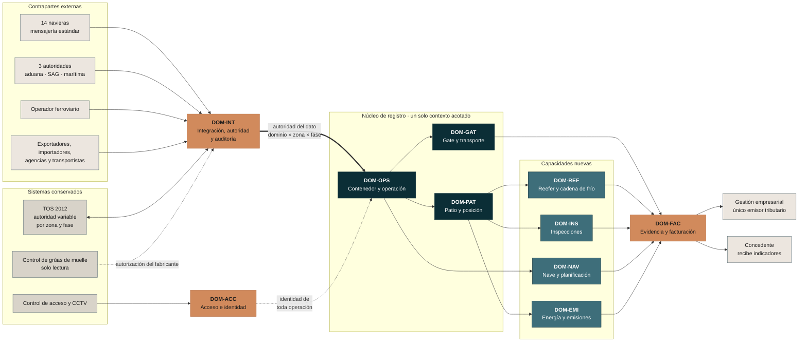

**Lectura obligatoria del diagrama.** El núcleo de registro —contenedor, patio y gate— es **un solo contexto acotado** y se sustituye junto, no por partes: el gate crea el contenedor en el inventario y la salida lo elimina, mientras la posición y los movimientos lo modifican; separarlos generaría dos fuentes de verdad sobre el mismo objeto, que `BA, Art. 17.2` prohíbe expresamente. Lo que se escalona es el **despliegue territorial por zona**, no la función.

---

## 3. Diagrama D-02 — Núcleo: contenedor, visita, movimiento y posición

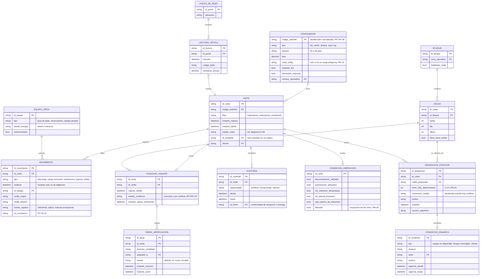

**Decisiones de modelado que conviene defender en la presentación:**

1. **`CONTENEDOR` es el maestro y `VISITA`/`VisitaContenedor` es el agregado operacional.** El mismo contenedor físico vuelve al terminal muchas veces; los días de almacenaje, los hechos facturables y la estadía se cuentan por visita, no por el maestro. `RN-04` cuenta días desde el día siguiente a la descarga o al ingreso a patio, lo que solo tiene sentido sobre una estadía concreta.
2. **`POSICION_VIGENTE` lleva `estado_confianza` como atributo de primera clase**, no como un flag derivado. `RF-PAT-03` obliga a que el 100 % de los contenedores del inventario tenga uno de los dos estados —«conocida» o «por verificar»— y a que sea consultable.
3. **`MOVIMIENTO` declara su `fuente_registro`.** `RF-PAT-05` y `RF-PAT-12` exigen registrar el movimiento desde la telemetría del equipo sin acción del operador. Saber si un movimiento entró por telemetría, por lectura óptica o por la vía manual de excepción es lo que permite auditar el cumplimiento de esa exigencia.
4. **`ASIGNACION_POSICION` conserva el nivel de `RN-01` que la determinó y la restricción que cedió.** Es criterio de aceptación explícito de `RF-PAT-06`: una asignación sin su regla trazada no es defendible ante el CLIENTE.

---

## 4. Diagrama D-03 — Gate, cita y transporte terrestre

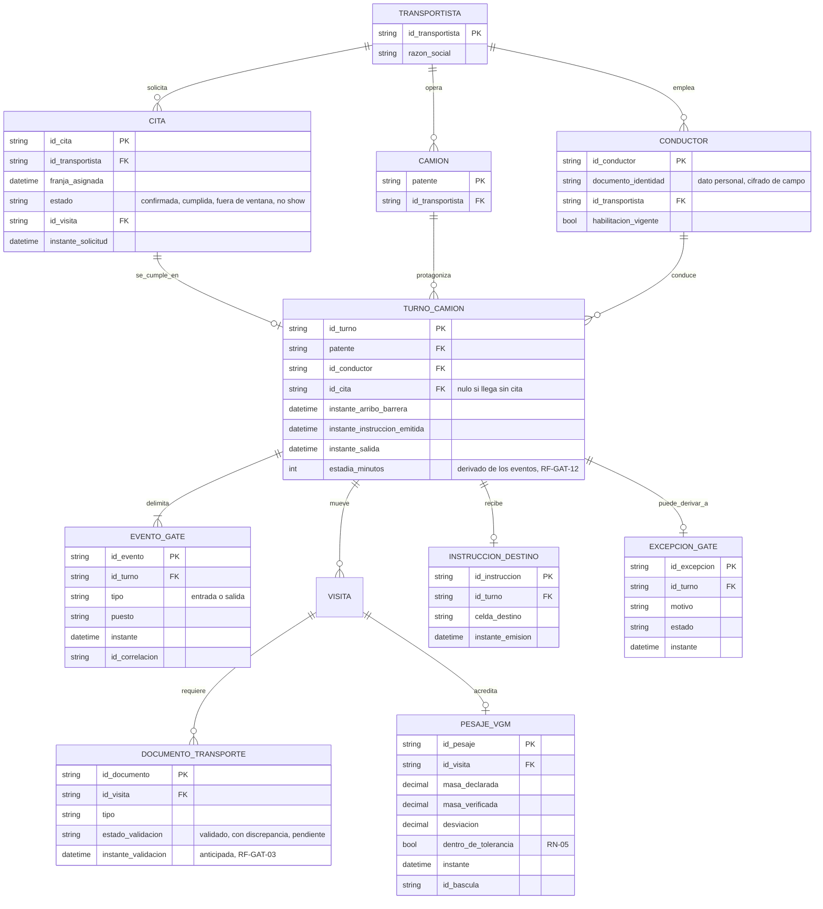

**Nota sobre `TURNO_CAMION`.** Es la entidad que hace medible el criterio de aceptación N.º 1 del caso —la estadía del camión contra el umbral comprometido con el concedente—. Los tres instantes que la componen son eventos de barrera y de emisión de instrucción; la estadía es **derivada**, nunca capturada a mano. Es la aplicación directa de la prohibición de reconstruir indicadores.

---

## 5. Diagrama D-04 — Reefer y cadena de frío

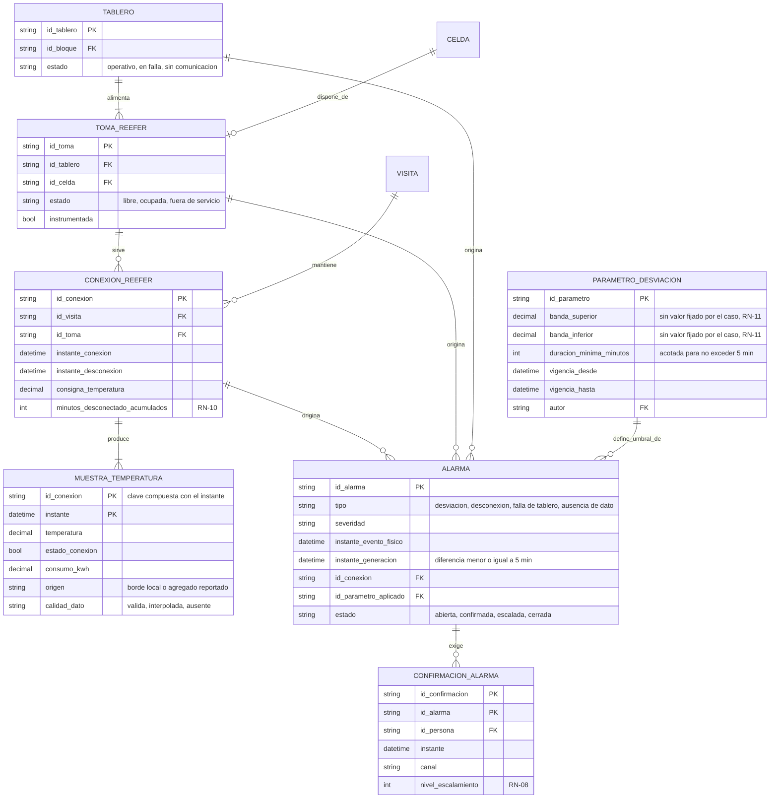

**Tres decisiones de modelado con respaldo directo:**

1. **`MUESTRA_TEMPERATURA` distingue `origen`** entre el muestreo local de alta resolución (1 a 5 minutos) y el agregado reportado al núcleo (5 a 15 minutos), conforme al modelo de dos capas de la Decisión N.º 8. Es la distinción que sostiene la retención diferenciada del § 5.12: la telemetría granular vive 2 años en línea y después se agrega.
2. **`PARAMETRO_DESVIACION` es una entidad versionada, no una constante.** `RN-11` define banda y duración **sin fijar valores numéricos**, porque el caso no los entrega, y prohíbe una parametrización que haga inalcanzable el plazo de alarma de 5 minutos. Cada alarma guarda qué versión del parámetro la disparó (`id_parametro_aplicado`), o la evidencia de cadena de frío no es defendible ante un tercero.
3. **`ALARMA` guarda dos instantes distintos:** el del evento físico y el de la generación. Sin los dos no se puede demostrar el umbral de `CP, Cap. 15, RT-05.29` —5 minutos desde el evento físico—, que es el que separa esta solución del evento del 18 de febrero.

---

## 6. Diagrama D-05 — Nave, planificación y mensajería

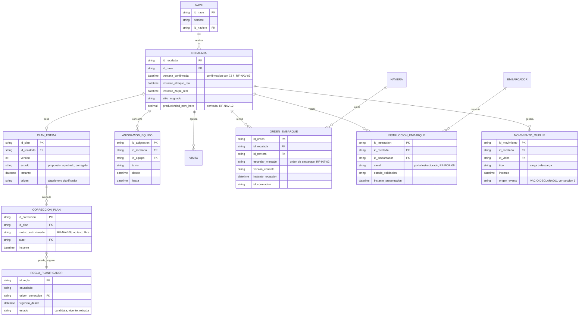

**El punto crítico de este diagrama.** `INSTRUCCION_EMBARQUE` y `ORDEN_EMBARQUE` son entidades **distintas**, con propietario, canal y contrato distintos. Confundirlas fue exactamente el error que la tercera ronda de corrección de Célula 2 detectó: el 41 % de documentación redigitada corresponde **íntegro** al flujo del embarcador o su agencia hacia el terminal, no al de naviera hacia terminal. Un modelo que las funda en una sola entidad hace que el indicador de redigitación no se pueda medir.

**`REGLA_PLANIFICADOR` es la entidad que responde al criterio de aceptación N.º 22 del caso** —que el planificador se jubile en 2028 y el terminal siga planificando igual o mejor—. El conocimiento tácito no se captura pidiéndole al planificador que lo escriba: se deriva del motivo estructurado de cada corrección que hace al plan propuesto.

---

## 7. Diagrama D-06 — Evidencia facturable, inspecciones y emisiones

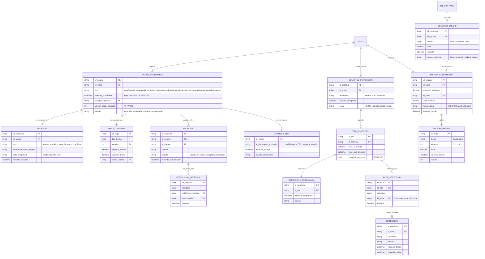

**Por qué `EVIDENCIA` y `HECHO_FACTURABLE` son entidades separadas.** No es prolijidad: son objetos con reglas de mutabilidad **opuestas**. La evidencia es inmutable y ningún perfil, incluido el administrador de la plataforma, puede modificarla (`BTT, Cap. 16, RT-16.07`). El hecho facturable sí admite corrección, pero únicamente por compensación y con auditoría de valores anteriores y posteriores. Fundirlos en una sola entidad haría imposible cumplir las dos exigencias a la vez.

**Por qué `REGLA_TARIFARIA` se versiona y el hecho guarda la versión aplicada.** Criterio de aceptación de `RF-FAC-02`: se modifica la versión de una regla y los hechos anteriores conservan la versión con que fueron calculados. Sin esa relación, una objeción de facturación sobre un hecho de hace ocho meses no se puede defender.

---

## 8. Diagrama D-07 — Acceso, identidad y nombrada

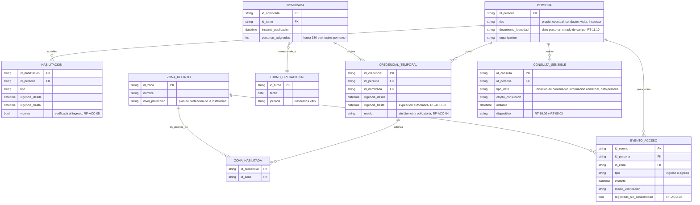

**`CONSULTA_SENSIBLE` no es una tabla de log técnico: es una entidad del modelo de negocio.** `CP, Cap. 15, RT-16.09` obliga a registrar el acceso a la información comercial de clientes, a la ubicación y contenido declarado de contenedores y a los datos personales, y califica expresamente la consulta de la ubicación de un contenedor como sensible por seguridad de la carga. Modelarla como entidad, y no como un efecto colateral de la infraestructura, es lo que permite responder «quién preguntó dónde estaba ese contenedor y cuándo» durante todo el plazo de retención.

---

## 9. Diagrama D-08 — Integración, autoridad del dato y auditoría

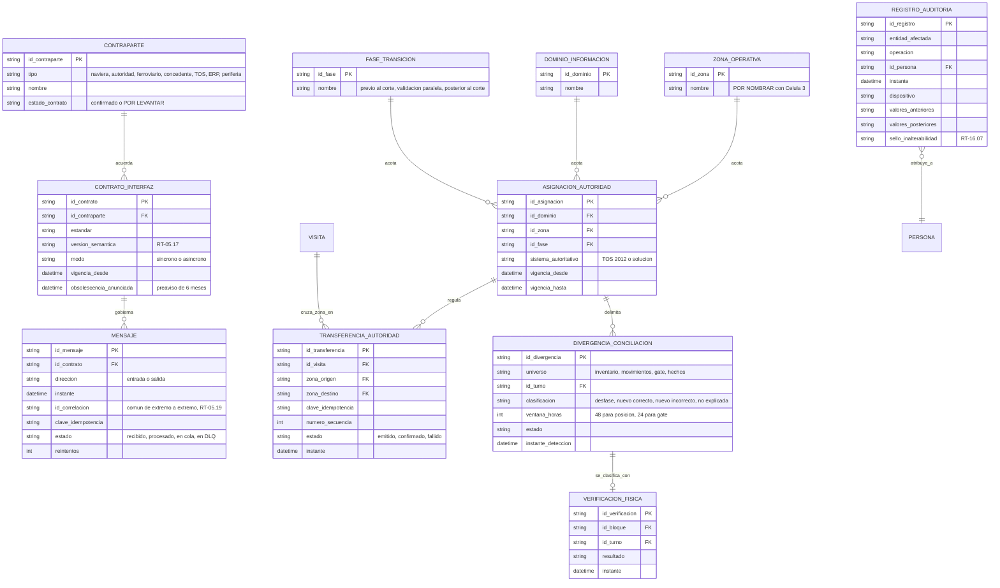

**Este es el diagrama que distingue esta propuesta.** La autoridad del dato **no es una regla escrita en un procedimiento: es una entidad del modelo** con vigencia, y la transferencia entre zonas es un objeto con clave de idempotencia, número de secuencia y estado. Es la única forma de sostener la exigencia de que nunca dos sistemas acepten escrituras autoritativas sobre el mismo contenedor y dominio, y de que un fallo parcial mantenga la autoridad anterior en vez de dejarla indefinida.

**`DIVERGENCIA_CONCILIACION` incorpora la regla direccional.** Cada divergencia se clasifica contra verificación física, y cuando el sistema nuevo resulta correcto **no computa** contra el umbral: se registra como evidencia de mejora. Sin esta clasificación en el modelo, la marcha blanca penalizaría a la solución precisamente por ser más exacta que el sistema al que reemplaza.

---

## 10. Diagrama D-09 — Ciclo de vida de la visita del contenedor

El ciclo de vida es lo que convierte el modelo estático en un modelo de negocio. Los estados están tomados de los requerimientos vigentes, no inventados.

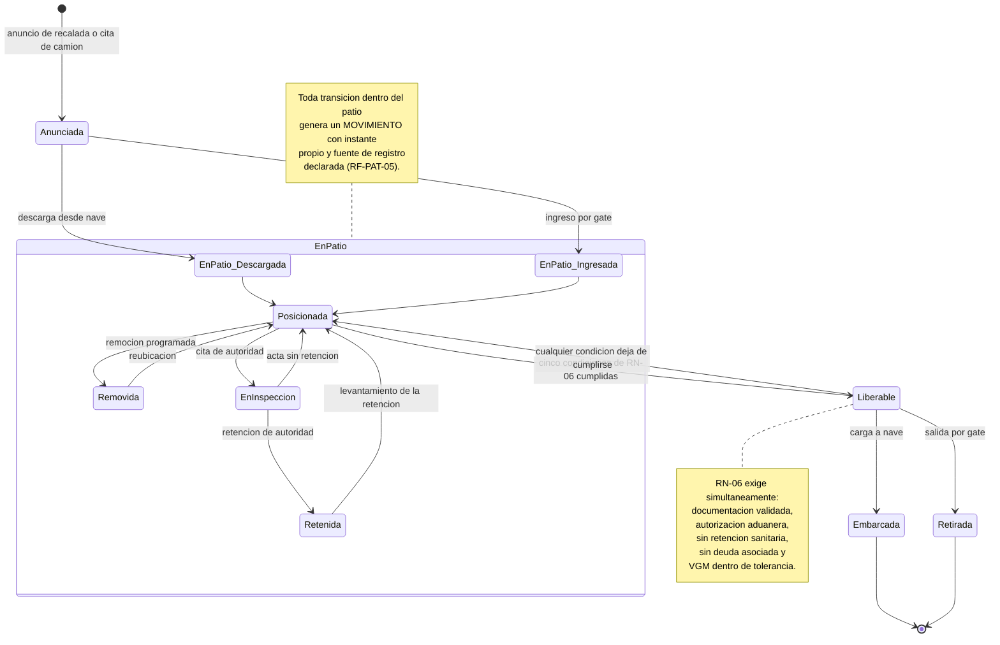

**Regla que el diagrama impone al modelo:** `Liberable` no es un estado que alguien marca a mano. Es la conjunción evaluada de las cinco condiciones de `RN-06`, y por eso `CONDICION_LIBERACION` existe como entidad con cinco banderas y no como un simple campo booleano en `VISITA`. Cuando una condición deja de cumplirse —una retención sobreviniente, una deuda—, el contenedor **vuelve** a `Posicionada` sin intervención humana.

---

## 11. Diagrama D-10 — Estado de confianza de la posición

Este es el ciclo que responde al criterio de aceptación N.º 9 del caso: que la posición registrada coincida con la real y no haya búsquedas físicas.

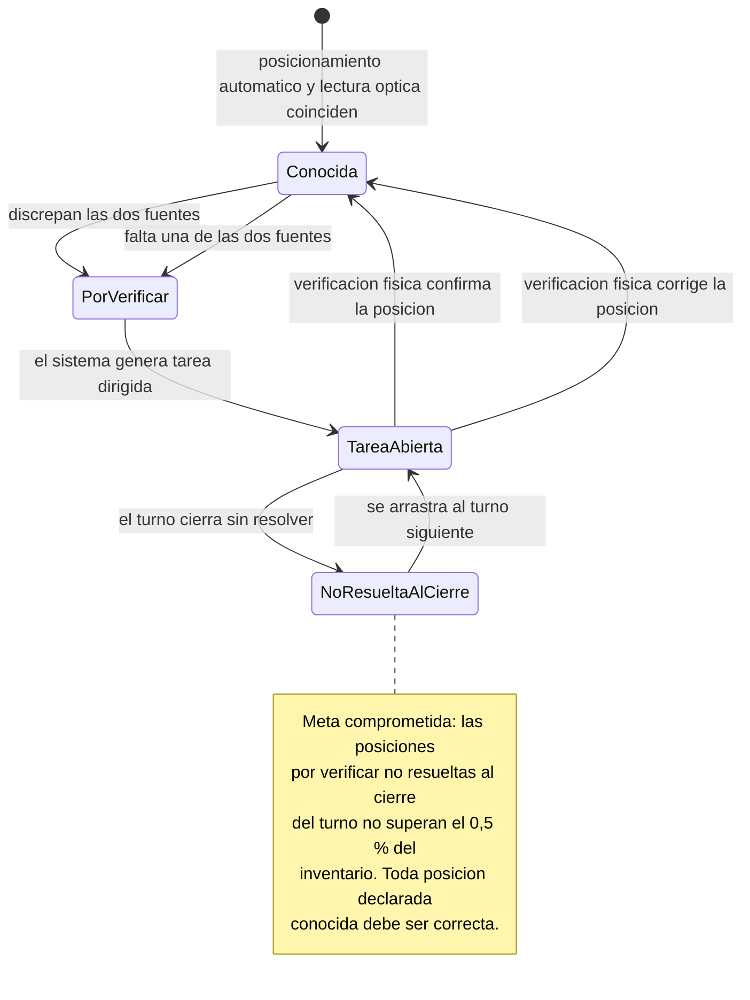

**Por qué importa la distinción.** El indicador comprometido no es «0,5 % de error». Es que **toda posición declarada conocida sea correcta**, y que el residual de 0,5 % aplique únicamente a las posiciones explícitamente marcadas «por verificar» que no se resolvieron al cierre del turno. Un modelo que use un solo campo de posición, sin estado de confianza, no puede expresar esa diferencia y convierte una posición dudosa en una posición falsa.

---

## 12. Diagrama D-11 — Del evento operacional al indicador y al hecho facturable

Este diagrama sostiene la separación entre almacenamiento transaccional, temporal y analítico del § 5.6, y la prohibición de reconstruir indicadores.

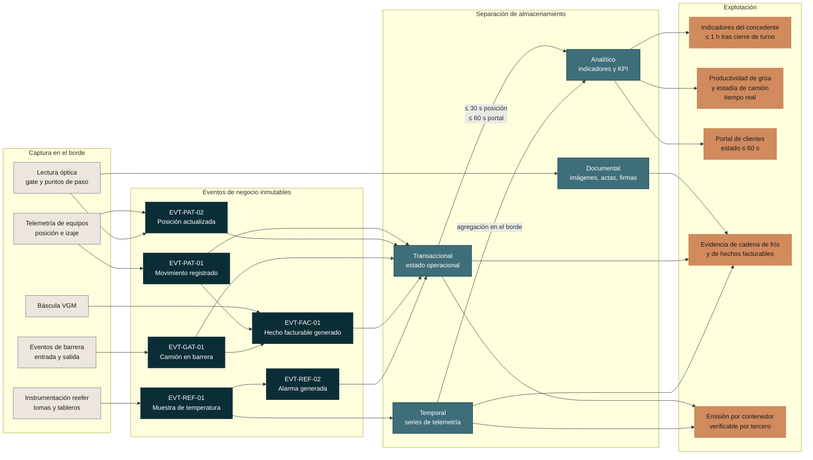

**Lo que el diagrama demuestra:** ningún indicador y ningún hecho facturable se origina en una planilla, un reporte de turno o una consolidación manual. Todos descienden de un evento capturado en el borde con instante propio. Ese es el requisito de `CP, Cap. 10, restricción N.º 14` y el criterio de aceptación N.º 20, y es también lo que hace posible la profundización desde el indicador hasta la transacción de origen que exige `BTT, Cap. 5, RT-05.26`.

---

## 13. Catálogo de entidades

Cuarenta y seis entidades en diez dominios. La columna «origen» cita el requerimiento, la regla o el requisito que la hace existir; ninguna entidad aparece sin él.

### 13.1 DOM-OPS — Contenedor y operación

| ID | Entidad | Identificador natural | Clase de dato | Retención | Origen |
|---|---|---|---|---|---|
| `ENT-OPS-01` | Contenedor | código ISO 6346 | maestro | mientras opere | `RF-INT-08` · `RT-05.23` |
| `ENT-OPS-02` | Visita | id de visita | operacional | 10 años | `RN-04` · `RF-GAT-11` |
| `ENT-OPS-03` | Movimiento | id de movimiento | operacional | 10 años | `RF-PAT-05` · `RF-PAT-12` · `RT-05.10` |
| `ENT-OPS-04` | Custodia | id de custodia | evidencia | 6 años | `RF-FIR-01` · `RT-16.14` |
| `ENT-OPS-05` | Condición de liberación | id de visita | operacional | 10 años | `RN-06` |

### 13.2 DOM-PAT — Patio y posición

| ID | Entidad | Identificador natural | Clase de dato | Retención | Origen |
|---|---|---|---|---|---|
| `ENT-PAT-01` | Bloque | id de bloque | maestro | mientras exista | `RN-02` · `CP, Cap. 3` |
| `ENT-PAT-02` | Celda | id de celda | maestro | mientras exista | `RF-PAT-06` |
| `ENT-PAT-03` | Posición vigente | id de visita | **sensible por seguridad de la carga** | 10 años | `RF-PAT-03` · `RT-16.09` |
| `ENT-PAT-04` | Asignación de posición | id de asignación | operacional | 10 años | `RF-PAT-06` · `RN-01` |
| `ENT-PAT-05` | Condición dinámica | id de condición | operacional | 10 años | `RF-PAT-07` · Decisión N.º 5 |
| `ENT-PAT-06` | Tarea de verificación | id de tarea | operacional | 10 años | `RF-PAT-04` |
| `ENT-PAT-07` | Equipo de patio | id de equipo | maestro | mientras exista | `RF-PAT-12` · `RF-TRA-01` |
| `ENT-PAT-08` | Punto de paso | id de punto | maestro | mientras exista | `RF-PAT-02` |
| `ENT-PAT-09` | Lectura óptica | id de lectura | evidencia · imagen | **12 meses** | `RF-GAT-05` · `RT-05.10` |

### 13.3 DOM-GAT — Gate y transporte terrestre

| ID | Entidad | Identificador natural | Clase de dato | Retención | Origen |
|---|---|---|---|---|---|
| `ENT-GAT-01` | Transportista | id de transportista | maestro | mientras opere | `CP, Cap. 14.1` |
| `ENT-GAT-02` | Camión | patente | maestro | mientras opere | `RF-GAT-06` |
| `ENT-GAT-03` | Conductor | id de conductor | **personal** | 5 años | `RF-GAT-07` · `RT-11.10` |
| `ENT-GAT-04` | Cita | id de cita | operacional | 10 años | `RF-GAT-01` · `RN-07` |
| `ENT-GAT-05` | Turno de camión | id de turno | operacional | 10 años | `RF-GAT-12` · criterio 1 del caso |
| `ENT-GAT-06` | Evento de gate | id de evento | operacional | 10 años | `RF-GAT-11` |
| `ENT-GAT-07` | Documento de transporte | id de documento | operacional | 6 años | `RF-GAT-03` |
| `ENT-GAT-08` | Pesaje VGM | id de pesaje | evidencia | **5 años** | `RF-GAT-08` · `RN-05` · `RT-05.10` |
| `ENT-GAT-09` | Instrucción de destino | id de instrucción | operacional | 10 años | `RF-GAT-10` |
| `ENT-GAT-10` | Excepción de gate | id de excepción | operacional | 10 años | `RF-GAT-04` |

### 13.4 DOM-REF — Reefer y cadena de frío

| ID | Entidad | Identificador natural | Clase de dato | Retención | Origen |
|---|---|---|---|---|---|
| `ENT-REF-01` | Tablero | id de tablero | maestro | mientras exista | `RF-REF-06` |
| `ENT-REF-02` | Toma refrigerada | id de toma | maestro | mientras exista | `RF-REF-05` |
| `ENT-REF-03` | Conexión refrigerada | id de conexión | operacional | 6 años (hecho facturable) | `RF-REF-13` · `RN-10` |
| `ENT-REF-04` | Muestra de temperatura | conexión + instante | **telemetría** | **5 años** la serie; 2 años en línea la telemetría granular | `RF-REF-11` · `RNF-CUM-08` · `RT-05.10` |
| `ENT-REF-05` | Parámetro de desviación | id de parámetro | operacional versionado | 5 años | `RN-11` |
| `ENT-REF-06` | Alarma | id de alarma | operacional | 5 años | `RF-REF-04` a `RF-REF-07` |
| `ENT-REF-07` | Confirmación de alarma | alarma + persona | evidencia | 5 años | `RF-REF-10` · `RN-08` |

### 13.5 DOM-NAV — Nave y planificación

| ID | Entidad | Identificador natural | Clase de dato | Retención | Origen |
|---|---|---|---|---|---|
| `ENT-NAV-01` | Nave | id de nave | maestro | mientras opere | `RF-NAV-01` |
| `ENT-NAV-02` | Recalada | id de recalada | operacional | 10 años | `RF-NAV-03` · `RF-NAV-12` |
| `ENT-NAV-03` | Plan de estiba y de patio | id de plan + versión | operacional | 10 años | `RF-NAV-06` · `RF-NAV-07` |
| `ENT-NAV-04` | Corrección de plan | id de corrección | operacional | 10 años | `RF-NAV-08` |
| `ENT-NAV-05` | Regla del planificador | id de regla | **conocimiento capturado** | permanente | `RF-NAV-09` · criterio 22 del caso |
| `ENT-NAV-06` | Asignación de equipo | id de asignación | operacional | 10 años | `RF-NAV-02` |
| `ENT-NAV-07` | Orden de embarque | id de orden | operacional | 6 años | `RF-INT-02` |
| `ENT-NAV-08` | Instrucción de embarque | id de instrucción | operacional | 6 años | `RF-POR-09` |
| `ENT-NAV-09` | Movimiento de muelle | id de movimiento | operacional | 10 años | `RF-NAV-12` · **vacío V-01** |

### 13.6 DOM-INS — Inspecciones

| ID | Entidad | Identificador natural | Clase de dato | Retención | Origen |
|---|---|---|---|---|---|
| `ENT-INS-01` | Solicitud de inspección | id de solicitud | operacional | 6 años | `RF-INS-01` |
| `ENT-INS-02` | Cita de inspección | id de cita | operacional | 6 años | `RF-INS-02` · `RF-INS-07` |
| `ENT-INS-03` | Remoción programada | id de remoción | operacional | 10 años | `RF-INS-03` |
| `ENT-INS-04` | Acta de inspección | id de acta | evidencia firmada | 6 años | `RF-INS-06` · `RT-16.14` |
| `ENT-INS-05` | Retención de autoridad | id de retención | operacional | 6 años | `RN-06` · `RF-INS-05` |

### 13.7 DOM-FAC — Evidencia y facturación

| ID | Entidad | Identificador natural | Clase de dato | Retención | Origen |
|---|---|---|---|---|---|
| `ENT-FAC-01` | Hecho facturable | id de hecho | **comercial sensible** | **6 años** | `RF-FAC-01` · `RT-05.10` |
| `ENT-FAC-02` | Regla tarifaria | tipo de hecho + versión | comercial sensible | 6 años + histórico | `RF-FAC-02` · `RT-16.02` |
| `ENT-FAC-03` | Evidencia | id de evidencia | **evidencia inmutable** | 6 años | `RF-FAC-06` · `RT-16.07` |
| `ENT-FAC-04` | Objeción | id de objeción | comercial sensible | 6 años | `RF-FAC-08` |
| `ENT-FAC-05` | Resolución de objeción | id de objeción | comercial sensible | 6 años | `RF-FAC-09` |
| `ENT-FAC-06` | Entrega al sistema de gestión | id de hecho | comercial sensible | 6 años | `RF-INT-09` |

### 13.8 DOM-ACC — Acceso e identidad

| ID | Entidad | Identificador natural | Clase de dato | Retención | Origen |
|---|---|---|---|---|---|
| `ENT-ACC-01` | Persona | id de persona | **personal** | 5 años tras el último acceso | `RF-ACC-01` · `RT-11.10` |
| `ENT-ACC-02` | Habilitación | id de habilitación | personal | 5 años | `RF-ACC-05` |
| `ENT-ACC-03` | Turno operacional | id de turno | operacional | 10 años | `RT-22.04` |
| `ENT-ACC-04` | Nombrada | id de nombrada | personal | 5 años | `RF-ACC-01` |
| `ENT-ACC-05` | Credencial temporal | id de credencial | personal | 5 años | `RF-ACC-02` · `RF-ACC-04` |
| `ENT-ACC-06` | Zona del recinto | id de zona | maestro | mientras exista | `RF-ACC-03` |
| `ENT-ACC-07` | Evento de acceso | id de evento | personal | **5 años** | `RF-ACC-06` · `RT-05.10` |
| `ENT-ACC-08` | Consulta a dato sensible | id de consulta | **auditoría** | plazo de la clase consultada | `RT-16.09` · `RT-05.03` |

### 13.9 DOM-EMI — Energía y emisiones

| ID | Entidad | Identificador natural | Clase de dato | Retención | Origen |
|---|---|---|---|---|---|
| `ENT-EMI-01` | Consumo de equipo | id de consumo | telemetría | 2 años en línea | `RF-EMI-01` · `RF-EMI-02` |
| `ENT-EMI-02` | Factor de emisión | id de factor + versión | maestro versionado | permanente | `RF-EMI-03` · Decisión N.º 16 |
| `ENT-EMI-03` | Emisión por contenedor | id de emisión | operacional | 10 años | `RF-EMI-03` · `RF-EMI-04` |
| `ENT-EMI-04` | Reporte verificado | id de reporte | evidencia | permanente | `RF-EMI-06` |

### 13.10 DOM-INT — Integración, autoridad y auditoría

| ID | Entidad | Identificador natural | Clase de dato | Retención | Origen |
|---|---|---|---|---|---|
| `ENT-INT-01` | Contraparte | id de contraparte | maestro | mientras opere | `RT-05.21` |
| `ENT-INT-02` | Contrato de interfaz | id de contrato + versión | maestro versionado | vigencia + 6 meses de preaviso | `RT-05.16` · `RT-05.17` |
| `ENT-INT-03` | Mensaje | id de mensaje | operacional | según clase que transporta | `RT-05.19` · `RF-INT-11` |
| `ENT-INT-04` | Zona operativa | id de zona | maestro | mientras exista | Decisión N.º 1 · **vacío V-02** |
| `ENT-INT-05` | Fase de transición | id de fase | maestro | permanente | Decisión N.º 1 |
| `ENT-INT-06` | Asignación de autoridad | dominio + zona + fase | **gobierno del dato** | permanente | `RF-CON-14` · `BA, Art. 17.2` |
| `ENT-INT-07` | Transferencia de autoridad | id de transferencia | operacional | 10 años | `RF-CON-14` |
| `ENT-INT-08` | Divergencia de conciliación | id de divergencia | operacional | 10 años | `RF-CON-05` · `RF-CON-06` |
| `ENT-INT-09` | Verificación física | id de verificación | evidencia | 10 años | `RF-CON-09` |
| `ENT-INT-10` | Registro de auditoría | id de registro | **auditoría inalterable** | plazo de la clase auditada | `RT-05.03` · `RT-16.07` |

---

## 14. Catálogo de eventos de negocio

Un evento es un hecho ocurrido, inmutable, con instante propio. Esta tabla es la que sostiene la exigencia de que indicadores y hechos facturables **se produzcan y no se reconstruyan**.

| ID | Evento | Disparador físico | Productor | Datos mínimos | Consumidores | Origen |
|---|---|---|---|---|---|---|
| `EVT-PAT-01` | Movimiento registrado | izaje y desplazamiento del equipo instrumentado | equipo de patio | visita, tipo, instante, equipo, celda origen y destino, fuente | posición, facturación, emisiones, indicadores | `RF-PAT-05` · `RF-PAT-12` |
| `EVT-PAT-02` | Posición actualizada | movimiento confirmado o lectura óptica | patio | visita, celda, estado de confianza, instante | portal, inventario, planificación | `RF-PAT-03` · `RF-PAT-11` |
| `EVT-PAT-03` | Discrepancia de posición detectada | desacuerdo entre posicionamiento y lectura óptica | patio | visita, fuentes en conflicto, instante | tarea de verificación, calidad de datos | `RF-PAT-04` |
| `EVT-GAT-01` | Camión en barrera | cruce de barrera de entrada | gate | turno de camión, puesto, instante | estadía, congestión, facturación | `RF-GAT-11` |
| `EVT-GAT-02` | Instrucción de destino emitida | resolución del algoritmo de patio | gate | turno, celda destino, instante | estadía del camión, patio | `RF-GAT-10` |
| `EVT-GAT-03` | Camión fuera del recinto | cruce de barrera de salida | gate | turno, instante | estadía, indicador del concedente | `RF-GAT-12` |
| `EVT-GAT-04` | VGM verificado | pesaje en báscula | gate | visita, masa, desviación, resultado | liberación, replanificación de estiba | `RF-GAT-08` · `RN-05` |
| `EVT-REF-01` | Muestra de temperatura capturada | ciclo de muestreo en el borde | instrumentación reefer | conexión, instante, temperatura, estado, consumo | serie continua, alarmas, evidencia | `RF-REF-01` · `RF-REF-11` |
| `EVT-REF-02` | Alarma generada | desviación, desconexión, falla de tablero o ausencia de dato | reefer | tipo, severidad, instante físico, instante de generación, parámetro aplicado | notificación, escalamiento, calidad | `RF-REF-04` a `RF-REF-07` |
| `EVT-REF-03` | Alarma confirmada | acción de una persona identificada | reefer | alarma, persona, instante, canal, nivel | auditoría, indicador de cadena de frío | `RF-REF-10` · `RN-08` |
| `EVT-NAV-01` | Ventana de atraque confirmada | confirmación con 72 horas de antelación | nave | recalada, ventana, instante | mensajería a naviera, planificación | `RF-NAV-03` |
| `EVT-NAV-02` | Plan corregido por el planificador | corrección sobre la propuesta automática | planificación | plan, motivo estructurado, autor, instante | captura de reglas del planificador | `RF-NAV-08` · `RF-NAV-09` |
| `EVT-INS-01` | Inspección atendida | atención efectiva de la cita | inspecciones | cita, hora acordada, hora real, resultado | indicador de cumplimiento, acta | `RF-INS-05` · `RF-INS-07` |
| `EVT-FAC-01` | Hecho facturable generado | ocurrencia del hecho en su dominio de origen | facturación | visita, tipo, instante, versión de regla | entrega al sistema de gestión, objeciones | `RF-FAC-01` |
| `EVT-ACC-01` | Acceso registrado | ingreso o egreso de una persona a una zona | acceso | persona, zona, tipo, instante, medio | conteo por zona, auditoría, emergencia | `RF-ACC-06` · `RF-ACC-07` |
| `EVT-INT-01` | Autoridad transferida | cruce de zona por un contenedor | integración | visita, zona origen y destino, secuencia, clave de idempotencia | ambos sistemas durante la coexistencia | `RF-CON-14` |
| `EVT-INT-02` | Divergencia de conciliación detectada | conciliación por turno | integración | universo, turno, clasificación, ventana | detención del avance del dominio | `RF-CON-05` · `RF-CON-07` |
| `EVT-OPD-01` | Modo degradado activado | pérdida del enlace exterior | operación desconectada | instante, funciones no disponibles | interfaces, bitácora, reconciliación | `RF-OPD-01` · `RF-OPD-07` |
| `EVT-OPD-02` | Conflicto resuelto en la reconexión | sincronización tras la desconexión | operación desconectada | visita, regla aplicada, valores en conflicto, instante | bitácora auditable | `RF-OPD-05` · `RF-OPD-06` |

**Regla transversal a todos los eventos.** Cada uno lleva `id_correlacion` común, que permite seguir una operación de negocio a través de todos los sistemas involucrados (`BTT, Cap. 5, RT-05.19`), y cada uno es reintentable con clave de idempotencia y ventana de deduplicación.

---

## 15. Invariantes del modelo

Una invariante es una condición que el modelo debe garantizar en todo momento y cuya violación es un defecto, no una excepción operacional. Cada una cita su origen.

| ID | Invariante | Origen |
|---|---|---|
| `INV-01` | Ningún contenedor tiene dos sistemas con autoridad de escritura simultánea sobre el mismo dominio. Un fallo parcial en la transferencia mantiene la autoridad anterior y bloquea una segunda transferencia hasta conciliar. | `BA, Art. 17.2` · Decisión N.º 1 § 5.2 · `RF-CON-14` |
| `INV-02` | Toda posición del inventario tiene exactamente uno de dos estados de confianza: «conocida» o «por verificar». No existe una posición sin estado. | `RF-PAT-03` |
| `INV-03` | Toda posición declarada «conocida» es correcta. El residual tolerado se aplica únicamente a las «por verificar» no resueltas al cierre del turno. | Meta de Célula 2 · criterio 9 del caso |
| `INV-04` | Todo movimiento tiene instante propio y fuente de registro declarada. Ningún movimiento se origina en una consolidación de fin de turno. | `RF-PAT-05` · `RF-PAT-12` |
| `INV-05` | Toda asignación de posición conserva el nivel de `RN-01` que la determinó y, cuando hubo conflicto, la restricción que cedió. | `RF-PAT-06` · `RN-01` |
| `INV-06` | Dos contenedores con mercancías peligrosas incompatibles no ocupan posiciones adyacentes; se respeta la distancia mínima de segregación de la tabla IMDG. | `RN-02` |
| `INV-07` | Un contenedor solo es liberable cuando se cumplen simultáneamente las cinco condiciones de liberación. Si alguna deja de cumplirse, el estado revierte. | `RN-06` |
| `INV-08` | Todo hecho facturable tiene un evento de sistema con instante propio y la versión de la regla tarifaria con que fue valorizado. Ninguno se crea ni se edita manualmente. | `RF-FAC-01` · `RF-FAC-02` · `RF-FAC-07` |
| `INV-09` | La evidencia asociada a un hecho facturable es inmutable para todo perfil, incluido el administrador de la plataforma. El hecho admite corrección solo por compensación auditada. | `RF-FAC-06` · `RT-16.07` |
| `INV-10` | Toda serie de temperatura es continua entre la conexión y la desconexión, sin lagunas atribuibles al sistema. | `RF-REF-11` · criterio 12 del caso |
| `INV-11` | Toda alarma registra el instante del evento físico y el de su generación, y la diferencia no supera los cinco minutos. | `RT-05.29` · `RF-REF-04` |
| `INV-12` | Toda alarma crítica no confirmada dentro de su plazo escala automáticamente al siguiente destinatario, sin intervención manual, y la confirmación queda con identidad e instante. | `RN-08` · `RF-REF-09` |
| `INV-13` | Toda credencial temporal expira automáticamente al término de la nombrada que la originó. No existe credencial sin fecha de expiración. | `RF-ACC-02` |
| `INV-14` | Toda consulta a un dato sensible —ubicación de contenedor, información comercial o dato personal— queda registrada con quién, qué, cuándo y desde qué dispositivo. | `RT-16.09` · `RT-05.03` |
| `INV-15` | Toda operación de negocio es reconstruible con quién, qué, cuándo, desde qué dispositivo y con qué valores anteriores y posteriores, durante todo el plazo de retención de su clase. | `RT-05.03` |
| `INV-16` | Ningún indicador comprometido con el concedente ni ningún hecho facturable se reconstruye después del evento: ambos descienden de un evento capturado con instante propio. | `CP, Cap. 10, restricción 14` · criterios 14 y 20 |
| `INV-17` | Ningún dato tiene un plazo de retención uniforme: cada clase de información tiene el suyo, con su tratamiento al vencer y su prueba. | `RNF-CUM-14` · `RT-05.07` |
| `INV-18` | Cada emisión calculada permite descender hasta los consumos y movimientos que la componen, con sus instantes y el factor aplicado. | `RF-EMI-04` |
| `INV-19` | Durante la desconexión, todo evento crítico se registra localmente y la reconexión resuelve los conflictos de posición de forma determinista, con bitácora auditable. | `RF-OPD-02` · `RF-OPD-05` · `RF-OPD-06` |
| `INV-20` | La divergencia en que el sistema nuevo resulta correcto no computa contra el umbral de conciliación: se registra como evidencia de mejora. | `RF-CON-06` · Decisión N.º 1 § 15.2 |

---

## 16. Vacíos declarados

Cuatro elementos del modelo **no se completan por criterio propio**. Aparecen marcados en los diagramas y en el catálogo, y cada uno tiene su destinatario.

| ID | Vacío | Dónde aparece | Responsable | Qué se hace mientras tanto |
|---|---|---|---|---|
| `V-01` | De qué evento se deriva `MOVIMIENTO_MUELLE`. El universo instrumentable declarado son 74 equipos actuales y 88 proyectados, y **excluye las seis grúas de muelle**, cuyo sistema de control no se interviene. | `ENT-NAV-09`, atributo `origen_evento` | Célula 2 y Célula 3 (consulta C-05 y B-05) | La entidad existe en el modelo con su atributo de origen marcado como vacío. No se presume una interfaz con el sistema del fabricante ni se inventa un sensor. |
| `V-02` | Los nombres de las zonas operativas que estructuran la autoridad del dato. | `ENT-INT-04` | Célula 3 (consulta B-01) | Las zonas quedan **parametrizadas y no enumeradas**: el modelo admite N zonas sin cambiar su estructura. |
| `V-03` | Los valores numéricos de banda y duración mínima de la desviación de temperatura. | `ENT-REF-05` | Célula 2 y CLIENTE (consulta C-03) | Se modelan como parámetro versionado con vigencia y autor, con la restricción de que ninguna parametrización puede hacer inalcanzable el plazo de cinco minutos. |
| `V-04` | La lista concreta de campos sujetos a cifrado a nivel de campo. | atributos marcados como personales y comerciales sensibles | Célula 2 y Célula 3 (consultas C-02 y B-09) | Se marca la **clase de sensibilidad** de cada entidad, que es lo que permite construir la lista después. La decisión sobre cuáles se cifran condiciona qué atributos pueden indexarse. |

Además, dos elementos quedan **sujetos a confirmación** sin bloquear el modelo: la vigencia de `RF-PAT-07` para el catálogo de condiciones dinámicas, que Célula 2 declara pendiente de validación interna, y el acuerdo con Célula 3 sobre el corte entre su modelo conceptual de alto nivel y este modelo de datos.

---

## 17. Cómo insertar esto en el documento LaTeX

### 17.1 Dónde va cada diagrama

| Diagrama | Apartado del Subdocumento 5 | Figura |
|---|---|---|
| D-01 Mapa de dominios | § 5.2 | Figura 1 |
| D-02 Núcleo contenedor y patio | § 5.2 y § 5.14 | Figura 2 |
| D-03 Gate y transporte | § 5.14 | Figura 3 |
| D-04 Reefer | § 5.7 y § 5.14 | Figura 4 |
| D-05 Nave y planificación | § 5.14 | Figura 5 |
| D-06 Evidencia, inspecciones y emisiones | § 5.14 | Figura 6 |
| D-07 Acceso e identidad | § 5.14 | Figura 7 |
| D-08 Integración, autoridad y auditoría | § 5.3 y § 5.8 | Figura 8 |
| D-09 Ciclo de vida de la visita | § 5.14 | Figura 9 |
| D-10 Estado de confianza de la posición | § 5.2 | Figura 10 |
| D-11 Del evento al indicador | § 5.6 | Figura 11 |

Los catálogos de entidades y de eventos van al **Anexo A** del documento, junto a la matriz de propiedad del dato que ya está escrita. Las invariantes van al § 5.2, como cierre del apartado de dominios.

### 17.2 Reactivar el índice de figuras

En `main.tex`, volver a agregar `\listoffigures` después de `\tableofcontents` (hoy está desactivado porque el documento no tenía ninguna figura).

### 17.3 Bloque de inserción de una figura

```latex
\begin{figure}[htbp]
  \centering
  \includegraphics[width=\textwidth]{figuras/D-01-mapa-dominios}
  \caption{Mapa de dominios de información, sistemas conservados y contrapartes externas.}
  \label{fig:d01-dominios}
\end{figure}
```

Para los diagramas anchos —D-02, D-06 y D-08— conviene la versión horizontal:

```latex
\begin{landscape}
\begin{figure}[p]
  \centering
  \includegraphics[height=0.85\textwidth]{figuras/D-02-nucleo}
  \caption{Modelo conceptual del núcleo: contenedor, visita, movimiento y posición.}
  \label{fig:d02-nucleo}
\end{figure}
\end{landscape}
```

Crear la carpeta `figuras/` en la raíz del proyecto (el `README.md` ya la contempla en su estructura).

---

## 18. Cómo generar las imágenes

### 18.1 Opción rápida, sin instalar nada

1. Abrir **mermaid.live**.
2. Pegar el contenido de un bloque `mermaid` de este documento.
3. Exportar como **SVG** para LaTeX, o como **PNG** a 2× de resolución si se prefiere mapa de bits.
4. Guardar en `figuras/` con el nombre del diagrama: `D-01-mapa-dominios.svg`.

pdfLaTeX no acepta SVG directamente. Dos salidas: exportar a **PDF** desde la misma herramienta (es lo más limpio, porque el vector se conserva), o convertir el SVG con Inkscape:

```bash
inkscape D-01-mapa-dominios.svg --export-type=pdf --export-filename=D-01-mapa-dominios.pdf
```

### 18.2 Opción reproducible, por línea de comandos

Guardar cada bloque en su propio archivo `.mmd` y generar los PDF de una vez:

```bash
npm install -g @mermaid-js/mermaid-cli

# un diagrama
mmdc -i D-01-mapa-dominios.mmd -o figuras/D-01-mapa-dominios.pdf -b transparent

# todos los diagramas de la carpeta
for f in diagramas/*.mmd; do
  mmdc -i "$f" -o "figuras/$(basename "${f%.mmd}").pdf" -b transparent
done
```

La ventaja de esta vía es que los diagramas quedan versionados como texto junto al resto del proyecto: si cambia una entidad, se edita el `.mmd` y se regenera, sin volver a dibujar nada.

### 18.3 Si prefieren compilar el diagrama dentro de LaTeX

Existe también la ruta de dibujar los diagramas en TikZ dentro del propio documento, sin herramienta externa. Es más trabajo por diagrama y menos legible de mantener, pero elimina la dependencia de archivos de imagen. Para once diagramas de este tamaño, la vía Mermaid es la razonable.

---

## 19. Trazabilidad de este entregable

| Exigencia | Fuente | Dónde se cumple |
|---|---|---|
| Modelo conceptual de datos | checklist oficial del Subdocumento 5 | secciones 2 a 12 |
| Identificación de dominios de información | `BA, Form. T-7, Subdoc. 5`, primera viñeta | sección 2 y catálogo 13 |
| Modelo de datos documentado y normalizado donde corresponda | `BA, Art. 23` | secciones 3 a 9 |
| Diccionario de datos con propietario y sensibilidad por atributo | `BTT, Cap. 5, RT-05.01` | **parcial**: entidad, propietario, clase y retención en la sección 13; el detalle por atributo es el pendiente A-02 |
| Estrategia de datos maestros sin duplicación de entidades compartidas | `BTT, Cap. 5, RT-05.09` | entidades marcadas como `maestro` en la sección 13 |
| Trazabilidad de toda operación de negocio | `BTT, Cap. 5, RT-05.03` | `ENT-INT-10` e `INV-15` |
| Indicadores y hechos facturables producidos, no reconstruidos | `CP, Cap. 10, restricción 14`; criterios 14 y 20 | diagrama D-11 e `INV-16` |
| Única fuente de verdad para los datos compartidos | `BA, Art. 17.2` | diagrama D-08 e `INV-01` |

---

**Cierre.** El modelo cubre los diez dominios, cuarenta y seis entidades, diecinueve eventos de negocio y veinte invariantes, todos con origen citado. Los cuatro vacíos declarados están marcados en el propio modelo y trazados a su responsable. Ninguna entidad, atributo, cardinalidad ni cifra se incorporó sin respaldo.
